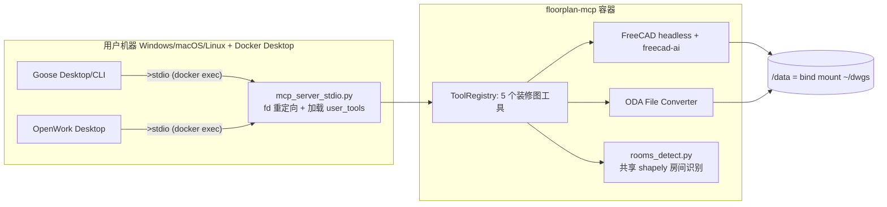
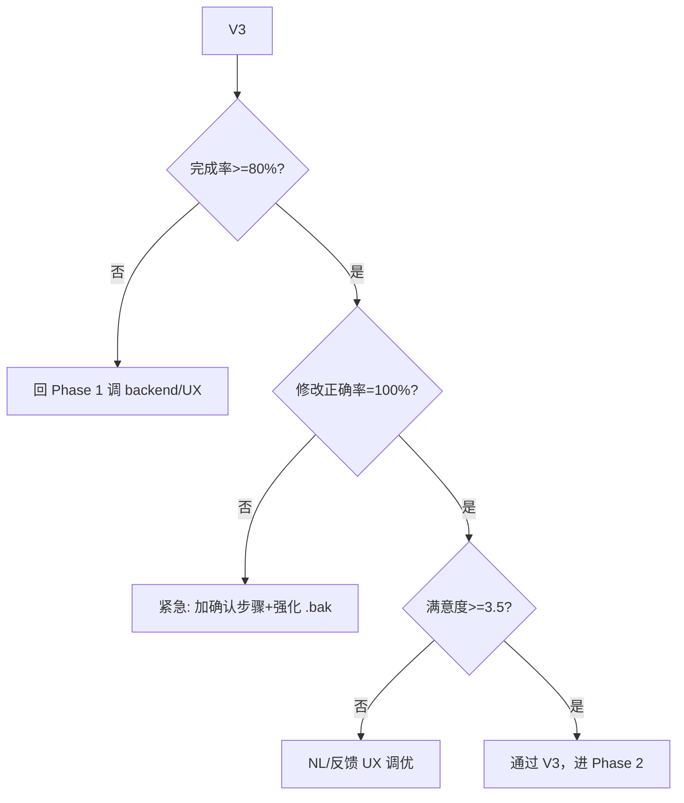
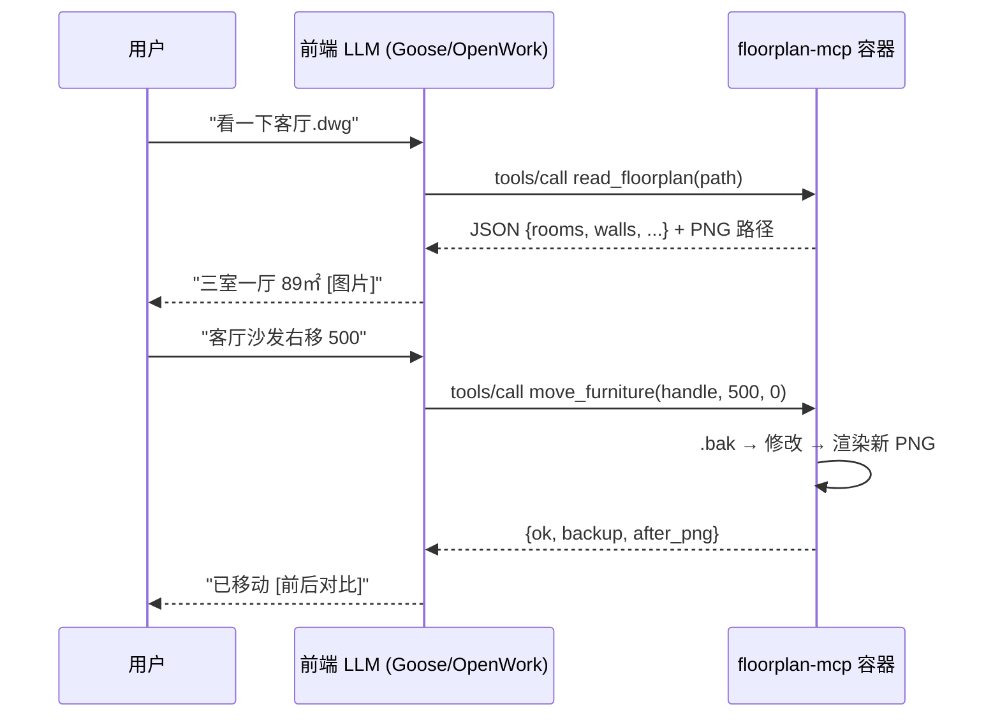

# 产品 Spec — floorplan-mcp（装修师傅的自然语言 CAD 助手）

> ✅ **当前权威实施文档**（与 `方案-F-容器化.md` + `方案-F2-*.md` 配套）。
> 架构演进/经验教训见 `复盘-2026-08-08-Phase0准备.md`，V3 真人测试包在 `floorplan-mcp/usertest/`。
>
> **版本**：v1.1 / 2026-08-08
> **依赖文档**：本 spec 是当前权威；早期 `方案-v1.md`~`方案-E-混合架构.md` 已归档（顶部 ⚠️ 标注）
> **本 Spec 范围**：MVP 的产品定义、前端集成（Goose + OpenWork 双前端）、用户故事、验收标准

---

## 0. 概要（TL;DR）

| 项 | 定义 |
|----|------|
| **一句话产品** | 设计师在桌面 Chat 客户端里用自然语言读改查装修 DWG，UI 即所得。 |
| **形态** | 单 Docker 镜像（floorplan-mcp）+ 用户的 Chat 桌面客户端（Goose 或 OpenWork） |
| **核心价值** | 不写 Python/不学 FreeCAD API；对话式读图、查询、改图、导出 |
| **MVP 用户** | 室内设计师 / 会用 CAD 的施工 / 懂点 DIY 的房主 |
| **MVP 不做** | 3D 联动（Phase 3）/ 多用户 SaaS（远期）/ 自动出全套施工图 / 家具智能布局 |

---

## 1. 用户的两种前端（关键决策）

经实读 Goose / OpenWork 源码与文档（2026-08-08），确认支持的是这两种前端，**不是 Claude Desktop**（之前 F 文档默认的）。

### 1.1 Goose（github.com/aaif-goose/goose, 52.6k stars）

- **实现**：Rust + TypeScript，Apache-2.0，AAIF 基金会托管
- **形态**：Desktop / CLI / API（用户确认 Desktop + CLI 都要）
- **跨平台**：macOS / Linux / Windows
- **LLM provider**：15+，含 Anthropic / OpenAI / Google / Ollama / OpenRouter
- **MCP transport（源码 `ExtensionConfig` 枚举确证）**：
  - `stdio`：✅ 支持（`cmd + args + envs`）
  - `streamable_http`：✅ 支持（`uri + headers`）
  - `sse`：🔴 **已废弃**（"no longer supported, kept only for config file compatibility"）
- **配置位置**：`~/.config/goose/config.yaml` 的 `extensions.EXTNAME` 字段

### 1.2 OpenWork（github.com/different-ai/openwork, 21.5k stars）

- **实现**：TypeScript + Electron，FSL-1.1-MIT 许可
- **形态**：Desktop app / 也可作 MCP server 给其他 agent 用
- **跨平台**：macOS / Windows / Linux
- **定位**："Privacy-first, open-source alternative to Claude Cowork"
- **LLM provider**：自带（"Sign in with ChatGPT"或自带 LLM key）
- **MCP transport**：
  - 远程 server：`Settings > Extensions > Add Custom App`，填 URL（默认想走 OAuth 动态客户端注册）
  - 本地 stdio server：支持（"custom or local MCP server that is not available through OpenWork Connect"）

### 1.3 集成路径与容器需求（MVP 已定调）

| 前端 | MVP transport | Phase 1.5+ |
|------|---------------|------------|
| Goose Desktop | `stdio`（`docker exec` 拉起容器内 server） | + `streamable_http` |
| Goose CLI | `stdio` | （满足） |
| OpenWork Desktop | `stdio`（"Add Custom App" 高级模式） | + `streamable_http / OAuth`（远程主线模式） |

**MVP 选定 `stdio` 单通道**（2026-08-08 拍板，详见 §5.4）：
- 避开 Goose 已废弃的 SSE、OpenWork 远程模式必须的 OAuth
- 三前端都能用同一种入口（`docker exec -i floorplan-mcp python /opt/floorplan/mcp_server_stdio.py`）
- 容器**无需暴露端口**，最简、最少出错点

> **🔴 关键修正**（早期 F 文档默认 SSE）：freecad-ai 的 SSE server **在 Goose 上不能用**（SSE 已废弃），OpenWork 远程模式还要求 OAuth。MVP 选 stdio 一次性绕开这两个坑。

### 1.4 MVP 架构（stdio 单通道）



**容器工作模式**：`docker compose up -d` 常驻，`entrypoint.sh` 不直接跑 server（仅 tail-f 维持运行）；客户端每开一次会话用 `docker exec -i` 拉起独立 stdio 进程。

> Phase 1.5 起，容器同时在入口拉起 streamable_http server 占端口（3000），与 stdio 共用 ToolRegistry——届时一个镜像同时服务两种 transport。

---

## 2. 用户故事（MVP 五件套 + 跨前端一致性）

每个故事在 Goose Desktop / Goose CLI / OpenWork Desktop 三种前端下表现一致（因为都通过同一组 MCP 工具）。

### 2.0 PNG 在前端的展示机制（跨故事前提）

MCP 工具调用返回的是 **JSON**，不能直接返回图片。我们用 bind mount 把 PNG 落到 `~/dwgs/` 后：

- **机制**：工具返回 `{"png_path": "/data/xxx.png"}`（容器内路径，bind mount 后等于 `~/dwgs/xxx.png`）
- **前端视觉**：LLM 把路径翻译成 `~/dwgs/xxx.png` 告诉用户去打开；用户在前端的"附件/预览"区或文件管理器查看。
- **Phase 1.5+ 优化**：streamable_http 模式下，容器提供 `/preview/<token>.png` 静态路由，工具同时返回该 URL，前端 LLM 把 URL 当 markdown 图片直接展示。MVP 阶段走文件路径足够。

> 这意味着 MVP 用户看到的图是**文件路径**（需用户自己打开），而非嵌入式预览——这是为简化传输链路做的有意识权衡，V3 真人测试时要观察是否成摩擦点。

### US-0：首次安装（一次性）

**作为**设计师，**我想** 30 分钟内装好启动，**以便** 立刻试。

**步骤**：
1. 安装 Docker Desktop（最新版，ops 已确认旧版 17.12 不行）
2. `docker compose up -d`（容器常驻；MVP 不暴露端口，等客户端 `docker exec`）
3. 安装 ODA File Converter（合规：用户自己接受 EULA，按 `install_oda.sh` 引导挂载）
4. 装前端二选一/两个：Goose Desktop 或 OpenWork Desktop
5. 在前端配 MCP server（详见 `clients/goose.md` / `clients/openwork.md`）：
   - Goose：`~/.config/goose/config.yaml` 加 stdio extension
     ```yaml
     extensions:
       floorplan:
         type: stdio
         name: floorplan
         cmd: docker
         args: ["exec", "-i", "floorplan-mcp", "python", "/opt/floorplan/mcp_server_stdio.py"]
         timeout: 300
     ```
   - OpenWork：`Settings > Extensions > Add Custom App`（高级模式），不勾 OAuth，命令同上 `docker exec ...`
6. 验证：`./scripts/check_stdio_server.sh` 通过
7. 把要处理的 DWG 放 `~/dwgs/`（容器 bind mount 到 `/data`）

**验收**：前端对话框里出现 floorplan 工具集；调一次 `read_floorplan` 返回非错误 + PNG 落到 `~/dwgs/`。

### US-1：读图理解

**你**：看一下 `客厅.dwg` 这张图有什么。
**前端**：调 `read_floorplan` → 返回 "三室一厅，5 门 12 家具，总面积 89㎡" + 结构化 JSON + 渲染的 PNG（PNG 通过 bind mount 落到 `~/dwgs/preview.png`，前端展示给用户）。

### US-2：查询统计

**你**：客厅面积多大？哪些家具？
**前端**：调 `list_rooms` → "客厅 23.4 ㎡，含沙发/茶几/电视柜"。

### US-3：修改编辑（核心 + 自动备份）

**你**：把客厅沙发往右移 500mm。
**前端**：调 `move_furniture(handle=..., dx_mm=500, dy_mm=0)` → 返回 "已移动，备份在 `客厅.dxf.bak.1`，前后对比 PNG"。
**关键**：每次写入自动 `.bak`（R2 安全层要求），用户能说"撤销"→ 系统回滚。

### US-4：可视化

**你**：给我看图 / 把门高亮。
**前端**：调 `render_preview(highlight=[门 handle])` → 返回高亮后的 PNG。

### US-5：导出

**你**：导出 DWG / PDF。
**前端**：调 `export_drawing(target_format="dwg")` → 文件落到 `~/dwgs/` 里，前端告知路径。

---

## 3. 功能需求（MVP 边界）

### 3.0 用户角色画像（细化，V3 招募依据）

| 画像 | 能力特征 | 典型场景 |
|------|---------|---------|
| **P1 室内设计师**（主） | 会 CAD、看懂 DWG 图层/块；不写代码；可能用过 SketchUp | 改自家项目的图、批量算面积、出快速变体 |
| **P2 装修施工/包工头** | 看 CAD 图、量尺寸；技术背景较浅 | 现场改尺寸、问"这段墙多长"、查家具位置 |
| **P3 懂 DIY 的房主** | 不熟 CAD，但能装 Docker | 把设计公司给的 DWG 改改自家户型 |

MVP 优先服务 **P1**（信号最干净），P2/P3 作为副画像观察（V3 至少招 1 个 P2 测易用性）。

### 3.1 必做（P0）

| ID | 功能 | 实现工具 |
|----|------|---------|
| F1 | 读取 DWG/DXF → 结构化 JSON | `read_floorplan` |
| F2 | 房间识别 + 面积统计（共享 shapely 算法，已一致） | `list_rooms`（背后 `backends/rooms_detect.py`） |
| F3 | 家具/门窗分类（含已知误命中点，Phase 1 升三维特征） | `read_floorplan`（含 `furniture` 字段） |
| F4 | 移动实体（含 .bak 自动备份） | `move_furniture` |
| F5 | PNG 渲染（不破坏图层，用 RenderContext 副本） | `render_preview` |
| F6 | 导出 DWG/DXF/PDF | `export_drawing` |
| F7 | stdio transport（MVP 通道） | `mcp_server_stdio.py`（streamable_http 留 Phase 1.5） |

### 3.2 不做（明确的 Phase 后置）

- 3D 模型联动（SketchUp ↔ CAD）→ Phase 3，方案 C
- 增删门窗自动断墙 → Phase 2
- 多 DWG 批处理 / 跨图查询 → Phase 2
- 多用户权限 / SaaS → 远期
- 家具智能布局建议 → 远期

### 3.3 user_tool 精确 I/O 契约（前后端联调依据）

实际定义见 `tools/floorplan_tools.py`，这里钉住契约（version-lock）：

| 工具 | 必填参数 | 返回最小字段 | 备注 |
|------|---------|-------------|------|
| `read_floorplan` | `path: str` | `{layers, walls, doors, windows, furniture, rooms, summary}` | summary 至少含 wall/door/window/furniture/room 计数 + total_area_m2 |
| `list_rooms` | `path: str` | `{count: int, rooms: [{name, area_m2, furniture}], total_area_m2}` | 派生自 read_floorplan |
| `move_furniture` | `path, handle_or_name, dx_mm: float, dy_mm: float` | `{ok: bool, backup_path: str|null, data: {new_position_xy}}` 或 `{ok: false, error}` | auto_backup=True 默认 |
| `render_preview` | `path, output_png` | `{png_path: str}` | highlight 可选，逗号分隔 |
| `export_drawing` | `path, target_format, output_path` | `{output_path: str}` | target_format ∈ {dwg, pdf, dxf} |

**生命周期约束**（写 spec 时钉死，避免实现漂移）：
- 写工具（move/export-dwg）必返回 `backup_path`，让 LLM 把它告诉用户
- 读工具不修改原文件，不产生 .bak（避免误备份）
- 所有 path 参数用容器内绝对路径（`/data/...`），LLM 把用户的 `~/dwgs/x.dwg` 翻成 `/data/x.dwg`

### 3.4 tool description 写法（影响 LLM 路由准确率，KPI 关联）

LLM 在多种工具间选哪个，全靠 description。MVP 5 个工具的 description 必须满足：

| 原则 | 反例 | 正例 |
|------|------|------|
| 一句话讲"做什么"+"什么时候用" | "移动家具" | "在装修图上移动某个实体（家具/门/窗等）。用户说'把 X 往 Y 方向移 N mm'时用，不要用于读取或查询。" |
| 名词/动词用用户口语（不是 CAD 术语） | "translate entity by vector" | "把 X 向右移 N mm" |
| 明示"不要在哪种场景用" | （无） | "不要用于查询面积——用 list_rooms" |
| 列典型用户表达 | （无） | "用户可能说：把沙发右移500 / 沙发靠墙 / 门往左挪200" |

> 这是 KPI "单次会话平均用到的工具数 = 1-3" 的基础。Phase 1 实现 user_tool 时 description 要按此模板写，CI 加 lint 检查"含口语示例 + 含何时不用"。

### 3.5 非功能需求

| 类别 | 要求 |
|------|------|
| **性能** | 10MB DWG 读 + 首渲染 < 8s（容器内 FreeCAD daemon 常驻） |
| **可靠性** | 修改正确率 100%（V3 红线，错改 = 数据破坏） |
| **跨平台** | Windows / macOS / Linux Docker Desktop 都跑得起来 |
| **合规** | ODA 不打包进镜像；镜像只含 LGPL/MIT 组件 |
| **可撤销** | 每次写操作自动 .bak，至少保 10 份 |

---

## 4. 用户验证方案（与 F2 文档 Part 3 对齐，简化版）

### 4.1 三阶段

| 阶段 | 时机 | 通过线 |
|------|------|--------|
| V1 自动化（已部分过） | Phase 0 前 | **27/27 单元**（backend/安全/分类/AST/stdio fd/共享房间算法 + 7 边界用例）+ 1 集成（合成 DXF） ✅ |
| V2 内部 | Phase 1 MVP 完 | 5 个用户故事三前端各跑一遍 |
| V3 真人 | Phase 1 后 | 3-5 真实设计师，任务完成率 ≥ 80%，修改正确率 = 100% |

### 4.2 V3 任务清单（30-45 分钟/人）

| 任务 | 前端 | 达成 |
|------|------|------|
| T1 装好并连上容器 | Goose + OpenWork 各试 | 15 分钟内两个前端都能调通 |
| T2 读自己的 DWG | 任选前端 | PNG + 房间数对 |
| T3 查客厅面积 | 任选前端 | 误差 < 5% |
| T4 查客厅家具 | 任选前端 | 与图一致 ≥ 90% |
| T5 改 + 撤销 | 任选前端 | 改对 + .bak 回滚成功 |
| T6 自由探索 | 任选前端 | 记录卡点 |

### 4.3 失败决策



---

## 5. 双前端集成实施清单

### 5.1 transport 路线（与 §1.3、§5.4 一致）

| Phase | Transport | 状态 | 何时做 |
|-------|-----------|------|-------|
| **MVP（当前）** | `stdio` 单通道 | ✅ 已实现 | — |
| Phase 1.5 | + `streamable_http` | 待 | V3 通过后，或远程访问需求出现 |
| Phase 2+ | + `HTTPS / OAuth` | 远期 | 云形态 / 多用户 |

### 5.2 Goose 配置（MVP stdio）

`~/.config/goose/config.yaml`（Desktop + CLI 共享），完整版见 `clients/goose.md`：

```yaml
extensions:
  floorplan:
    type: stdio
    name: floorplan
    cmd: docker
    args: ["exec", "-i", "floorplan-mcp", "python", "/opt/floorplan/mcp_server_stdio.py"]
    description: 装修图工具：读/查/改/导出 DWG/DXF
    timeout: 300
```

### 5.3 OpenWork 配置（MVP stdio，绕开 OAuth）

`Settings > Extensions > Add Custom App` → 高级模式 → 不勾 "Requires OAuth"，命令同 §5.2 的 docker exec。完整版见 `clients/openwork.md`。

### 5.4 MVP 选定方案（用户 2026-08-08 拍板）

| 决策项 | 选择 |
|--------|------|
| MVP transport | **stdio 单通道**（已实现） |
| Goose Desktop | stdio（`docker exec`） |
| Goose CLI | stdio（用户确认要，"先看效果"） |
| OpenWork Desktop | stdio 高级模式（绕 OAuth） |
| streamable_http（C1） | 推迟到 Phase 1.5 |

**容器工作模式**：`docker compose up -d` 让容器常驻（`entrypoint.sh` tail-f 不直接跑 server），客户端每开一次会话经 `docker exec -i floorplan-mcp python /opt/floorplan/mcp_server_stdio.py` 拉起独立 stdio 进程。Phase 1.5 加 streamable_http 时再在 entrypoint 里同时启动 HTTP server 占端口 3000。

---

## 6. 信息架构 / 对话流（所有前端通用）

每次对话由前端 LLM 驱动，按下面流程调我们的工具：



**关键约束**（前端提示词要明示给 LLM）：
- 每次写操作返回 `backup_path`，让 LLM 主动告诉用户
- PNG 落 `/data/` (= `~/dwgs/`)，让用户在前端外也能看到
- 撤销靠用户复述"撤销"+ LLM 调系统层 .bak 回滚（或 Phase 1 加 `undo` 工具）

---

## 7. 错误处理与边界（产品体验关键）

| 场景 | 用户感知 | 系统行为 |
|------|---------|---------|
| ODA 未装 / DWG 读失败 | "请先按 install_oda.sh 装 ODA" | 工具返回明确中文错误，不静默 |
| 房间识别返回 0 个 | "这张图墙线可能不规范，未识别到房间；试试框选算面积？" | 降级（Phase 4 可加框选） |
| 写操作崩了 | "操作失败，已自动回滚，没有破坏原文件" | abortTransaction + 文件未被覆盖 |
| 实体 handle 找不到 | "没找到 'SOFA#2'，请先 read_floorplan 看可用 handle" | 返回当前所有 handle 列表 |
| 图层名 GBK 编码乱码 | "图层名编码异常，按通用名匹配；如不准请改图层命名" | 自动尝试 GBK/UTF-8，仍失败按几何匹配 |
| LLM 想改坏文件（如覆盖备份） | 拒绝 | 工具守护 .bak 文件不可改 |

---

## 8. 成功指标（KPI）

MVP 上线 3 个月后看：

| 指标 | 目标 |
|------|------|
| 活跃用户周留（用 ≥1 次/周） | ≥ 40% |
| 任务完成率（V3 持续） | ≥ 80% |
| 修改正确率（数据不破坏） | = 100% |
| 平均任务时长（一轮对话完成） | < 30s |
| 单次会话平均用到的工具数 | 1-3 个（说明 LLM 路由准确） |
| 报错 → 用户能自查解决的比例 | ≥ 50% |

---

## 9. 风险与依赖（与 F2 Part 1 对齐，新增前端相关）

| # | 风险 | P × I | 缓解 |
|---|------|-------|------|
| R1 | 真实图房间识别不准 | 中×高 | 已统一 shapely 算法；7 边界用例（L/T/走廊/门洞/重复墙/共线段）全过；Phase 0 真实样本是最终闸门 |
| R2 | 写工具绕过安全层 | 中×高 | `_safety.with_transaction` 自带 + .bak（已实现+单测覆盖） |
| R3 | DWG round-trip 丢实体 | 高×高 | ODA 默认 + CI 回归 |
| R4 | ODA EULA | 高×高 | 不打包；install_oda.sh 引导 |
| R5 | freecad-ai server 只支持 SSE（Goose 不兼容） | 已规避×高 | MVP 走 stdio 单通道绕开；Phase 1.5 自补 streamable_http server |
| R6 | Goose/OpenWork 版本与 MCP 兼容性 | 低×中 | 锁版本；CI 测三种前端 |
| R7 | macOS Docker 性能 | 低×低 | 接受 |
| R8 | 国内访问 LLM | 中×中 | Goose 多 provider（含国产/Ollama）；OpenWork 偏 ChatGPT OAuth |
| R9（新） | MVP PNG 用文件路径而非嵌入式预览，可能成体验摩擦 | 中×低 | V3 真人测试观察；若摩擦大，Phase 1.5 上 streamable_http + 静态 PNG 路由 |

---

## 10. 路线图

| Phase | 重点 | 周期 |
|-------|------|------|
| **Phase 0（前置闸门）** | Docker 升级 + 2 个真实 DWG 跑 `phase0_verify.py` 验 round-trip + 房间识别准确率 | 半天 |
| **Phase 1（MVP）** | stdio transport 解锁；5 个 user_tool 完整化；双前端调通；跑 5 用户故事（V2） | 5-7 天 |
| **Phase 1.5**（V3 通过后） | + streamable_http transport；PNG 静态路由（嵌入式预览）；可选 OAuth | 2-3 天 |
| **Phase 2** | 工程化：CI 回归测试、容器 systemd、性能监控、增删门窗自动断墙 | 2-3 天 |
| **Phase 3** | 3D 联动（IFC + SketchUp），方案 C 落地 | 按需 |

---

## 11. 已拍板决策（2026-08-08）

| 问题 | 决策 |
|------|------|
| MVP transport | ✅ **stdio 单通道** |
| Goose CLI 是否要 | ✅ **要**（"先看效果"） |
| OpenWork 走 OAuth 还是 stdio | ✅ **stdio** 绕开 OAuth（Phase 1.5 再补远程） |
| 房间识别算法 | ✅ **共享 shapely polygonize**（freecad/ezdxf 两个 backend 同源，27/27 测试过）；Arch Space 弃用作识别路径，留 Phase 3 |
| streamable_http（C1） | ⏸️ **推迟**到 Phase 1.5（MVP 不需要） |
| PNG 展示方式 | ✅ MVP 走文件路径；嵌入式预览留 Phase 1.5 |

后续开放：
- Phase 0 真实样本到位后验证 shapely 在真实图上的准确率（验证主备是否仍需差异）
- Docker 升级到最新版（ops 阻塞项，必须用户操作）

---

## 12. Phase 0 验证 checklist（用户就绪后立刻跑）

> 这一半天的产出是 Phase 1 启动的硬性前置。任一不通过都阻塞 MVP。

**前置（用户提供）**：
- [ ] Docker 升级到最新（≥4.x，engine ≥25）
- [ ] 2 个真实装修 DWG 放 `~/dwgs/`（用 `sample1.dwg` / `sample2.dwg` 命名）
- [ ] 装 ODA File Converter（按 `floorplan-mcp/install_oda.sh`）并挂载到容器

**自动化（容器内跑）**：
```bash
cd floorplan-mcp
docker compose up -d
./scripts/check_stdio_server.sh                                # stdio 通道通
docker compose exec floorplan-mcp python3 \
    /opt/floorplan/scripts/phase0_verify.py /data              # R1+R3 验证
```

**通过线**：

| # | 检查项 | 通过线 | 失败处置 |
|---|--------|--------|---------|
| CHECK-1 | stdio server 返回合法 JSON-RPC | 收到 `serverInfo` 字段 | 看容器 logs，多半 freecad-ai 未正确加载 user_tools |
| CHECK-2 | R3 round-trip 平均实体丢失 | < 5% | 默认 ODA；若 LibreDWG 兜底也丢，评估只支持 DXF |
| CHECK-3 | R1 shapely 房间识别准确率 | ≥ 70% | 排查墙体关键词匹配（真实图层名 vs WALL_KEYWORDS），加映射表 |
| CHECK-4 | 家具分类（门/窗/沙发等）命中率 | ≥ 80% | 加三维特征分类器（升级 `_classify`）|

**通过即解锁 Phase 1；失败进对应缓解路径。**

---

## 13. Phase 1 自检 checklist（V2 验收前）

- [ ] 5 个 user_tool 完整实现（按 §3.3 契约），description 按 §3.4 写
- [ ] stdio transport 三前端（Goose Desktop / Goose CLI / OpenWork）各跑通一次
- [ ] 5 个用户故事（US-1~US-5）在合成+真实样本各跑一遍（含 .bak 回滚验证）
- [ ] V1 自动化测试 27/27 仍绿（防回归）
- [ ] `.bak` 至少存 10 份并被 FIFO 清理（test_make_backup_max_keep 已覆盖）
- [ ] 错误信息全部中文 + 给出下一步动作（§7）

通过后进 V3 真人测试。

---

## 14. 修订历史（关键）

| 版本 | 日期 | 变更 |
|------|------|------|
| v1.0 | 2026-08-08 | 双前端（Goose + OpenWork）调研完成；初版 spec |
| **v1.1** | 2026-08-08 | Review 修正：① §1.3/1.4/US-0/§5.2/5.3/§10 统一指向 **MVP stdio 单通道**（消除 streamable_http 与 stdio 的自相矛盾）；② F2/R1 更新为**共享 shapely**（Arch Space 已弃用）；③ §4 V1 状态更新到 27/27；④ 新增 §2.0 PNG 展示机制；⑤ 新增 R9（PNG 路径预览风险）；⑥ 修路线图"stdiostream"错别字 + Phase 1.5 关系 |
