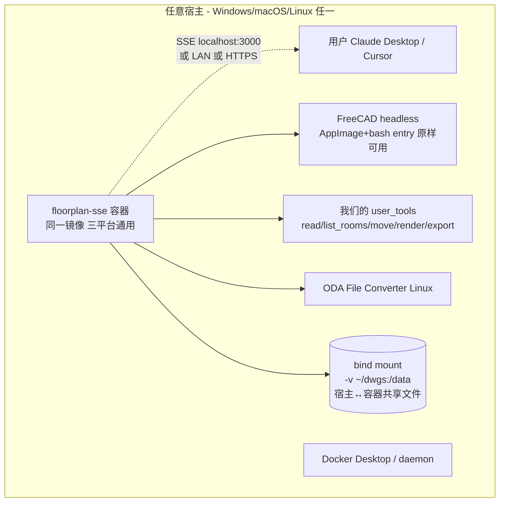

# 方案 F — 容器化（最终）

> ✅ **当前权威架构文档**（与 `方案-F2-*.md` + `产品Spec.md` v1.1 配套）。
> 此前的 v1/v2/v2-review/v3-final/C-BIM/D/E 均已归档（顶部 ⚠️ 标注）。
> 实施过程的关键经验在 `复盘-2026-08-08-Phase0准备.md`。

> **文档关系**：取代前面所有版本（v1~E）。当前唯一权威。
> **日期**：2026-08-08
> **本轮两个纠正（用户提出）**：
> 1. FreeCAD 是 C++ 桌面应用，原生支持 Windows——我之前把"freecad-ai 的 entry 是 Linux 专属"误说成"FreeCAD 不能在 Windows 跑"
> 2. 用 Docker 部署，Windows WSL2/Docker Desktop 同样能跑 → 不必依赖独立 Linux 服务器

---

## 0. 一句话决策

> **单一 Docker 镜像封装 FreeCAD + freecad-ai + 我们写的装修图 user_tools + ODA。该镜像在 Windows/macOS/Linux 三平台通过 Docker 跑同一个 Linux 容器，通过 SSE（localhost / LAN / HTTPS 三种网络形态）暴露工具给 Claude Desktop/Cursor。MVP 默认走此形态，复用 FreeCAD BIM 的 Arch Space 房间识别。备选 A（ezdxf+shapely）也在同一容器内可切。**

---

## 1. 承认前面两处不精确

| 之前（方案 D/E）我说 | 准确表述 |
|---------------------|----------|
| "FreeCAD 不能在 Windows 跑，所以 B 出局" | ❌ 错。FreeCAD **能**原生跑 Windows。是 **freecad-ai 的 `mcp_server_entry.py` launcher 用了 `bash + AppImage` 才是 Linux 专属**（launcher 问题，非 FreeCAD 问题） |
| "E 需要 Linux 服务器访问" | ✅ 当时对。但 Docker 化后**该依赖消失**——用户 Windows 上跑 Docker Desktop 即可 |

native Windows 跑 FreeCAD 也是可行的（装 Windows 版 FreeCAD + 自写 Windows entry 绕开 bash），但 **Docker 方案一举让 entry 跨平台通用，无需为 Windows 单独写 launcher**，所以 Docker 全面更优。

---

## 2. 架构



### 2.1 三种部署形态（同一镜像）

| 形态 | 宿主 | 网络 | 用户 |
|------|------|------|------|
| **本地** | 用户 Windows + Docker Desktop | SSE localhost:3000 | 单人/个人 |
| **团队** | 公司 Linux 机 + Docker | SSE LAN IP，扩展 allowed_hosts | 小团队 |
| **云** | 云 VM/容器服务 | SSE HTTPS + headers token | 多用户/SaaS |

**单一镜像，三态零修改**——区别只是网络拓扑。

### 2.2 平台支持矩阵（Docker 后最终结果）

| 平台 | 支持 | 说明 |
|------|------|------|
| **Windows** | ✅ | Docker Desktop / WSL2 跑 Linux 容器（用户主战场） |
| **macOS** | ✅ | Docker Desktop 跑 Linux 容器（**E 之前放弃 mac 的结论过时，现在恢复支持**） |
| **Linux** | ✅ | 原生 Docker |

容器内统一是 Linux + bash + AppImage，**freecad-ai 的 entry 在三平台下原样可用，不需要为任何平台改 launcher**。

---

## 3. Docker 化带来的四个简化（vs 方案 E）

| 议题 | 方案 E | **方案 F（Docker）** |
|------|--------|---------------------|
| Linux 服务器访问 | 必需 | **不需要**（用户 Windows Docker Desktop 即可） |
| macOS | "不支持也能接受" | ✅ **等价支持**（Docker Desktop on mac） |
| 文件传输 | HTTP `/upload + token` 端点 | **bind mount**（`-v ~/dwgs:/data`），删掉上传端点 |
| 部署 artifact | 多个安装步骤 | **单个 Docker 镜像** |
| 三态切换（本地/团队/云） | 各自部署 | **同一镜像改网络配置即可** |

bind mount 是 Docker 天然优势：用户 DWG 放本地 `~/dwgs/`，容器直接读 `/data/sample.dwg`，PNG 渲染回写同一目录，宿主即时看到——**完全不需要文件上传逻辑**。

---

## 4. 合规（Docker 打包带来的新风险点）

| 组件 | 许可 | 容器打包考量 |
|------|------|------------|
| FreeCAD | LGPL v2+ | 容器部署无传染 |
| freecad-ai | LGPL v2.1 | user_tools 扩展不改核心，无传染 |
| ezdxf / shapely | MIT | 自由 |
| **ODA File Converter** | **闭源 EULA** | 🔴 **打包进 Docker 镜像再分发几乎肯定违反 EULA** |
| Docker Desktop | 私有协议 | 个人/小公司免费，大公司（>250 人 或 >$10M）需付费 license |

### ⚠️ 必须解决的 ODA 打包合规

**问题**：ODA File Converter 的 EULA 禁止再分发。打包进 Docker 镜像 = 再分发，构成违规。

**三个选项**（你需拍板）：

1. **不打 ODA 进镜像**（推荐）：用户首次 `docker run` 后用 entrypoint 引导其挂载本地 ODA 安装目录，或镜像启动时自动从 ODA 官网下载（用户接受 EULA）
   - 优点：合规
   - 缺点：用户多一步安装 ODA 到宿主
2. **镜像内用 LibreDWG 替代**：避开 ODA EULA，但 DWG 写保真度下降
3. **接受 EULA 风险**（仅限个人/研究，非产品）

> **MVP 建议**：选项 1（合规优先）。镜像里留一个 `install_oda.sh` 引导脚本。

---

## 5. MVP 实施路径

### Phase 0: 假设验证（半天，前置阻断）

需要：**2 个真实装修 DWG**（你给）+ 本机 Docker（开发机 Docker Desktop 即可）。

验证两条最贵假设：
1. **FreeCAD Arch Space 在真实 DWG 上房间识别准确率**
   - 流程：DWG → ODA→DXF → FreeCAD `importDXF` + `Draft.draftify` 成墙 → `Arch.makeSpace`
   - 修正 v2 §11.2 的天真错误：必须先 draftify 成墙，否则 makeSpace 拿到空
2. **容器端到端 SSE 通**：`docker compose up` 起容器 → Claude Desktop 连 localhost:3000 → 调一次 ping 工具

**触发备选 A 的条件**：Arch Space 准确率 < 50% → MVP 切 ezdxf+shapely（**仍在同容器内跑**，客户端不动，只换 backend）。

### Phase 1: MVP（5-7 天）

```
floorplan-mcp/
├── Dockerfile                  # FreeCAD AppImage + freecad-ai + ODA 引导 + user_tools
├── docker-compose.yml          # bind mount + 端口 + 环境变量
├── entrypoint.sh               # 启动 FreeCAD + freecad-ai SSE server
├── tools/
│   ├── floorplan_tools.py      # 5 个 user_tool (调 floorplan_backend)
│   └── floorplan_backend.py    # Protocol 接口
├── backends/
│   ├── freecad_backend.py      # 主：FreeCAD + Arch Space
│   └── ezdxf_backend.py        # 备：ezdxf + shapely（Phase 0 失败时实现）
├── scripts/
│   ├── install_oda.sh          # 合规的 ODA 引导安装
│   └── phase0_verify.py        # Phase 0 验证脚本
└── README.md                   # 三平台 Docker 部署说明
```

### Phase 2: 工程化（2 天）

- 自动 `.bak` 备份（写容器内 `/data`）
- 异常分级 + 容器日志
- round-trip CI 回归（多版本 DWG 对照）
- pytest 覆盖 backend 纯函数

### Phase 3（未来 3D）: 接 IFC

同镜像加 IfcOpenShell + FreeCAD NativeIFC，新加 3 个 user_tool（import_3d / sync_to_3d / list_spaces）。

---

## 6. FloorplanBackend 接口（不变，与 D/E 一致）

主备后端都装进容器内，靠 `FLOORPLAN_BACKEND=freecad|ezdxf` 环境变量切换。客户端、镜像、网络配置都不动。

未来若上 3D，加 `ifc` 作为第三个 backend。

---

## 7. 风险

| 风险 | 概率 | 严重 | 对策 |
|------|------|------|------|
| Arch Space 真实图识别失败 | 中 | 高 | Phase 0 前置；备选 A 兜底 |
| **ODA 打包 EULA 违规** | 高（如打进去） | 高 | 不打 ODA 进镜像，引导用户自行安装 |
| DWG round-trip 丢实体 | 高 | 高 | 默认 ODA；CI 回归对照 |
| Docker Desktop 大公司 license | 低 | 低 | 个人/小团队免费；产品化再评估 |
| FreeCAD 容器启动慢（首次几秒） | 中 | 低 | 容器常驻、daemon 复用 FreeCAD doc |
| macOS Docker Desktop 性能开销 | 低 | 低 | 接受（用户已说装包大小不是问题） |
| 3D 联动延后（用户已接受为未来） | — | — | Phase 3 用 IFC |

---

## 8. 旧文档处置

| 文档 | 处置 |
|------|------|
| 方案.md、方案-v2.md、方案-v2-review.md、方案-v3-final.md、方案-D-决策.md、方案-E-混合架构.md | 归档（E 因 ODA 打包 / macOS 判断已过时，被 F 取代） |
| 方案-C-BIM.md | 保留（Phase 3 切 IFC 的依据） |
| **方案-F-容器化.md（本文）** | **当前唯一权威** |

---

## 9. 下一步（实际可执行）

需要你提供才能启动 Phase 0：
1. **2 个真实装修 DWG**（你给）
2. **ODA 合规方案选哪个**（你的决策，见 §4）—— 默认走选项 1（不打进去，引导安装）

我能立即做（不依赖外部）：
1. 写 Phase 0 验证脚本（Arch Space 房间识别**修正版**：先 draftify 后 makeSpace）
2. 起骨架：Dockerfile + docker-compose + entrypoint + 5 个 user_tools 签名 + FloorplanBackend 接口
3. 写 install_oda.sh 合规引导脚本

**给我"2 个样本 + ODA 合规方案选哪个"两个答案，我就开干第 2/3 项。**

---

## 10. 修订记录

| 版本 | 日期 | 变更 |
|------|------|------|
| v1~E | 2026-08-08 | 各种演进（见各文档） |
| **F 初版** | 2026-08-08 | 修正 FreeCAD 跨平台误判；引入 Docker 单镜像三平台通用；macOS 恢复支持；bind mount 替代文件上传端点；新增 ODA 打包 EULA 合规问题 + 三个处置选项 |
