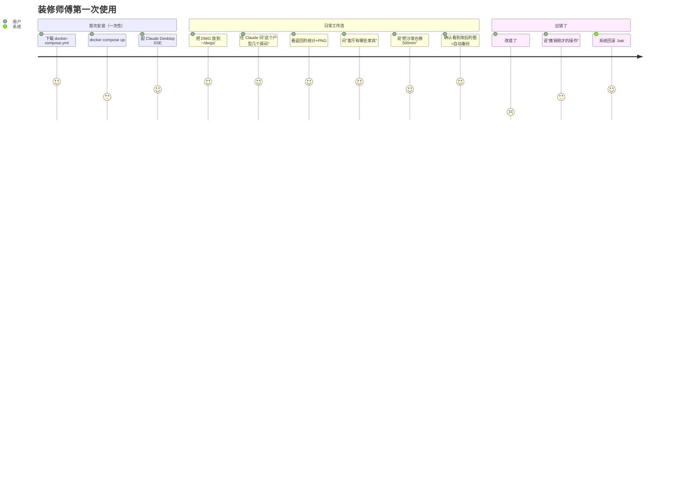
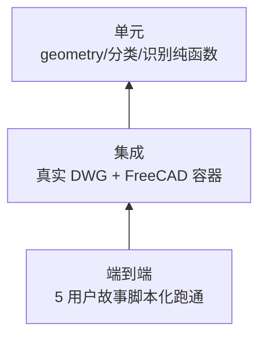
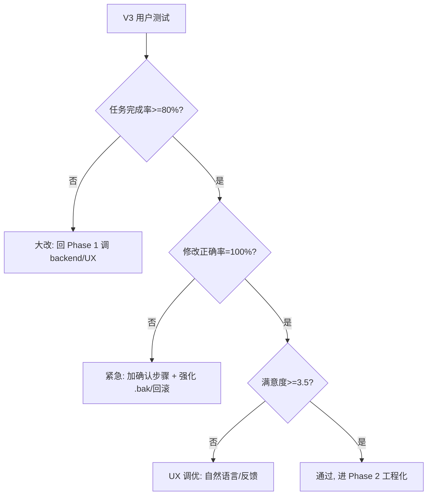

# 方案 F-2 — Risk Review + 产品设计与用户验证方案

> ✅ **当前权威**（架构风险 + 产品 + 验证三件套，与 `方案-F-容器化.md` 配套）。
> 产品实施细节在 `产品Spec.md` v1.1，V3 真人测试包在 `floorplan-mcp/usertest/`。

> **文档关系**：对 `方案-F-容器化.md` 的深度 risk review（四个维度），并交付后续两份产物——**产品设计**与**用户验证方案**。
> **日期**：2026-08-08

---

## Part 1 — 方案 F 的 Risk Review（四维度）

### 1.1 可行性（Feasibility）

| 风险项 | 评级 | 证据/调研结果 | 缓解/备选 |
|--------|------|--------------|----------|
| **FreeCAD AppImage 在容器内跑需要 FUSE** | 🟡 中 | AppImage 默认挂载用 FUSE，多数 Docker 基础镜像没有 `--device /dev/fuse` | **预先 extract AppImage**：`./FreeCAD.AppImage --appimage-extract` 后直接跑解包目录里的 `AppRun`，彻底绕开 FUSE。这是社区标准做法 |
| **容器 headless 渲染方式** | ✅ 已确认 | freecad-ai `tests/integration/conftest.py` 用 **`QT_QPA_PLATFORM=offscreen`**，**不需要 Xvfb** | 直接照搬；Dockerfile 不装 X11/Xvfb，省 ~500MB |
| **FreeCAD C++ 非线程安全，工具须在 main 线程跑** | 🟢 已解决 | freecad-ai `QtMainThreadToolExecutor`（signal/QWaitCondition cross-thread 派发，960 测试覆盖） | 复用 freecad-ai 的 executor，自己别另写跨线程逻辑 |
| **freecad-ai 的 SSE server `mcp_server_http.py` 在容器内跑** | 🟢 已确认 | 该脚本就是为 AppImage 设计的，单文件入口，stdin/stdout 已分离 | entrypoint.sh 直接 `FreeCAD.AppImage mcp_server_http.py` |
| **OOM/大 DWG** | 🟡 中 | 装修图一般 1-20MB，FreeCAD 加载占内存 ~500MB-2GB | Docker `--memory=4g` 限制 + 监控；按需加 swap |

**可行性结论**：所有列出的"未知风险"经调研都有现成解法（offscreen、AppImage extract、复用 executor）。**升级可行性评级：高**。F 原文"容器启动慢/性能"风险可降级。

### 1.2 正确性（Correctness）

| 风险项 | 评级 | 证据 | 缓解 |
|--------|------|------|------|
| **房间识别招牌算法（Arch Space 在真实图）** | 🔴 高 | v1 那套"闭合多段线=房间"已被证伪；Arch Space 仍未在真实图验证 | **Phase 0 强制前置**，跌破 50% 切备选 A（shapely polygonize） |
| **DWG→DXF→墙识别链路的端到端正确性** | 🔴 高 | importDXF 进来是裸 LINE，必须 draftify 成墙才能 makeSpace（v2 §11.2 修正版） | Phase 0 必须跑通这条链；产出对照报告 |
| **家具/门窗分类不稳定**（v1 P2 遗留） | 🟡 中 | 关键词含 `"W_"` 误命中 `WORK`，识别依赖遍历顺序 | 三维特征（块几何+名称+图层）+ 用户可配映射表；写 fixture 测试 |
| **写工具破坏 freecad-ai 的安全性** | 🔴 高（依赖发现） | freecad-ai 的 `execute_code` 有 sandbox + undo transaction + auto-save 四层保护，**但 user_tools 是否走这条通道未确认** | **预先研究**：读 freecad-ai 的 user_tools 加载路径（`docs/specs/2026-03-12-user-tools-design.md` 第 29-46 行），确认我们的写工具是否自动享受这些保护层；若否，自带 undo + .bak |
| **面积重复统计** | 🟡 中 | v1 `total_area = sum(rooms)` 嵌套闭合线会双计 | 只统计 Arch Space 对象（FreeCAD 已逻辑去重），不手算 |
| **PNG 渲染破坏图层状态**（v1 P1） | 🟡 中 | v1 renderer 用 `layer.off()` 永久改图层 | 用 freecad-ai 的 viewport 或 offscreen Qt 渲染，不动图层对象 |

**正确性结论**：写工具的安全通道是**最该预先研究的点**（影响所有 user_tool）， founding 在 Phase 1 前必须读源码确认。

### 1.3 KISS / 精益

F 比 D/E 好很多（单镜像、bind mount 免上传端点），但仍有几个隐忧：

- ✅ 删掉了文件上传端点（Docker bind mount）——简化好
- ✅ 单镜像三平台通用——简化好
- 🟡 **仍保留 freecad-ai 整个运行时作为依赖**——960 测试背书，但锁定上游
- 🟡 **家具块工厂 13 种（v1）**——之前已建议砍到 door/window，本次 review 重申砍

**KISS 衡准**：MVP 应该只有 5 个 user_tool + 1 个 backend。超过就违反。

### 1.4 风险深度（含预先研究 + 缓解 + 备选）

下表是 F 原文风险表的**精度升级版**，每行附"预先研究/缓解/备选"三件套：

| # | 风险 | P×I=暴露 | 预先研究（Phase 0 前/中） | 主缓解 | 备选/降级 |
|---|------|---------|------------------------|--------|-----------|
| R1 | **Arch Space 真实图识别失败** | 中×高 | 拿 2 真实样本跑，记录房间数对照 | 调 FreeCAD 墙体关键词 + draftify 参数 | 切 A：ezdxf+shapely polygonize（同容器内，零客户端改动） |
| R2 | **写工具绕过 freecad-ai 安全层** | 中×高 | 读 user_tools 加载路径源码，确认是否走 execute_code | 强制走 execute_code；自带 undo + .bak | 把写工具做成独立 subprocess 隔离 |
| R3 | **DWG round-trip 丢实体** | 高×高 | ODA vs LibreDWG 对照实体数（HATCH/DIM/PROXY 逐类） | 默认 ODA；CI 回归对照集 | 不支持写 DWG，只写 DXF（接受降级）；或换 Aspose.CAD 云 API（付费） |
| R4 | **ODA 打包 EULA 违规** | 高×高 | （已在 F §4 分析）镜像不打包，entrypoint 引导用户自行安装 | install_oda.sh 引导 | LibreDWG 替代（保真度降）；或要求用户自带 ODA license 挂载 |
| R5 | **AppImage FUSE 缺失** | 中×中 | 测 `--appimage-extract` 解包后 AppRun 是否正常 | Dockerfile 里 extract | 用 apt 装 FreeCAD 替代 AppImage |
| R6 | **freecad-ai 上游 breaking change** | 低×中 | 锁定 FreCAD 版本（如 1.0.2-conda-py311，conftest 用的就是这个） | git submodule + 锁 commit | fork + 自维护 |
| R7 | **SSE 跨网络（云形态）安全** | 低（MVP）×高 | （非 MVP） | loopback-only 起步 | 上云时加 TLS + token（freecad-ai SSEServerTransport 已支持 allowed_hosts/headers） |
| R8 | **3D 联动延后**（用户已接受） | —×低 | 现状 | Phase 3 IFC | — |
| R9 | **macOS Docker Desktop 性能** | 低×低 | （用户已说不考虑体积/性能） | 接受 | — |
| R10 | **大公司 Docker Desktop license** | 低×低 | （个人/小团队免费） | 个人默认免费 | 企业版 Linux 原生 Docker |

**风险深度总结**：
- **最高暴露是 R1+R3+R4**（房间识别 / round-trip / ODA 合规）——R1 有 A 兜底、R3 有 CI+降级、R4 有 install_oda.sh 引导
- **必须预先研究的是 R2**（写工具安全通道）——它影响全部 user_tool 设计
- **没有不可缓解的"红旗风险"**——F 落地的真正门槛是 Phase 0 的 R1 验证

---

## Part 2 — 产品设计

### 2.1 产品定位（一句话）

> **"装修师傅的自然语言 CAD 助手"——会用电脑、会用 CAD、不一定会写脚本的设计师/施工，通过对话读取、查询、修改自己的装修 DWG 图，获得即时可视化反馈。**

### 2.2 目标用户画像

| 主画像 | 副画像 |
|--------|--------|
| 室内设计师（中小工作室，1-10 人） | 装修施工/包工头（要看图、改现场尺寸） |
| 用 SketchUp Pro 做 3D（未来 3D 联动的种子用户） | 自住房主（懂点 DIY，想可视化自家户型） |

**用户能力基线**（重要，决定产品复杂度）：
- ✅ 会装 Docker Desktop
- ✅ 会装并用 Claude Desktop/Cursor
- ✅ 能看懂 DWG 图、知道"图层/块/标注"
- ❌ 不会写 Python/ezdxf/FreeCAD API

### 2.3 用户旅程（关键场景）

### 2.4 核心功能（MVP 五件套，对应 5 个 user_tool）

| 功能 | 用户语言 | 实现 user_tool |
|------|---------|---------------|
| **读图理解** | "看一下这张图" | `read_floorplan(dwg_path)` |
| **查询统计** | "户型有几个房间？客厅面积？" | `list_rooms(dwg_path)` / `read_floorplan` 派生 |
| **可视化** | "给我看图" | `render_preview(dwg_path, output_png)` |
| **修改编辑** | "把沙发右移500mm" / "在卧室加个门" | `move_entity(...)` / `add_entity(...)` |
| **导出** | "导出 DWG/PDF" | `export(dwg_path, target_format)` |

### 2.5 交互设计原则

1. **每次修改必给"前后对比 PNG"**——用户靠图不靠文字信任
2. **每次写操作必自动 `.bak`**——肉眼不易发现的错误要能回滚
3. **查询返回结构化数据 + 自然语言摘要**——LLM 把 JSON 翻成人话
4. **路径用 bind mount 友好的相对路径**——用户 `~/dwgs/客厅.dwg`，容器内 `/data/客厅.dwg`

### 2.6 不做的（防过度设计）

| 看似该做 | 不做的理由 |
|---------|----------|
| Web UI | Docker bind mount + Claude Desktop 已经够，再写 Web 是另一个产品 |
| 多用户/权限 | MVP 单人/小团队，不需要 |
| 3D 联动（MVP） | 用户已接受为 Phase 3 |
| 自动出施工图全套（水电/吊顶） | 超出 MVP，留 Phase 4 |
| 家具智能布局建议 | 过早优化 |

---

## Part 3 — 用户验证方案

### 3.1 验证目标（一句话）

> **在 Phase 0 通过后，找 3-5 个真实设计师，验证"他们能用对话完成 DWG 读/查/改"且"结果可信"。**

### 3.2 三阶段验证（与 Phase 对齐）

| 阶段 | 时机 | 目的 | 通过标准 |
|------|------|------|---------|
| **V1：技术验证** | Phase 0 完成后 | 证明链路通、识别对 | R1 房间识别准确率 ≥ 70%（不是 F 原文 50%，提高标准因为招牌功能）+ R3 round-trip ≤ 5% 实体丢失 |
| **V2：内部演示** | Phase 1 MVP 完成 | 自己/团队跑完 5 个用户故事 | 5 个用户故事全过 |
| **V3：真实用户** | Phase 1 后 | 找 3-5 真实设计师用 | 见 §3.5 指标 |

### 3.3 V3 用户测试协议（核心产物）

**被试招募**：
- 3-5 人，覆盖主画像（设计师）和副画像（施工/房主）
- 每人自带 1-2 张自己常处理的 DWG（避免"测试样本"偏差）

**任务清单**（每人 30-45 分钟）：

| 任务 | 测的能力 | 成功标准 |
|------|---------|---------|
| T1 安装启动 | 部署门槛 | 15 分钟内 docker compose up 成功 |
| T2 "看一下我的图" | 读图+渲染 | 返回 PNG + 房间数对 |
| T3 "客厅面积多少" | 查询准确 | 误差 < 5%，与设计师手算一致 |
| T4 "客厅有哪些家具" | 分类准确 | 列表与图一致 ≥ 90% |
| T5 "沙发右移 500mm" | 修改+回滚 | 改对且 PNG 显示，能撤销 |
| T6 自由探索"你自己想问什么" | 边界探索 | 观察卡点/误识别 |

**观察指标**：

| 指标 | 测量 | 达标线 |
|------|------|--------|
| 任务完成率 | 完成/总数 | ≥ 80% |
| 首次成功率 | 一次说对话术就成功 | ≥ 60% |
| 修改正确率 | 改对没改坏 | 100%（错改一直是严重问题） |
| 主观满意度 | 5 分量表 | ≥ 3.5 |
| 安装摩擦点 | T1 卡壳次数 | 中位数 ≤ 2 次 |

**关键失败模式记录**（用于回 backend 调优）：
- 房间识别错（按哪种墙线/图层）
- 家具分类错（哪些块名）
- 修改改坏（哪些操作链）
- LLM 不懂用户口语（哪些表达）

### 3.4 自动化测试金字塔（工程层）

| 层 | 覆盖 | 工具 |
|---|------|------|
| 单元 | geometry.py / classify_block_name / draftify 参数 | pytest（无 FreeCAD） |
| 集成 | 真实 DWG 走完整链路，对照人工标注 | pytest + freecad-ai 的 `run_freecad_script` fixture |
| 端到端 | 5 个用户故事脚本化 | pytest + mock MCP client |

**回归集**（CI 跑）：
- 圆环对照（DWG→DXF→DWG 实体不丢）
- 多版本 DWG（R2010/R2018 各一份）
- 同一图房间识别哈希稳定（防回归）

### 3.5 V3 通过的"金标准"

同时满足以下全部，才算"用户验证通过"可进 Phase 2：

- [ ] 任务完成率 ≥ 80%
- [ ] 修改正确率 = 100%（这一条不达标直接停，错改是产品红线）
- [ ] 至少 1 个设计师主动表达"想继续用"
- [ ] 收集到 ≥ 10 条具体改进点（穷人版 bug 库）

### 3.6 失败决策树

---

## Part 4 — 下一步（合并 F + 本文档）

需要你提供才能启动：
1. **2 个真实装修 DWG**（启动 Phase 0 的硬输入）
2. **ODA 合规方案选哪个**（F §4，默认选项 1）

我能立即做（不依赖外部）：
1. **写 Phase 0 验证脚本**（round-trip 对照 + Arch Space 修正版房间识别——先 importDXF→draftify→makeSpace）
2. **读 freecad-ai user_tools 加载源码**，确认写工具是否自动享受安全层（R2 预先研究）
3. **起骨架**：Dockerfile（含 AppImage extract + QT_QPA_PLATFORM=offscreen）+ docker-compose + entrypoint + 5 个 user_tool 签名 + FloorplanBackend 接口
4. **写 install_oda.sh**（F §4 选项 1）
5. 把 v1~E 五份旧方案 + 本 F-2 文档关系在 README 里串起来

**建议执行顺序**：② R2 预先研究（10 分钟，影响所有 user_tool 设计）→ ① Phase 0 脚本 → ③ 骨架 → 你给样本 → 跑 Phase 0 → 触发/不触发备选 A → 进 Phase 1 + V2 → V3 用户测试。

---

## 修订记录

| 版本 | 日期 | 变更 |
|------|------|------|
| F | 2026-08-08 | 容器化方案（取代 v1~E） |
| **F-2** | 2026-08-08 | F 的四维度 risk review（含 AppImage extract / offscreen / Qt 线程安全等已调研事实）；新增产品设计；新增用户验证方案（V1/V2/V3 三阶段 + 6 任务协议 + 金标准 + 失败决策树） |
