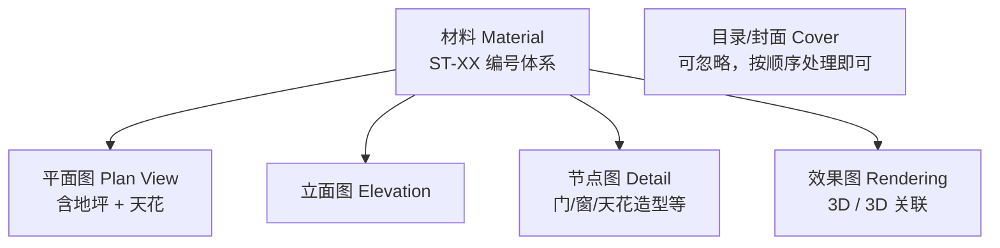
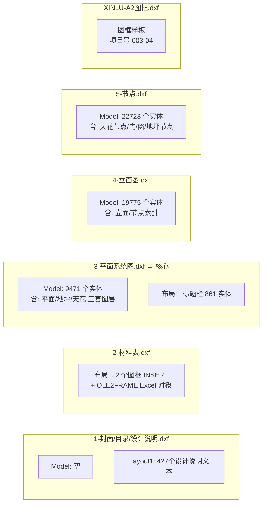
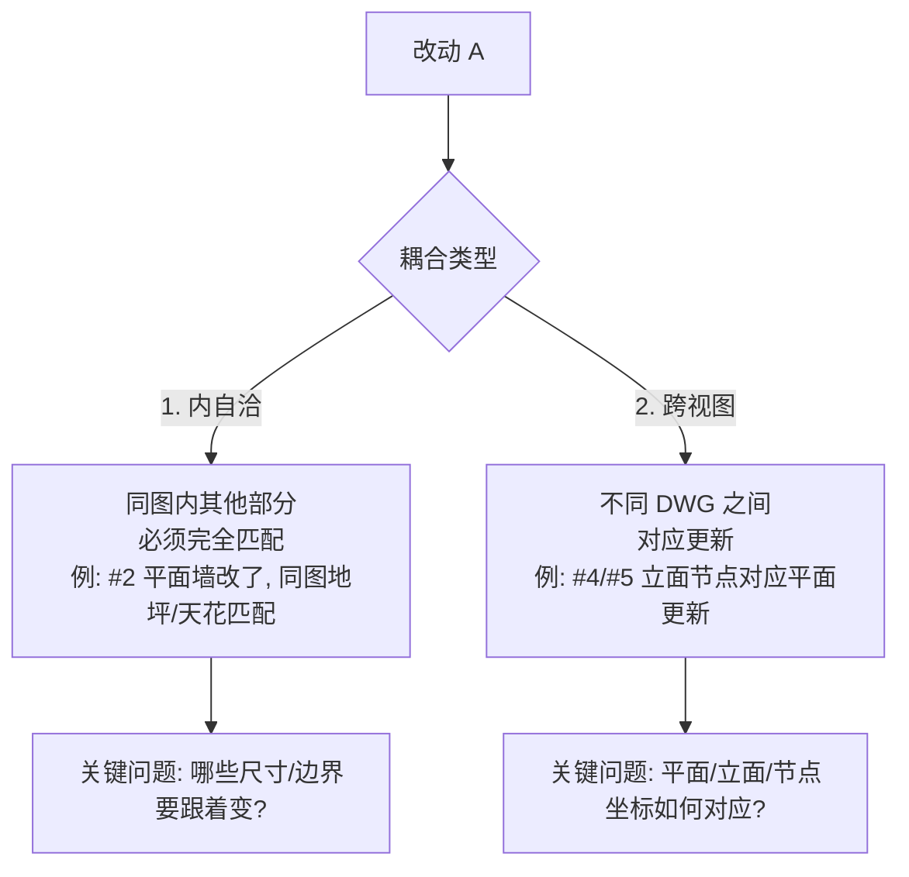
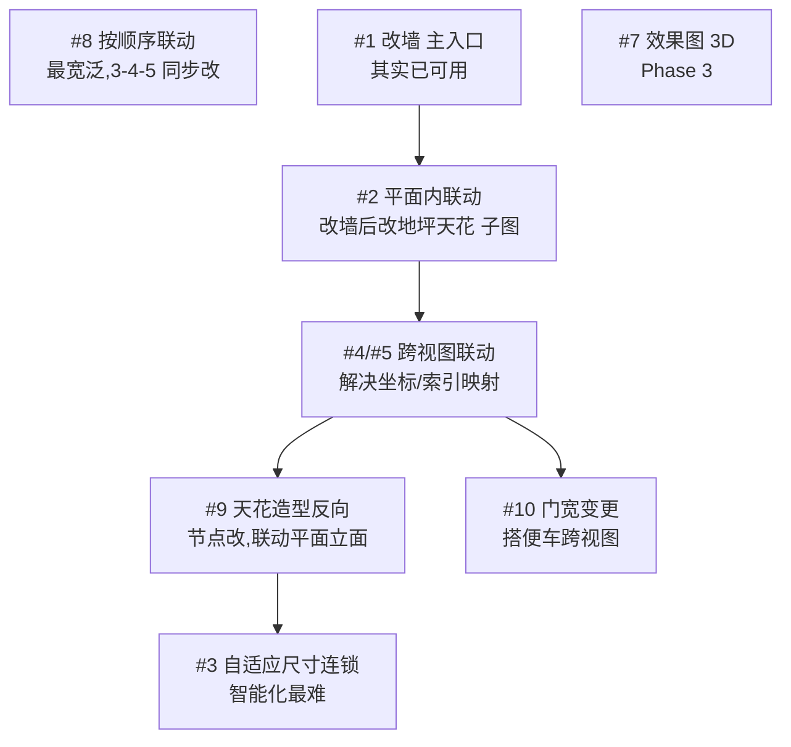

# 室内装修 DWG 知识图谱（含联动改造逻辑）

> **创建**：2026-08-09 04:30
> **关键事件**：用户提供基础认知（"目录/材料/平面/立面/节点"5 大要素），结合探查数据**重新建立了图纸内外正确关系**
> **意义**：本文档修正了 10 项任务分析里 5 处错误假设，给出正确的 2 步实施框架。

---

## 一、关键认知修正（推翻原假设）

### ❌→✅ 5 个误解 vs 真相

| 任务 | 我之前误解 | 实际理解（用户澄清 + 数据印证）|
|------|-----|-----|
| **#8** | 找"目录索引条目"（封面 Layout1 里翻） | **目录可忽略**！只需按顺序批量修改 3-平面/4-立面/5-节点 |
| **#2** | 找单独的"地坪.dwg"和"天花.dwg" | **不是单独文件！** 地坪/天花就是 **3-平面系统图.dxf 里的同名图层组** |
| **#9** | "天花节点"是 5-节点里某图层 | ✓ 在 **5-节点**里改，联动 3-平面 + 4-立面 |
| **#3** | DIMENSION 重算（孤立算法难题） | **2 类联动**：改墙引起**别的墙体尺寸连锁变化**（要完全匹配）|
| **#4/#5** | 立面节点对平面坐标对齐？ | **2 类联动**：改 A 引起**其他视图对应更新**（不是简单平移）|

---

## 二、知识图谱核心模型

### 2.1 5 大要素

### 2.2 5 大要素在 6 个 DWG 里的分布

---

## 三、图纸内部分类（实测数据）

### 3.1 **3-平面系统图.dxf**（最复杂，核心）

**Model 内含 3 套独立系统**（用户澄清 #2 的关键）：

| 系统 | 图层组 | 实体数 | 用途 |
|------|--------|------:|------|
| **平面**本体 | `A原建筑墙体`、`A原建筑外幕墙，门，窗`、`J活动家具`、`K插座` | ~8252 | 平面布置图 |
| **地坪**子图 | `F地坪分缝细线`(393)、`F地坪分缝粗线`(60)、`F地坪填充`、`S新铺地坪定位尺寸`(250)、`H地坪符号` | **751** | 地面铺装图 |
| **天花**子图 | `S天花灯具定位尺寸`(588)、`S天花造型定位尺寸`(211)、`C天花造型线`(112)、`C天花格栅细线`(84)、`L天灯`(602) | **1053** | 吊顶布置图 |

→ **#2 改墙后地坪天花顺改 = 在同一个 dxf 文件内**，平移/调整本文件里的"地坪组"和"天花组"图层里的对应实体。

### 3.2 **4-立面图.dxf**

- 主体：立面图层组 ~11,408 个实体
- 关键图层：`E-0.0立面线型`(2657)、`E天地墙完成面`(1775)、`2-Elevation-立面细线`(6524)
- 节点索引 `Z节点索引` 92 个（指向 5-节点 图）
- 含少量 `F地坪分缝细线`/`S天花造型定位尺寸`（立面图里表示地坪天花对接位置）

### 3.3 **5-节点.dxf**

- 主体：立面/淡显线（含节点表示）
- 含相关"地坪符号"(28)、"地面"(3)、"天花造型线"(1)、"天花造型定位尺寸"(21)
- 多种门（`D门` 804、`D门套`、`M门类-1/2`、`FF▲04 门-1`、`FF◆02 门套`）

### 3.4 **2-材料表.dxf**

- 只含 **2 个图框 INSERT + 1 个 OLE2FRAME**
- 材料表数据嵌在 OLE2（Excel）里 — **当前 ezdxf 无法解析**
- 任务 #6 已经在 3/4/5 图里把块属性的 ST-01 改了，但 **2-材料表里的 ST-01 可能还在 OLE 里**（无法处理）

### 3.5 **1-封面/目录/Layout1**

- Model 是空（只有图框 INSERT）
- Layout1 有 427 个 TEXT（全是设计说明 / 施工规范 / 材料燃烧性能等）
- **没有目录索引条目**（一次实测确认）
- **任务 #8 不找目录**，按顺序处理 3/4/5 即可

---

## 四、10 项任务的重新理解

### 4.1 新版任务定义

| # | 正确理解 | 涉及文件 | 涉及图层 |
|---|---------|---------|---------|
| #1 | 平面图改一堵墙（已完成 ✅）| 3-平面 | `A原建筑墙体` |
| #2 | **#1 完成后，在 3-平面 内修改"地坪子图"+"天花子图"对应部分** | 3-平面（内部!）| `F地坪`*、`S天花`*、`C天花`* |
| #3 | 改墙/改门窗引起其他墙尺寸连锁变化（**完全匹配**）| 多文件的关联尺寸 | 多组 `A原建筑墙体` |
| #4 | 改墙→更新立面（**对应视图更新**，非简单平移）| 4-立面 | `E天地墙完成面`、`E-0.0立面线型` |
| #5 | 改墙→更新节点（**对应视图更新**）| 5-节点 | `E-0.0立面线型`、`A原建筑墙体`（5 里也有 284 个） |
| #6 | ST-01 → ST-A（已完成 ✅）| 3/4/5（**注意 2-材料表的 OLE 没改**）| 标签 tag/value |
| #7 | 效果图 3D 同步 | 需 3D 数据 | 阻塞 |
| #8 | 按顺序批量改 3→4→5（不需要目录）| 3/4/5 顺序 | 任意 |
| #9 | **5-节点改天花节点 → 联动 3-平面 + 4-立面** | 5→3,4 | `C天花造型线`、`S天花造型定位尺寸` |
| #10 | 门宽变更引起其他视图更新 | 多文件 | `D门`、`A原建筑外幕墙，门，窗` |

### 4.2 "2 类联动"模型（用户关键的二分法）

---

## 五、关键问题清单（向用户请教前自检）

### 5.1 内自洽（#2 内部匹配）

| 问题 | 我的探查发现 | 待用户确认 |
|------|------|------|
| 3-平面的"地坪子图"在哪几个图层？ | `F地坪分缝细线`/`F地坪分缝粗线`/`F地坪填充`/`S新铺地坪定位尺寸`/`H地坪符号`（共 751 实体）| 这些是否是完整的"地坪子图"？还有别的吗？ |
| 3-平面的"天花子图"在哪几个图层？ | `S天花灯具定位尺寸`(588)、`S天花造型定位尺寸`(211)、`C天花造型线`(112)、`C天花格栅细线`(84)、`L天灯`(602)（共 1053 实体）| 是否遗漏？特别是 `L天灯` 算天花系统吗？ |
| 改墙后，地坪子图具体改啥？ | 墙线在 `A原建筑墙体`，会影响地坪分缝边界 | 是按"墙体边界平移后，地坪边界跟着平移"还是其他规则？ |

### 5.2 跨视图（#4/#5/#9 坐标对应）

| 问题 | 我的探查发现 | 待用户确认 |
|------|------|------|
| 平面图坐标 vs 立面图坐标是否对齐？ | 平面墙线 X 范围 [-218000, +211000]，立面墙线 Y 范围差异很大 | 是否各图独立参考系？ |
| 多个 layout 还是多个 DWG 的对应？ | 3/4/5 各自有 `Model + 布局/Layout1` | 跨图"对应"如何标识？ |
| `Z立面索引`(166 个 in 3-平面)、`Z节点索引`(69 个 in 3-平面) 是关联指针吗？ | 这两个图层在 3-平面 出现，里面是 INSERT | 是否蕴含"3-平面某位置→对应 5-节点哪个区域"的映射？|

---

## 六、修正后的实施 2 步法（用户原话提炼）

### Step 1: 建立图纸内部的知识图谱
- ✅ 已知：每张图的 layouts/layers 实体分布
- ✅ 已知：每个要素对应哪些图层
- ✅ 已知：什么是"地坪子图"、"天花子图"（含 5 个地坪图层 + 5 个天花图层）

### Step 2: 建立跨 DWG 的关系图谱
- ✅ 已知：5-节点里有指向地坪/天花的少量图层
- ✅ 已知：3-平面里有 `Z立面索引`/`Z节点索引` 指针 INSERT
- ❓ 未知：**坐标对应关系**（平面图的某段墙，对应立面图的哪根线？）
- ❓ 未知：**插入索引块**（Z立面索引 等）是否编码了对应关系

---

## 七、下一步实施路径（基于正确理解）

---

## 修订记录

| 版本 | 日期 | 变更 |
|------|------|------|
| v1 | 2026-08-09 04:30 | 创建：基于用户澄清（5 大要素 + 2 类联动）重写知识图谱，修正 5 处错误理解 |
