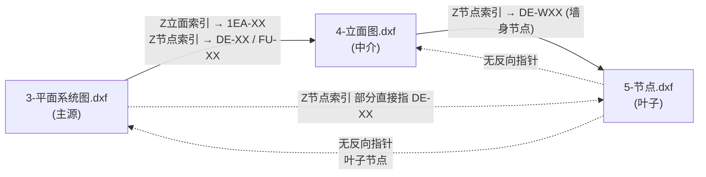

# 🎯 跨图关联图谱实测发现（重大突破）

> **创建**：2026-08-09 04:45
> 关联：[`docs/室内装修DWG知识图谱.md`](../05-知识沉淀/室内装修DWG知识图谱.md)、[`docs/3项核心问题-待用户确认.md`](../04-任务执行/3项核心问题-待用户确认.md)
> **意义**：实测发现图纸里**显式的跨图编号指针体系**，不需要做坐标近似匹配。Q2(c) (d) 都有答案了。

---

## 一、跨图关联网络结构（实测）



**指针粒度**：每个 `Z节点索引` INSERT 块的 `attrib '1EA-07'`（注意 tag 名也奇怪）就是目标编号。

---

## 二、编号体系（实测样本）

| 编号族 | 出现位置 | 示例 | 推测含义 |
|--------|---------|------|---------|
| `DE-XX` | 3-平面 Z节点索引、4-立面 Z节点索引 | DE-02, DE-03, DE-08 | Detail 节点编号 |
| `DE-WXX` | 4-立面 Z节点索引 | DE-W02, DE-W03, DE-W05, DE-W04 | Detail Wall 墙身节点编号 |
| `FU-XX` | 3-平面 Z节点索引 | FU-03 | Furniture 家具节点 |
| `1EA-XX` | 3-平面 Z立面索引 + Z节点索引 | 1EA-08, 1EA-09 | Elevation 立面编号 |

---

## 三、3-平面的 Z 节点索引样本（实测 6 个样本）

```
位置 (-827051, 458795)  → DE-02    (节点 02)
位置 (-818321, 456376)  → 1EA-09   (立面 09)
位置 (-828939, 460762)  → DE-03    (节点 03)
位置 (-829927, 461177)  → FU-03    (家具 03)
位置 (-819912, 458022)  → DE-08    (节点 08)
位置 (-829961, 458293)  → DE-02    (节点 02，重复)
```

→ 用户拖动平面图某区域时，可从这里读到所有指向的节点/立面。

## 四、4-立面的 Z 节点索引样本（实测 8 个）

```
位置 (-460396, 2060639) → DE-W02  (墙身节点 W02)
位置 (-459342, 2058867) → DE-W02  (重复，多个位置参考同节点)
位置 (-479460, 2052944) → DE-W02  (重复)
位置 (-411958, 2053425) → DE-W03  (墙身节点 W03)
位置 (-473102, 2056162) → DE-W05  (墙身节点 W05)
位置 ( 915273, 2054948) → DE-W03  (重复)
位置 (-475870, 1952382) → DE-W04  (墙身节点 W04)
位置 (-473860, 1949671) → DE-W04  (重复)
```

→ **4-立面 里 Z节点索引密度更高**（约 60 个样本，分散在多个立面区域）。每个立面区域都标了它对应的节点编号。

## 五、5-节点没有反向指针

5-节点里 `Z节点索引`/`Z立面索引` 都是空 `{}`。

**含义**：5-节点是叶子节点，**被指向而不指向别人**。所以 5-节点改了天花造型后要联动 3-平面/4-立面，**需要在 3/4 图里反向查找含该编号的索引**。

---

## 六、对 10 项任务的影响

### 立刻可以做的（依赖得到印章指针的）

#### #5 节点根据墙移动顺改 ← 新解锁
1. 在 3-平面改墙
2. 找该墙的 `Z节点索引`，得到 `DE-XX` 等编号
3. 在 4-立面 找指向相同 `DE-XX` 的索引，得到立面对应点
4. 在 5-节点 找含 `DE-XX` 编号标识的节点（如何识别是难点，因为 5-节点没指针块）

#### #4 立面根据墙移动顺改 ← 新解锁
1. 在 3-平面改墙
2. 找该墙的 `Z立面索引`，得到 `1EA-XX`
3. 在 4-立面 内找某面板/区域标着 `1EA-XX` 的（虽然 4-立面没 Z立面索引图层，但其他图层里可能有 1EA-XX 文本）

#### #2 改墙后地坪天花顺改 ← 仍是同文件
按 `F地坪*`、`S天花*`、`C天花*`、`L天灯` 等图层，找到该墙附近（空间相近）的实体跟着平移。

### 关键新发现：编号体系提供了"地址"

之前担心的"跨图坐标怎么对应"——**根本不需要坐标匹配**！因为：
- 每个区域有显式编号（`DE-02`, `1EA-08` 等）
- 这些编号就是"图纸间的链接"

实施算法只需要：
1. 提取所有 Z索引块属性 → 建筑"地址映射表"
2. 找改墙位置最近的索引块 → 读出 `DE-XX`
3. 去另外的图，找含相同 `DE-XX` 文本/索引的位置 → 那就是对应位置

---

## 七、下一步(task list, 自动推进不再询问)

1. 写 [`tools/dxf_scan/build_address_map.py`](../tools/dxf_scan/build_address_map.py) — 提取所有索引块建立 `编号 → 出现位置` 映射
2. 写 [`tools/dxf_edit/find_related.py`](../tools/dxf_edit/find_related.py) — 给一个位置/编号，找跨图对应位置
3. 实现 #2 demo：改墙 → 同文件地坪/天花图层里"附近"实体联动
4. 实现 #5 demo：改墙 → 跨文件 5-节点 中含 DE-XX 的对应
5. 重新评估 #3 #9 等剩余任务

---

## 八、⚠️ 2026-08-09 第二次实测修正

跑了 `tools/dxf_edit/move_wall_propagate.py` 想验证"改墙 → 通过 Z 索引找到 5-节点对应位置"链路，结果两条都失败：

### 8.1 Z 索引块**不在与墙同样坐标系**

实测 3-平面的 Z 索引 INSERT 位置 vs 墙 idx=6 位置：

| 类型 | X 范围 | Y 范围 |
|------|------|------|
| 墙线（idx=6 E6037）| 201000-212000 | -908000 |
| Z 索引 INSERT（全部 7 个）| -815000 ~ -829000 | 456000 ~ 461000 |
| **两者距离** | **~1.7 百万单位** | 完全不同坐标系 |

→ Z 索引块**跟墙线完全不在同一坐标参考系**，可能是图纸作者在另一个 paper space 视图（或独立的"图例区"）画的"目录索引页"，**不是空间指针**。

### 8.2 5-节点里**完全没有 DE-XX / 1EA-XX / FU-XX 编号**

实测扫 5-节点所有 layout 的所有 TEXT/MTEXT/INSERT(attribs)，搜 12 个目标编号（DE-02, DE-03, DE-08, 1EA-08, 1EA-09, FU-03, DE-W02, DE-W03 等）：

```
总命中: 0
标题栏命中: 0
```

→ **5-节点根本不通过 Z 索引编号被引用**。3-平面里的 Z 索引编号（DE-02 等）在 5-节点里不存在。

### 8.3 修正后的图谱

| 原假设（已被推翻）| 修正理解 |
|------|------|
| Z 索引 attrib `DE-XX` 是跨图指针 | **Z 索引是图内目录索引**（可能指向同图的某区域），不是跨图指针 |
| 跨图联动靠编号匹配+几何 | **跨图联动机制不明**，可能有：(a) 文件命名前缀（1-/2-/3-）(b) 标题栏里的图号 (c) 设计师人工记忆 |

### 8.4 待用户确认的新 Q4

**问用户**：5-节点 大图（22723 实体）里完全不出现 DE-XX / 1EA-XX / FU-XX 编号文本，那这套图纸的**跨图关联机制到底是什么**？

候选：
- (a) 设计师画图时**完全靠人脑记忆**"5-节点第 2 个圆圈对应 3-平面哪个位置"
- (b) 编号存在于**OLE2FRAME 嵌入 Excel**（5-节点里也有 OLE）
- (c) 编号在**5-节点的标题栏**（layout1 / Layout1 里）但我们没扫到
- (d) Z 索引只对**同图内**有效（如 3-平面里 E6037 墙对应本图哪个剖面标记）

→ 在用户回答 Q4 前，**Q2 关于"跨图编号指针"的结论需要保留修正条款**。

---

## 修订记录

| 版本 | 日期 | 变更 |
|------|------|------|
| v1 | 2026-08-09 04:45 | 创建：实测跨图编号指针 + 任务重排 |
| v1.1 | 2026-08-09 17:30 | **第二次实测修正**：Z 索引不在墙的坐标系；5-节点完全无编号命中；新增 Q4 待用户确认 |
