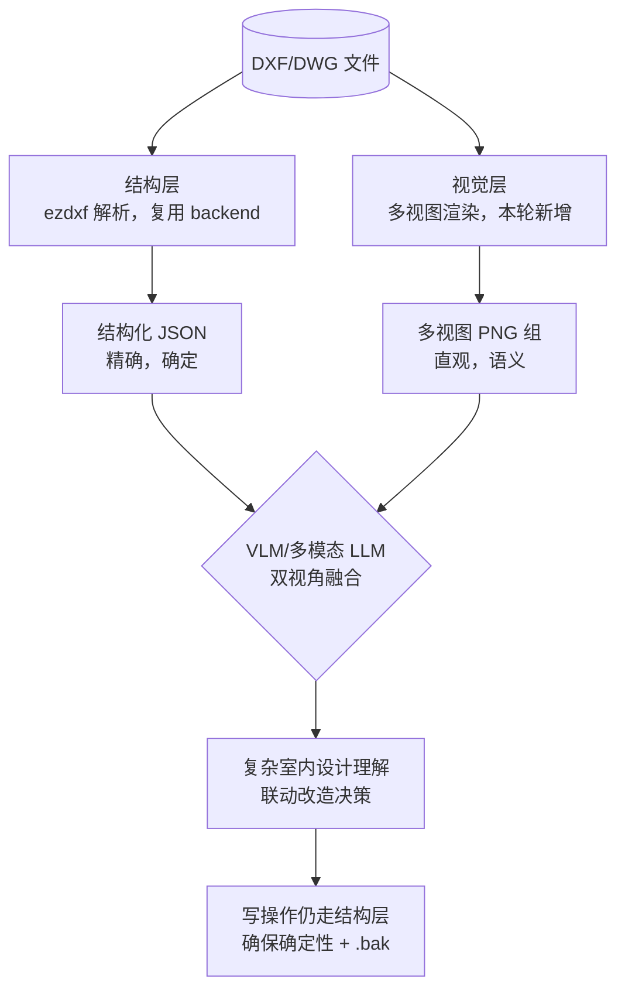
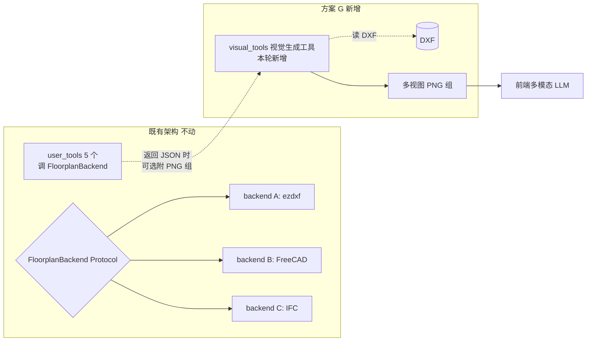

# 方案 G — 多模态双视角（结构 + 视觉）

> 🗄️ **本方案已归档（2026-08-09）**——见末尾"归档说明"。
> 继承方案：**方案 H — 视觉验证层（PDF 拆页 + 改前后对比）**（基于本方案的反证结论重做）
> 一句话归档原因：试图用 ezdxf 自渲的"几何视角"替代结构化 JSON，让 VLM 看 PNG 推断 CAD 结构——实测反证实验下视觉视角 0 分（几何细节太薄），方向错误。
> 真正的视觉价值不在"看图猜结构"而在"PDF 对照校验 + 改后验收"，见方案 H。

---

## 0. 为什么提这套方案

### 0.1 现状：所有方案（A/B/C/F）都是"单视角"

| 方案 | 数据中心 | 给 LLM 的表征 |
|------|---------|--------------|
| A (纯 ezdxf) | DXF 文件 | JSON + 一张整图 PNG |
| B (FreeCAD) | DXF/DWG | JSON + 一张整图 PNG |
| C (IFC/BIM) | IFC 模型 | JSON + 渲染 |
| F (容器化) | 同 B | 同 B |

**共性**：只用一个"结构通道"喂给 LLM（实体/图层/块的 JSON），可视化只是辅助确认。

### 0.2 单视角的真实瓶颈（来自 19-102 真实任务复盘）

`复盘-2026-08-09-DWG转换与图纸摸底.md` 里 10 项联动改造任务的结构-视觉价值分布：

| 任务 | 结构视角够不够 | 加视觉视角的价值 |
|------|--------------|---------------|
| #1 改一堵墙 | ✅ 够（LINE 端点改造） | 低 |
| **#2/#4/#5 平面→立面/节点顺改** | 🔴 **不够**：跨图语义联动靠块名/图层难判 | **高**：VLM 看"平面+立面并排"能直观看对应关系 |
| #3 墙体自动定位 | 🟡 部分 | 中 |
| **#6 ST-01→ST-A 跨图同步** | 🟡 能扫块属性，跨"封面/目录/材料表/平面/立面/节点"联动判断难 | **高**：材料表是表格+图块混合，VLM 读表格更强 |
| #7 效果图顺改（需 3D） | 🔴 不可能 | 高（属方案 C 范畴） |
| #8 插入新图→编号/目录顺改 | 🟡 | 中 |
| #10 门宽变更→立面顺改 | 🟡 | **高**：门在立面图上的样子，视觉匹配 > 块名匹配 |

**核心洞察**：最难的 #2/#4/#5/#6/#10 恰好是**"结构视角天然薄弱、视觉视角能补强"**的甜区。

### 0.3 为什么要"双视角"而不是"只走视觉"

| 能力 | 结构 JSON | VLM 视觉 |
|------|----------|---------|
| 精确尺寸/坐标 | ✅ 毫米级 | 🔴 像素量不准 |
| 确定性增删改（写操作） | ✅ 100% 可控 | 🔴 VLM 写代码不可靠 |
| 跨图语义关联（哪堵墙→哪个立面） | 🟡 块名+图层启发式，易漏 | 🟢 人眼级直观 |
| 表格/混合内容读取（材料表） | 🔴 块属性碎片化 | 🟢 整体性强 |
| 异常/风格识别（"这是简欧风格"） | 🔴 无字段 | 🟢 强 |
| 密集图纸细节 | ✅ 全量实体可遍历 | 🟡 拥挤，需分图层/分区域放大 |

→ **正确的分工**：视觉做"**理解 / 关联 / 异常发现**"，结构做"**精确数值 / 确定性操作**"。两各司其职，互为兜底。

---

## 1. 关键认知：DWG 是 2D，"3D 视角"分 4 个梯度

用户原始描述"结合 3D 的视角"，落地时按成本从低到高其实是 4 件不同的事：

| 梯度 | 做法 | 成本 | 适合解决的问题 |
|------|------|------|--------------|
| **G1 多视图渲染** | 不动数据，按图层/房间/区域/跨图并排，多种角度渲染 PNG 喂 VLM | **极低**（扩展现有 `renderer.py`） | 跨图关联、空间关系、密集图分块 |
| **G2 伪 3D / 2.5D 挤出** | 检测到的墙挤出 2.7m、门窗挖洞、家具放定向 box，渲等轴/透视 | 中（要写挤出启发式 + 3D 渲染器） | 体积感、家具空间关系 |
| **G3 直接喂原始栅格图** | 整张 DWG 高分辨率栅格化，让 VLM 像人一样"看图" | **极低** | 结构化解析漏掉的东西（如图标识别厨房） |
| **G4 真 BIM 重建** | ezdxf→IFC→IfcOpenShell 渲染真 3D | 高（即 `方案-C-BIM.md` Phase 3 本体） | 真 3D / 语义化 / 标准化 |

> **🚨 重要澄清**：你提的方向与 `方案-C-BIM.md` 不是一回事。
> 方案 C 是"**重塑数据模型**"（IFC 当 single source of truth，DWG 只是输出视图）。
> 方案 G 是"**丰富喂给 VLM 的表征**"——G1/G3 几乎零成本就能做，根本不需要碰 IFC。
> 方案 G 的 G4 梯度才会复用方案 C 的能力。

**本文先落地 G1 + G3**（成本最低，可立即验证），G2 列为 Phase 2 探索，G4 留给方案 C。

---

## 2. 方案 G 的核心思想：双视角表征



**两个不变式（守护整个方案）**：
1. **结构层永远是真源**（source of truth）。视觉只是辅助理解，不放数据。
2. **所有写操作（add/move/delete）必须走结构层**，不能用 VLM 直接画图。视觉只读。

---

## 3. 与现有架构的关系：正交叠加层，不替换



**实现层面**：方案 G 给既有 5 个 user_tool 增加一个可选参数 `enhance_with_vision=False`。前端 LLM 可以在调用时打开它，工具就会在返回 JSON 的同时，调用 `visual_tools` 旁路生成一组针对性 PNG，路径随 JSON 一起返回。

**对 backend 0 改动**——视觉层只直接读 DXF（`ezdxf.readfile`），不依赖任何 backend 实现。

---

## 4. 视觉图层（visual_tools）的设计

### 4.1 六类视图（覆盖 G1 + G3）

| 视图类型 | 用途 | 实现成本 | MVP 优先级 |
|---------|------|---------|-----------|
| **V1 全图概览** | 整张图栅格化（G3） | 极低 | P0 |
| **V2 分图层视图** | 按"原建筑墙体/门窗/家具/标注"分别渲染，减噪音 | 低 | P0 |
| **V3 跨图并排** | 平面+立面同尺寸并排，让 VLM "看对应关系" | 低 | P0 |
| **V4 局部放大** | 指定区域（bbox 或图层并集）高分辨率裁剪 | 低 | P1 |
| **V5 元数据叠加** | 渲染时在实体上画房间名/面积/块名标签 | 中 | P1 |
| **V6 时间轴对比** | 改前/改后并排（配 `.bak` 机制） | 低 | P1 |

### 4.2 渲染管线（**2026-08-09 实测后的关键修正**）

> 🔴 **重要转折**：原计划复用 `cad_tools.archived/renderer.py`（基于 ezdxf Frontend + MatplotlibBackend），**实测不可用**。设计文档同时已更新 §6 风险表将此风险升级为已证见底。

#### 实测数据（平面图 9471 实体）

| 渲染路径 | 一张图耗时 | 文件大小 | 结论 |
|---------|----------|---------|------|
| ezdxf Frontend + MatplotlibBackend | **280 秒** | 10 KB（**空图**） | ❌ autoscale 被一个 z=7.8e98 的退化实体破坏；patch 转换为 O(n) 过重 |
| ezdxf Frontend + SVGBackend | 160 秒 | 256 MB（**元余备手**） | ❌ SVG 把每实体转千百个 path，文件大 |
| **绕开 Frontend，原生 LineCollection 直渲（采用）** | **10 秒** | 17-47 KB | ✅ 仅 LINE 类实体，手设 bbox 绕开退化实体 |

#### 根因

1. ezdxf `Frontend.draw_layout()` 把每个实体转成 matplotlib patch 对象，复杂度 O(n) 峰高；9471 实体上是 233s。
2. `ax.autoscale()` 量 bbox 时遇到 1 个 z=7.8e98 退化实体（全图 extents 直接乱），viewport 退化为 1 像素。
3. SVGBackend 同样受 `draw_layout` 拖拽，加上 SVG 文本冗余，文件 256MB。

#### 采用的渲染管线（`tools/visual/render_views.py`）

```python
def collect_line_segs(layout, layer_filter=None) -> dict[str, list]:
    """从 layout 抽 LINE/LWPOLYLINE/POLYLINE 实体"""
    out = {}
    for e in layout:
        layer = e.dxf.layer
        if layer_filter and layer not in layer_filter:
            continue
        et = e.dxftype()
        if et == "LINE":
            out.setdefault(layer, []).append(
                ((e.dxf.start.x, e.dxf.start.y),
                 (e.dxf.end.x,   e.dxf.end.y)))
        elif et in ("LWPOLYLINE", "POLYLINE"):
            # 转成段
            ...
    return out

# matplotlib 原生 LineCollection，每层一个
from matplotlib.collections import LineCollection
lc = LineCollection(segs, linewidths=1.2, color=color)
ax.add_collection(lc)
ax.set_xlim(x0, x1); ax.set_ylim(y0, y1)  # 手设 bbox，不用 autoscale
```

**代价**：只渲染 LINE 类实体（文字/填充/标注不显示）。
**适用面**：反证实验的“墙体门窗在跨图上的对应关系”任务 100% 够用；平面/立面/节点的墙门窗都是 LINE/INSERT，主体是后退一步的。
**不适用的任务**：读 TEXT/MTEXT、处理 HATCH 填充——若需要可后期补一层 ezdxf 原生渲染与当前叠加（代价成本另算）。

#### 两个不变细节（来自 memory）

- 分图层视图必须用**完整词匹配**（不能短前缀关键词，否则 `D_` 会命中 `BED_1800`）
- 렌더不需要调 `saveas()`，所以 materials.get("ByLayer") AttributeError 不存在（参见 memory `dwg-to-dxf-conversion`，仅在写回时才出现）

### 4.3 跨图并排（V3）的关键技巧

让 VLM 看跨图关联的核心，是**比例对齐**：

```python
def side_by_side(dxf_paths, out, scale="auto"):
    # 1. 各图分别渲，记下 bbox 和 figsize
    # 2. 选共同标尺（如都按实际毫米/像素比例）
    #    —— 关键：平面/立面/节点比例不同（平面 1:100，节点 1:20），
    #       并排时按"实际尺寸"对齐，让 VLM 看到真实空间关系
    # 3. matplotlib subplot 横向拼接，每张下方标注文件名+视图类型
```

---

## 5. 实施路径

### Phase G-0：反证实验（半天，**本方案的前置阻断**）

**目标**：证明 VLM 能看懂 19-102 这种 CAD 渲染图，否则方案 G 作废。

**做法**（详见 §7）：
1. 用 `tools/visual/render_views.py`（本轮先写最小版）渲出平面+立面+材料表各一张 PNG
2. 把图 + 任务 #2 描述，**直接丢给任意多模态前端**（Claude.ai / ChatGPT / Gemini），不接 MCP
3. 看它能否：(a) 指认立面图里哪段对应平面图那堵墙  (b) 说出改墙后立面该跟着改什么

**通过判据**：(a)+(b) 都达成 → 进入 Phase G-1
**未通过处理**：方案 G 作废，继续纯结构路线（不浪费工程投入）

### Phase G-1：MVP 集成（2-3 天）

- `tools/visual/render_views.py` 完整 V1 + V2 + V3
- `tools/floorplan_tools.py` 的 5 个 user_tool 新增 `enhance_with_vision` 参数
- 工具返回 JSON 时附 `vision_pack: [{type, png_path, caption}]`
- 端到端跑通：前端问任务 #6（ST-01→ST-A 跨图同步），看视觉+结构双通道是否比纯结构好

### Phase G-2：扩展（看 G-1 反馈）

- V4 局部放大 + V5 元数据叠加
- G2 伪 3D 挤出（视需要）
- 性能优化（缓存渲染结果）

---

## 6. 风险与边界（必须诚实标注）

| 风险 | 评级 | 说明 / 缓解 |
|------|------|-----------|
| **VLM 读 CAD 渲染图系统性差** | 🔴 高（未知） | **Phase G-0 反证实验就是干这个的**——通过率不达预期就作废 |
| **VLM 读精确尺寸不可靠** | 🟢 已设计规避 | 写操作永远走结构层，视觉只做理解 |
| **多视图 token 成本上升** | 🟡 中 | 每查询多渲 N 张图 + 多 image token。但"理解复杂设计"是高价值低频操作，可接受 |
| **🔴 ezdxf Frontend 渲染大图不可用**（已证） | 🟢 已解决 | 实测 9471 实体 = 280s + 10KB 空图。改用 LineCollection 直渲，10s/张；代价仅丢 TEXT/HATCH，反证任务足够（详见 §4.2） |
| **渲染出的 PNG 太糊 VLM 看不清** | 🟡 中 | 单图几千实体栅格化必然糊——所以才有 G1 分图层/分区域的 V2/V4 视图 |
| **G2 伪 3D 启发式不准** | 🟡 中（G2 后期） | 本轮不做（Phase G-2 探索） |
| **方案 C/G4 范围冲突** | 🟢 无 | 本轮只做 G1+G3，明确不动 IFC，与方案 C 并行不冲突 |

**与既有方案的兼容边界**（守护不破）：
- 既有 `FloorplanBackend` 接口 **0 改动**
- 既有 5 个 user_tool 的签名 **不破坏**（`enhance_with_vision` 是可选参数，默认 `False`）
- 既有 PNG 在前端的展示机制（bind mount 路径返回）**复用**——视觉层只是多产几张 PNG 走同一路径

---

## 7. 反证实验设计（Phase G-0，立即执行）

> 本节是写完设计文档后**立即交付**的实验，目的是决定方案 G 是否值得继续做。

### 7.1 实验对照组

| 组 | 输入 |
|----|------|
| **A. 单结构** | `3-平面系统图.dxf` 的结构 JSON + 任务描述 |
| **B. 单视觉（V1 全图）** | `3-平面系统图.png` + 任务描述 |
| **C. 视觉+视觉（V3 跨图并排）** | 平面+立面并排 PNG + 任务描述 |
| **D. 结构+视觉（双视角）** | 结构 JSON + 跨图 PNG + 任务描述 |

→ 对比 4 组在任务 #2（平面改墙→立面顺改）上的完成质量，证明/证伪视觉的边际价值。

### 7.2 输入素材（已有，0 转换成本）

18 MB DWG → 134 MB DXF 已就绪（memory `dwg-to-dxf-conversion`）：

| 素材 | 路径 |
|------|------|
| 平面图 | `workdir/19-102/dxf/3-19-102平面系统图.dxf` |
| 立面图 | `workdir/19-102/dxf/4-19-102立面图.dxf` |
| 材料表 | `workdir/19-102/dxf/2-19-102材料表.dxf` |
| 任务描述 | `samples/19-102/任务-要求.txt` 的 #2 |

### 7.3 判据（量化）

对任务 #2，每个被测前端（Claude / ChatGPT / Gemini 三选一）回答 3 个子问题，各 0-3 分：

1. **关联指认**：能否在立面图上指出对应平面那堵墙的位置？
2. **改动推演**：能否说出"墙移动后，立面图的哪条线/哪个标注要跟着动"？
3. **方案可行性**：给的顺改步骤是否符合 CAD 实操逻辑（不是瞎编）？

- D 组（双视角）总分明显 > A 组（单结构）≥ 3 分 → 方案 G **成立**
- D 组 ≈ A 组 → 方案 G **作废**，省下工程投入

---

## 8. 与既有方案文档的对照表

| 维度 | A 纯 ezdxf | B FreeCAD | C IFC/BIM | **G 多模态（本文）** |
|------|-----------|----------|----------|-------------------|
| 数据中心 | DXF | DXF/DWG | **IFC** | DXF（不动） |
| 给 LLM 的表征 | JSON + 1 PNG | JSON + 1 PNG | JSON + 渲染 | **JSON + 多视图 PNG 组** |
| 3D 联动 | ❌ | 🟡 受限 | 🟢 原生 | 🟡 仅 G2/G4 梯度 |
| 跨平台 | ✅ | 🟡 entry 需改 | ✅ | ✅（纯 ezdxf 渲染） |
| 开发成本 | 低 | 中 | 高 | **低（G1+G3）** |
| 替代关系 | — | — | — | **正交叠加，不替代任何** |

---

## 9. 开放问题（待 Phase G-0 后决策）

1. 视觉层的 PNG 应该**预渲染缓存**（按 DXF 文件 hash），还是**按需渲染**？
2. 跨图并排的"比例对齐"规则——按实际毫米，还是按各自图纸比例？
3. 如果反证实验证明 VLM 能读，是否要顺手做一个小数据集微调/评测（针对中文装修图）？
4. G2 伪 3D 挤出值得做吗？还是直接跳 G4（接方案 C 的 IFC）？

这些都不在本轮决策范围，等 Phase G-0 结果出来再回头定。
