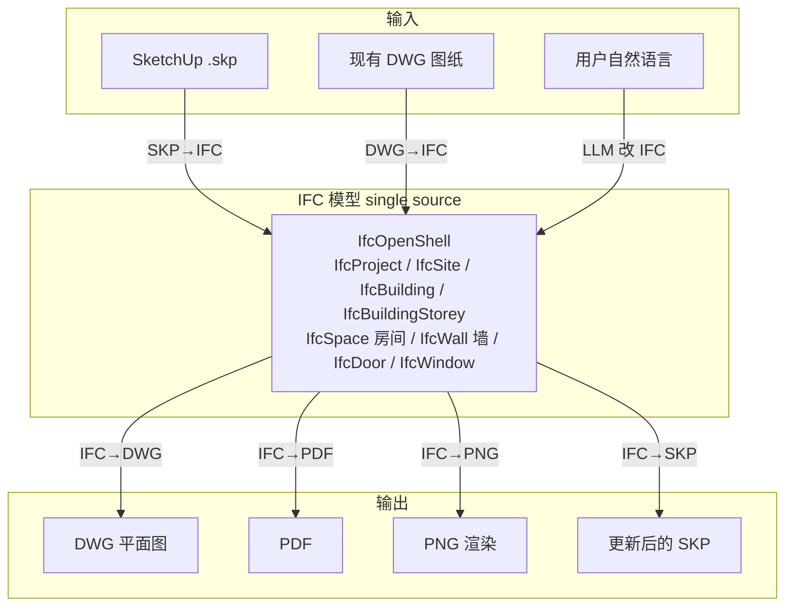
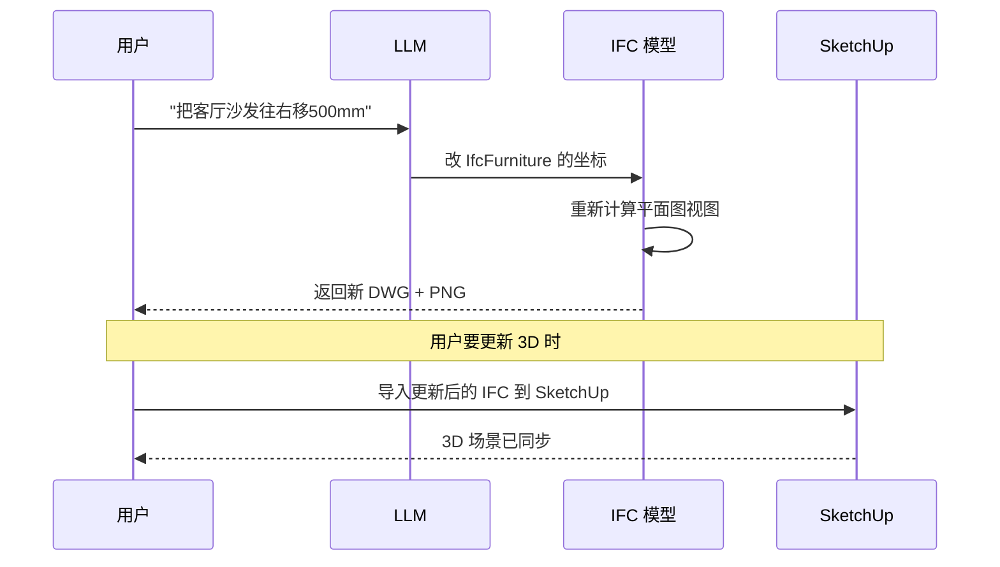
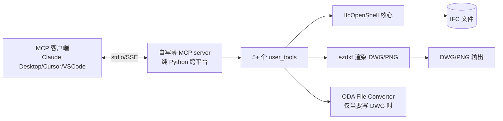
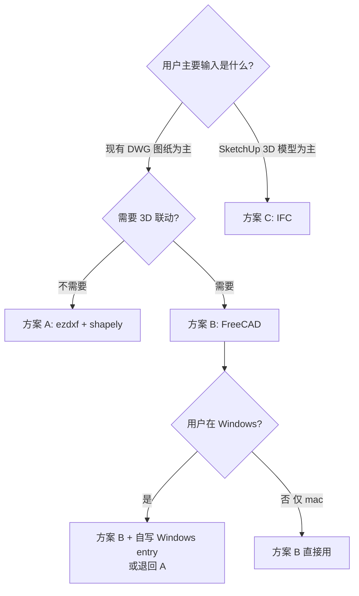

# 方案 C — BIM 原生路径（基于 IFC + SketchUp 联动）

> ⏸️ **此文档作 Phase 3 阶段参考保留**（非 MVP 范围，也未被取代）。
> 当前 MVP 架构权威：`方案-F-容器化.md` → `方案-F2-*.md` → `产品Spec.md` v1.1。
> 当 3D 模型联动需求落地（用户已用 SketchUp Pro）时，从本份接续设计 IFC 后端。

> **文档关系**：与 `方案-v3-final.md`（方案 B：FreeCAD+ezdxf）并列的**第三套对比方案**。本方案刻意走完全不同的技术范式，作为对比和备选。
> **日期**：2026-08-08
> **触发本方案的两个新输入**：
> 1. 用户环境 = **Windows + macOS**（必须明确双平台支持）
> 2. 新需求 = **3D 模型联动**（SketchUp 输入 → CAD 输出；3D 改 → CAD 跟改）

---

## 0. 为什么需要这第三套方案（与 A/B 的根本不同）

| 维度 | 方案 A (v1) | 方案 B (v3) | **方案 C（本文）** |
|------|-----------|------------|----------------|
| 核心范式 | 2D DXF 操作 | 2D DXF + FreeCAD BIM | **BIM 数据模型（IFC）原生** |
| 数据中心 | DXF 文件 | DXF/DWG 文件 | **IFC 模型**（DWG 只是导出的视图） |
| 3D 联动 | ❌ 不支持 | ⚠️ FreeCAD 能读 3D 但非本职 | ✅ **一等公民**（IFC 本来就是 BIM 标） |
| SketchUp 接入 | ❌ | ⚠️ 需插件 | ✅ **SKP→IFC 是标准工作流** |
| 房间识别 | 自研算法 | Arch Space | **IfcSpace 一等对象** |
| 跨平台依赖 | ezdxf（纯 Python，跨平台天然 OK） | FreeCAD+freecad-ai（**Windows/macOS 官方未验证**） | **纯 Python（IfcOpenShell）→ 跨平台天然 OK** |

**核心洞察**：如果 3D 联动是真需求，那么"DWG 当数据源"本身就是错的——DWG 是 2D 图纸，不是 BIM 模型。正确做法是 **IFC 当 single source of truth，DWG/SKP 都是它的输入或输出视图**。这是本方案与 A/B 的根本分野。

---

## 1. 跨平台支持矩阵（用户明确要求双平台，先验证）

### 1.1 各方案在 Windows + macOS 的真实支持度

| 组件 | Windows | macOS | 说明 |
|------|---------|-------|------|
| **ezdxf**（纯 Python） | ✅ `pip install` | ✅ `pip install` | 无系统依赖，**A/C 共享部分跨平台无忧** |
| **matplotlib** | ✅ | ✅ | 同上 |
| **ODA File Converter** | ✅ 官方 .exe | ✅ 官方 .dmg | 但 macOS 需手动放行 Gatekeeper |
| **shapely** | ✅ 预编译 wheel | ✅ 预编译 wheel | A 备选/C 用 |
| **IfcOpenShell** | ✅ conda/pip wheel | ✅ conda/pip wheel | C 核心，纯 Python+ C 内核预编译 |
| **FreeCAD** | ✅ 官方 .msi | ✅ 官方 .dmg | 双平台都有安装包 |
| **freecad-ai**（关键！） | ⚠️ **官方声明未验证** | ⚠️ **官方声明未验证** | README 原文："developed and tested on Linux... macOS/Windows have not been verified" |
| **freecad-ai entry 脚本** | 🔴 **跑不通** | 🟡 需改造 | 用 `bash -c "exec 3>&1 ..."` + AppImage，**Windows 完全没有 bash/AppImage** |

### 1.2 方案 B 的跨平台真实结论（必须诚实）

我实读了 `freecad-ai/mcp_server_entry.py` 和 README：

```python
# freecad-ai 的官方启动方式（README）：
"command": "bash",
"args": ["-c", "exec 3>&1 1>&2 && /path/to/FreeCAD.AppImage -c .../mcp_server_entry.py"]
```

这是 **Linux 专属**：
- AppImage 是 Linux 格式（Windows 用 .msi、macOS 用 .app）
- `bash` + `exec 3>&1 1>&2` fd 重定向在 Windows 命令行不存在
- `os.fstat(3)` 的 fd 3 套路依赖 bash 提前 save

**所以 v3（方案 B）在 Windows 上不能拿来即用**，需要自己写 Windows 版 entry。这是 B 的隐藏成本，必须在三方案对比里说清楚。

### 1.3 方案 C 的跨平台结论

IfCOpenShell 是纯 Python 包（pip/conda 装预编译 wheel），**Windows/macOS 都开箱即用**，没有 fd 重定向、bash、AppImage、GUI 工作台这些坑。**这是 C 在双平台上的结构性优势。**

---

## 2. 方案 C 的核心思想

### 2.1 IFC 作为 single source of truth



**关键**：DWG 不再是数据源，而是 IFC 模型的一种**视图输出**。3D 改了就是改 IFC，所有 2D 视图自动重新生成。这天然解决了"3D 改 → CAD 跟改"。

### 2.2 SketchUp 联动的工作流

SketchUp 到 IFC 的转化路径（按可行性排序）：

| 路径 | 可行性 | 说明 |
|------|--------|------|
| **SketchUp Pro 原生 IFC 导出** | ✅ 最稳 | SU Pro ≥2017 直接 `File → Export → IFC`，导出含 IfcWall/IfcSpace 语义（前提：用户在 SU 里用了正确的"分类"/"标签"） |
| SketchUp → COLLADA(.dae) → IFC | 🟡 备选 | SU 免费版也能导 DAE，但丢语义（只剩几何），需重建语义 |
| SketchUp → DWG → IFC | 🟡 备选 | SU Pro 能导 DWG，再 DWG→IFC，链路长 |
| 直接解析 .skp | 🔴 不行 | .skp 是闭源格式，无稳定开源解析器 |

**结论**：方案 C 的 SketchUp 联动**要求用户用 SketchUp Pro**（带 IFC 导出）。这是 C 的约束，用成本换来的标准性。

### 2.3 反向联动（CAD 改 → 更新 3D）



**诚实标注**：CAD→SKP 的"自动实时同步"几乎不可能做到（SketchUp 不暴露可被外部触发的 import API）。实际上**是"导出新版 IFC，用户手动在 SU 里重新导入"**，或保持 SU 长开 + 监听文件变化。这种半自动是 SU 联动的真实形态，不能给用户画"全自动"的饼。

---

## 3. 方案 C 技术栈



### 3.1 组件清单

| 组件 | 选型 | 跨平台 | 角色 |
|------|------|--------|------|
| MCP 运行时 | **自写薄 server**（参考 freecad-ai `StdioServerTransport` 结构，自己写） | ✅ 纯 Python | 工具暴露 |
| BIM 数据引擎 | **IfcOpenShell**（`pip install ifcopenshell`） | ✅ 预编译 wheel | 读/写/改 IFC |
| IFC→2D 图 | **ezdxf**（从 IFC 几何生成 DXF） | ✅ | DWG/PNG 输出 |
| DWG 写 | ODA File Converter | ✅ 双平台 | DWG 格式化 |
| SKP→IFC | **SketchUp Pro 原生导出**（不解析 .skp） | ✅ SU Pro 双平台 | 3D 输入 |
| 几何/渲染复用 | v1 `geometry.py`、`renderer.py`（修 bug） | ✅ | 共享 |

### 3.2 自写薄 MCP server 的合理性

方案 B 复用 freecad-ai 是为了省 MCP 运行时。但 **freecad-ai 的 Windows/macOS 未验证 + entry 是 Linux 专属**——在双平台场景下，复用收益打折。

而 MCP over stdio 的协议本身公开简单（JSON-RPC 2.0 on stdin/stdout），自写一个最小 server 约 150 行（我实读过 freecad-ai 的 `transport.py`，结构清晰）。**方案 C 自写薄 server 反而比"复用 + 双平台改造"省事。**

> ⚠️ 合规：不直接复制 freecad-ai 的代码（LGPL v2.1）。MCP over stdio 是公开协议，按结构自己写不构成衍生。

---

## 4. 三方案并排对比（决策核心）

| 维度 | A. 纯 ezdxf (v1) | B. FreeCAD+freecad-ai (v3) | **C. IFC + IfcOpenShell (本文)** |
|------|-----------------|--------------------------|------------------------------|
| **Windows 支持** | ✅ 天然 | ⚠️ freecad-ai entry 需自改 | ✅ **天然** |
| **macOS 支持** | ✅ 天然 | ⚠️ entry 需适配 .app | ✅ **天然** |
| **2D DWG 装修图读取** | ✅ 直读 | ✅ FreeCAD importDWG | 🟡 DWG→IFC 多一步转换 |
| **2D 房间识别** | 🔴 自研 planar-graph | 🟢 Arch Space | 🟢 IfcSpace 一等对象 |
| **3D 模型联动** | 🔴 **不支持** | ⚠️ FreeCAD 能读但非本职 | 🟢 **IFC 原生设计** |
| **SketchUp 接入** | 🔴 不支持 | ⚠️ 需插件转 | 🟢 SU Pro 原生导 IFC（需 Pro） |
| **CAD↔3D 一致性** | N/A | ⚠️ 双向同步难 | 🟢 IFC ssot，自动一致 |
| **DWG 输出保真度** | 🟡 LibreDWG 差 / ODA 好 | 🟡 同 A | 🟡 需 IFC→DXF→DWG |
| **既有 DWG 改造** | 🟢 直改 | 🟢 直接工作 | 🔴 **差**（要先 DWG→IFC 建模，回填难） |
| **依赖商业软件** | 仅 ODA 免费 | 仅 ODA 免费 | ODA + **SketchUp Pro（付费）** |
| **学习/开发成本** | 低 | 中 | **高**（IFC 数据模型陡） |
| **LLM 对 API 熟悉度** | 高（ezdxf 声明式） | 中（FreeCAD API 大） | **低**（IfcOpenShell 文档偏专业） |
| **未来标准化** | DXF 事实 | DXF/DWG/IFC | 🟢 **IFC 是 ISO 16739 国际标准** |
| **适合的团队** | 个人/快速 | 平衡 | **专业 BIM 团队/长期产品** |

### 4.1 决策建议（按场景）



**对当前用户的建议**：
- 如果 **3D 联动是硬需求** + 用户用 SketchUp Pro → **方案 C**（虽开发重，但范式对）
- 如果 3D 联动只是"未来可能" → **方案 B**（先 2D，预留 IFC 扩展接口）
- 如果**既有 DWG 改造为主**且 3D 不一定要 → **方案 A** 最省

---

## 5. 三方案的"风险错峰"——为什么要并存三套

三套方案不是冗余，而是**覆盖不同的失败模式**：

| 失败模式 | A 兜底 | B 兜底 | C 兜底 |
|---------|-------|-------|-------|
| 房间识别算法不准 | — | 🟢 Arch Space | 🟢 IfcSpace |
| freecad-ai Windows 跑不通 | 🟢 不依赖它 | — | 🟢 不依赖它 |
| FreeCAD 嵌入 Python 与 ezdxf 冲突 | 🟢 独立进程 | — | 🟢 纯系统 Python |
| 3D 联动做不了 | 🔴 也不行 | 🟡 受限 | — |
| 既有 DWG 改造回填难 | — | 🟢 直改 | 🔴 自身短板 |
| 长期标准化/可移植 | 🔴 DXF 专用 | 🟡 | 🟢 IFC 标准 |

**关键洞察**：C 的短板正好是 A/B 的长板（既有 DWG 直改），C 的长板正好是 A/B 的短板（3D 联动 + 跨平台天然）。**三套并存是合理的风险覆盖，不是过度设计。**

---

## 6. 统一抽象层：让三套可切换（复用 v3 的设计）

借鉴方案 B 接口设计的思路，三套方案可以共享一个 `FloorplanBackend` 接口，只是 IFC 后端多两个方法：

```python
# shared/floorplan_backend.py（升级版，三套共用接口）
from typing import Protocol

class FloorplanBackend(Protocol):
    """装修图后端接口。A/B/C 三套都是该接口的实现。"""

    # ─── 2D 能力（A/B/C 都支持）───
    def read(self, path: str) -> dict: ...
    def list_rooms(self, path: str) -> list[dict]: ...
    def move_entity(self, path, handle, dx, dy, auto_backup=True) -> dict: ...
    def render_preview(self, path, output_png, highlight=None) -> str: ...
    def export_dwg(self, path, output_dwg, acad_version="ACAD2018") -> str: ...

    # ─── 3D 联动能力（仅 C 支持，接口可选）───
    def has_3d_support(self) -> bool:
        return False  # A/B 默认不支持

    def import_3d_model(self, model_path: str) -> dict:
        """从 SketchUp IFC 导入，建立/更新 IFC 模型。仅 C 实现。"""
        raise NotImplementedError("此后端不支持 3D 联动")

    def sync_to_3d(self, ifc_path: str, target_skp: str) -> dict:
        """反向同步到 SketchUp。仅 C 实现。"""
        raise NotImplementedError
```

```python
# shared/__init__.py
import os
def get_backend() -> FloorplanBackend:
    choice = os.getenv("FLOORPLAN_BACKEND", "freecad").lower()
    if choice == "ezdxf":
        from backends.ezdxf_backend import EzdxfBackend
        return EzdxfBackend()
    elif choice == "ifc":
        from backends.ifc_backend import IfcBackend
        return IfcBackend()
    # 默认 B
    from backends.freecad_backend import FreeCADBackend
    return FreeCADBackend()
```

**user_tools 不感知后端是 A/B/C**，只在调用 3D 方法前 `if backend.has_3d_support()` 判断。

---

## 7. 方案 C 的实施路径（如选中）

### Phase 0：假设验证（半天，前置阻断）

需要样本：1 个 SketchUp Pro 导出的 IFC 文件 + 1 个真实装修 DWG。

验证：
1. IfcOpenShell 读 IFC → 能否拿到结构化的 IfcSpace/IfcWall/IfcDoor
2. DWG → IFC 转换路径的语义损失（这是 C 最贵的假设）
3. IFC → DXF → DWG 反向输出保真度

### Phase 1：MVP（5-7 天，比 B 重）

- 薄 MCP server（150 行）
- `IfcBackend` 实现 `FloorplanBackend`（含 3D 方法）
- IFC→DXF 2D 视图生成（核心难点）
- user_tools 5 个
- 双平台（Win/mac）各跑一遍端到端

### Phase 2+：SKP 联动工程化

- SU Pro IFC 导入导出的标准工作流文档
- 文件变化监听（半自动同步）
- 双向语义映射（SU 标签 ↔ IfcWall/IfcFurniture）

---

## 8. 综合风险表（A/B/C 三套）

| 风险 | A | B | C |
|------|---|---|---|
| 跨平台天然 | 🟢 | 🔴 Windows 改造 | 🟢 |
| 3D 联动 | 🔴 | 🟡 | 🟢 |
| 既有 DWG 直改 | 🟢 | 🟢 | 🔴 需重建模型 |
| 开发成本 | 低 | 中 | 高 |
| 依赖 SketchUp Pro | — | — | 🔴（要付费软件） |
| ODA 共同单点 | 是 | 是 | 是 |
| IFC 学习曲线 | — | — | 🔴 陡 |
| SU↔CAD 实时同步 | — | — | 🔴（半自动） |

---

## 9. 对三方案的最终建议（基于当前已知）

**当前用户约束**：Windows + macOS 双平台；3D 联动是真实需求（SketchUp 输入）。

| 倾向 | 推荐路径 | 理由 |
|------|---------|------|
| **如果 3D 联动优先** | **方案 C** | 范式正确，IFC 是 BIM 标准；跨平台天然 |
| **如果 既有 DWG 改造优先、3D 是次要** | **方案 A**（不是 B） | A 双平台天然 OK；B 的 freecad-ai 在 Windows 有改造坑 |
| **如果 想要 Arch Space 房间识别且只用 mac** | 方案 B | 仅供 mac 用户 |

**我个人的综合判断**：考虑到用户**明确要 3D 联动 + 双平台**，且没强调"大量既有 DWG 要改造"，**方案 C 的范式最贴合长期需求**，尽管短期开发重。建议：

1. **短期（MVP）**：先用方案 A 快速验证 DWG 读取/房间识别/渲染这条链（双平台天然 OK）
2. **中期**：根据 3D 需求强度，决定是否上方案 C
3. **三套保留接口**：通过 `FloorplanBackend` 让未来切换成本最低

方案 B（FreeCAD+freecad-ai）因其 Windows 跨平台坑，在当前双平台约束下**降级为"macOS 专用备选"**，不再是首选。

---

## 10. 修订记录

| 版本 | 日期 | 变更 |
|------|------|------|
| **C 初版** | 2026-08-08 | 新增第三套方案：IFC/IfcOpenShell 路径；明确 SketchUp 联动工作流；给出 A/B/C 三方案对比 + 跨平台矩阵；引入 FloorplanBackend 三套统一接口 |
