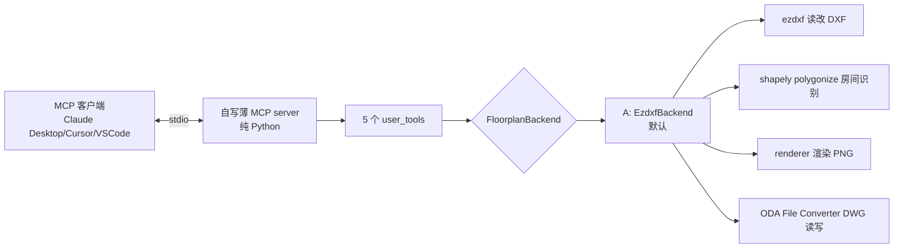

# 方案 D — 最终决策（锁定的实施路径）

> ⚠️ **此文档已被取代** — 仅作历史归档。
> D 的核心错判（"freecad-ai 是 Linux entry = B 在 Windows 不可用"）在 E/F 阶段被推翻，
> 详见 `复盘-2026-08-08-Phase0准备.md §三 P0 "跨平台 transport 误解"`。
> 当前权威：`方案-F-容器化.md`。

> **文档关系**：本文取代前面所有版本（v1 / v2 / v2-review / v3-final / C-BIM），是**当前唯一权威**。
> **日期**：2026-08-08
> **本轮锁定的三个用户决策**：
> - 3D 联动是**未来需求**，MVP 不做
> - 用户**有能力用 SketchUp Pro**
> - **优先 Windows**（开发可在 mac，但目标用户是 Windows-primary）

---

## 0. 一句话决策

> **MVP 走方案 A（ezdxf + shapely，双平台天然 OK）；未来 3D 联动上线时切方案 C（IFC + IfcOpenShell）；方案 B（FreeCAD+freecad-ai）降为"mac 专用、仅当 A 房间识别失败时启用"的备选。**
>
> 三套统一在 `FloorplanBackend` 接口下，切换靠 `FLOORPLAN_BACKEND` 环境变量，代码不推倒。

---

## 1. 为什么是这个结论（推理链）

### 1.1 Windows 优先 ⟹ B 不适合做 MVP

实读 freecad-ai 的 `mcp_server_entry.py` 和 README 原文：

```python
# freecad-ai 官方启动方式（README）
"command": "bash",
"args": ["-c", "exec 3>&1 1>&2 && /path/to/FreeCAD.AppImage -c .../mcp_server_entry.py"]
```

- **AppImage** 是 Linux 专属格式（Windows 用 .msi、mac 用 .app）
- **bash + `exec 3>&1 1>&2`** fd 重定向在 Windows 命令行不存在
- **README 明确声明**："developed and tested on Linux. The macOS and Windows examples ... have **not** been verified on those OSes"

也就是说，B 在 Windows 上**不能拿来即用**，必须自己写一份 Windows entry 脚本（解决 FreeCAD GUI 干扰 stdout、Windows 没 bash 的问题）。这是 B 在 Windows 优先约束下的硬伤。

### 1.2 3D 是未来 ⟹ MVP 不该上 C

方案 C（IFC）的开发成本是 A 的 1.5-2 倍，且 C 的全部优势（3D 联动、IfcSpace、SketchUp 接入）在 MVP（2D 读取/修改/渲染）阶段都用不上。MVP 用 C = 用重剑削苹果。

3D 落地时机由你定，到那时 A 已经把 2D 链路验证通，C 只需接上 IFC 后端，迁移成本低（接口已统一）。

### 1.3 A 与 B 房间识别风险相当 ⟹ 选 A（Windows 友好）

| | 房间识别算法 | 风险实质 |
|---|---|---|
| A | shapely polygonize | planar-graph face detection，成熟 |
| B | FreeCAD Arch Space | 内部也是 planar-graph，**同源** |

两者的真正 P0 风险都是**墙能不能从真实 DWG 里正确抽出来**（关键词匹配），不是识别算法本身。既然风险相当，选 Windows 天然支持的 A。

---

## 2. 主路径：方案 A（MVP）

### 2.1 技术栈



### 2.2 组件清单

| 组件 | 选型 | 跨平台 |
|------|------|--------|
| MCP 运行时 | 自写薄 server（参考 freecad-ai `StdioServerTransport` 结构，自己写，不复制代码） | ✅ 纯 Python |
| DXF 操作 | ezdxf | ✅ `pip install` |
| 房间识别 | shapely（`unary_union` + `polygonize`） | ✅ 预编译 wheel |
| 渲染 | ezdxf + matplotlib（修 v1 破图层 bug） | ✅ |
| DWG 读写 | ODA File Converter | ✅ 官方 .exe / .dmg |
| 几何/块识别 | 复用 v1 `geometry.py` / `blocks.py` | ✅ |

### 2.3 自写薄 MCP server 合规说明

不直接复制 freecad-ai 的代码（LGPL v2.1 传染边界）。MCP over stdio 是公开协议（JSON-RPC 2.0 on stdin/stdout），按结构自己写约 150 行，不构成衍生作品。

---

## 3. 双平台实证

### 3.1 MVP（方案 A）在 Windows + macOS 的支持

| 组件 | Windows | macOS | 验证方式 |
|------|---------|-------|---------|
| Python 3.12 | ✅ python.org 安装 | ✅ python.org / brew | 官方双平台二进制 |
| ezdxf | ✅ `pip install ezdxf` | ✅ 同 | 纯 Python，无系统依赖 |
| matplotlib | ✅ pip wheel | ✅ pip wheel | 预编译 |
| shapely | ✅ pip wheel（含 GEOS） | ✅ pip wheel | 预编译 |
| ODA File Converter | ✅ 官方 .exe 安装 | ✅ 官方 .dmg（Gatekeeper 放行） | https://www.opendesign.com/guestfiles/oda_file_converter |
| Claude Desktop / Cursor | ✅ | ✅ | MCP 客户端双平台 |

**结论：方案 A 在 Windows + macOS 双平台开箱即用，无平台专属坑。这是 Windows 优先约束下选 A 的核心原因。**

### 3.2 未来方案 C 的双平台

IfcOpenShell 也是 pip/conda 预编译 wheel，双平台天然 OK。C 落地时不引入新平台风险。

### 3.3 备选方案 B 的双平台现状

freecad-ai 在 Windows 需自写 entry，mac 需适配 `.app` 路径 —— 这是 B 被降级的直接原因。

---

## 4. FloorplanBackend 统一接口（三套切换的关键）

```python
# shared/floorplan_backend.py
from __future__ import annotations
from typing import Protocol


class FloorplanBackend(Protocol):
    """装修图后端接口。A/B/C 三套都是该接口的实现。MVP 只实现 A。"""

    # ─── 2D 能力（A/B/C 都支持）───
    def read(self, path: str) -> dict: ...
    def list_rooms(self, path: str) -> list[dict]: ...
    def move_entity(
        self, path: str, handle: str,
        dx_mm: float, dy_mm: float, auto_backup: bool = True,
    ) -> dict: ...
    def render_preview(
        self, path: str, output_png: str,
        highlight_handles: list[str] | None = None,
    ) -> str: ...
    def export_dwg(
        self, dxf_path: str, output_dwg: str,
        acad_version: str = "ACAD2018",
    ) -> str: ...

    # ─── 3D 联动能力（仅 C 实现，A 返回 False）───
    def has_3d_support(self) -> bool:
        return False

    def import_3d_model(self, model_path: str) -> dict:
        raise NotImplementedError("当前后端不支持 3D，未来方案 C 提供")

    def sync_to_3d(self, ifc_path: str, target_skp: str) -> dict:
        raise NotImplementedError
```

```python
# shared/__init__.py
import os


def get_backend() -> FloorplanBackend:
    """按环境变量选后端。user_tools 只调此函数，不直接 import 具体 backend。"""
    choice = os.getenv("FLOORPLAN_BACKEND", "ezdxf").lower()
    if choice == "freecad":
        from backends.freecad_backend import FreeCADBackend
        return FreeCADBackend()
    elif choice == "ifc":
        from backends.ifc_backend import IfcBackend
        return IfcBackend()
    # 默认 MVP：ezdxf
    from backends.ezdxf_backend import EzdxfBackend
    return EzdxfBackend()
```

切换后端只改 `FLOORPLAN_BACKEND` 一个环境变量，user_tools 代码不动。

---

## 5. 实施路径（MVP = 方案 A）

### Phase 0: 假设验证（半天，前置阻断）

**需要你提供**：2 个真实装修 DWG，放 `samples/`。

验证两个 P0 假设，决定是否需要 fallback 到 B：
1. **DWG round-trip 保真度**：DWG → DXF → DWG，实体数/图层/标注/填充是否丢失
2. **房间识别准确率**：shapely polygonize 识别房间数 vs 设计师人工数

**触发 fallback B 的条件**：房间识别准确率 < 50% 且 1 天内调不好 shapely 参数。

**触发终极降级的条件**：连 B 的 Arch Space 也识别不出，房间面积查询降级为"用户矩形框选 → 算面积"。

### Phase 1: MVP（3-5 天）

写 4 层（目录结构）：

```
chat-cad/
├── shared/                      # 后端无关，主备都复用
│   ├── floorplan_backend.py     # Protocol 接口
│   ├── geometry.py              # 复用 v1（质量 OK）
│   ├── blocks.py                # 复用 v1（砍掉家具工厂）
│   ├── renderer.py              # 复用 v1 修 bug（图层破坏）
│   └── dwg_convert.py           # 复用 v1 修 bug（同名覆盖）
├── backends/
│   └── ezdxf_backend.py         # Phase 1 实现（主/默认）
├── rooms/
│   └── graph.py                 # shapely polygonize
├── mcp/
│   └── server.py                # 自写薄 MCP server（~150 行）
├── user_tools/
│   └── floorplan_tools.py       # 5 个工具：read/list_rooms/move/render/export
├── samples/                     # 真实 DWG（.gitignore）
├── scripts/
│   ├── 00_roundtrip.py          # Phase 0 验证
│   └── 01_rooms_shapely.py      # Phase 0 验证
├── tests/
│   └── test_geometry.py         # 纯函数单元测试
├── requirements.txt             # ezdxf / matplotlib / shapely
└── README.md                    # 安装 + Windows/mac 指引
```

### Phase 2: 工程化（2 天）

- 写操作自动 `.bak`
- 异常分级 + 日志
- Windows + macOS 各跑一遍 5 个 MVP 用户故事
- pytest 覆盖 `shared/` 纯函数
- round-trip 对照纳入 CI 回归

### Phase 3（未来，3D 落地时）: 切方案 C

前提交：3D 联动需求明确 + 用户 SketchUp Pro 工作流就绪。
- 实现 `backends/ifc_backend.py`
- IfcOpenShell 读 IFC，IfcSpace 取房间
- DWG↔IFC 转换链路（最贵的工程点）
- SU Pro IFC 导入导出工作流文档

---

## 6. 三方案的触发条件（最终）

| 方案 | 何时启用 | 何时退出 |
|------|---------|---------|
| **A（MVP 默认）** | 立即，Phase 1 实现 | — |
| **B（备选）** | Phase 0 触发：A 房间识别准确率 < 50% | 当 Arch Space 也失败或切到 C |
| **C（未来主路径）** | 3D 联动需求落地 | — |

**注意 B 的 Windows 约束**：若 Mac 上验证 A 必须切 B，Windows 侧仍要自写 entry 才能用——所以**触发 B 意味着额外 1-2 天的 Windows entry 工作**。这也是把 A 设为默认的另一个理由。

---

## 7. 共同单点：ODA（无法靠接口消除）

所有方案（A/B/C）DWG 写都依赖 ODA File Converter。EULA 风险靠"终端用户本地下载、产品不打包"规避（桌面工具合规方式）。

---

## 8. MVP 验收标准（5 个用户故事）

- [ ] **US-1**：上传 DWG → 转 DXF → 渲染 PNG 返回
- [ ] **US-2**：问"户型有几个房间" → 数字正确（对照设计师原图 ±1）
- [ ] **US-3**：问"客厅面积" → 误差 < 5%
- [ ] **US-4**：问"客厅里有哪些家具" → 列表正确
- [ ] **US-5**：问"把沙发往右移 500mm" → 修改成功、自动 `.bak`、PNG 重渲染

不包含：新建生成户型、3D 联动、多方案对比——这些是未来。

---

## 9. 旧文档处置

| 文档 | 处置 |
|------|------|
| `方案.md` (v1) | 归档 |
| `方案-v2.md` | 归档 |
| `方案-v2-review.md` | 归档 |
| `方案-v3-final.md` | 归档（被 D 取代） |
| `方案-C-BIM.md` | **保留**（作为 Phase 3 切 C 的依据） |
| **`方案-D-决策.md`（本文）** | **当前唯一权威** |

---

## 10. 下一步（实际可执行）

需要你提供才能启动 Phase 0：
1. **2 个真实装修 DWG** 放 `samples/`（不提供则 Phase 0 跑不了）

我能立即做（不依赖样本）：
1. 起骨架代码骨架：`shared/floorplan_backend.py`、5 个 user_tools 签名、薄 MCP server 框架
2. 把 v1 `cad_tools/` 重构进新 `shared/` 结构，修 v1 renderer 破图层 bug、converter 同名覆盖 bug
3. 写 Phase 0 验证脚本（round-trip + shapely 房间识别）到 `scripts/`
4. 给 5 个旧文档加"已被方案 D 取代"标注

你想我先做哪个？建议顺序：①给旧文档加标注（10 秒）→ ②起骨架代码 → ③你给样本 → ④跑 Phase 0。

---

## 11. 修订记录

| 版本 | 日期 | 变更 |
|------|------|------|
| v1 | 2026-08-08 | 纯 ezdxf |
| v2 | 2026-08-08 | 加 FreeCAD 评估 |
| v3-final | 2026-08-08 | 收敛 B+A 混合，加备选 |
| C-BIM | 2026-08-08 | 第三套：IFC 路径 |
| **D-决策** | 2026-08-08 | **锁定：MVP=A / 未来=C / B 降备选；依据 Windows 优先 + 3D 未来 + SU Pro** |
