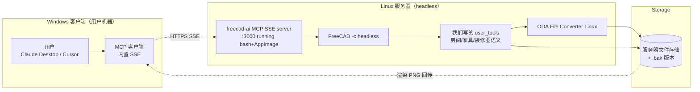

# 方案 E — 混合架构决策（Linux 服务器 + Windows 客户端）

> ⚠️ **此文档已被取代** — 仅作历史归档。
> E 的混合架构思路被 F 容器化吸收并超越（同一镜像 + Docker Desktop 在三平台跑）。
> 当前权威：`方案-F-容器化.md`。

> **文档关系**：取代前面所有版本（v1/v2/v2-review/v3/C-BIM/D）。当前唯一权威。
> **日期**：2026-08-08
> **本轮两个新约束**：
> 1. **混合架构允许**——可以一部分在 Linux 服务器，一部分 Windows 本地
> 2. **平台优先级 = Windows**（开发可在 mac，但用户主战场是 Windows；macOS 当前不支持也能接受）

---

## 0. 一句话决策（修正 D 的两个错判）

> **采用混合架构：Linux 服务器跑 FreeCAD + freecad-ai（SSE 模式），Windows 客户端通过 SSE 远程连接。**
> **MVP 走此混合架构（用 FreeCAD BIM 提供 Arch Space 房间识别）；若 Phase 0 发现服务器侧 FreeCAD 也有问题，本地客户端改连纯 ezdxf+shapely 薄服务（备选 A）。**
> **方案 C（IFC）作为未来 3D 联动的演进路径保留。**

---

## 1. 承认 D 的两个错判

### 错判 1：把"freecad-ai 是 Linux 专属 entry"当 B 缺点

实读 freecad-ai 代码后发现的：

| D 的判断 | 实际情况 |
|---------|---------|
| "freecad-ai entry 用 bash+AppImage 是 B 的硬伤" | 这恰恰是 **Linux 服务器的最优配置**——Linux 本来就有 bash，AppImage 单文件免安装 |
| "Windows 没 bash/AppImage → B 在 Windows 不可用" | 在混合架构下 **FreeCAD 根本不在 Windows 上跑**，这个"缺点"不存在 |

**真相**：freecad-ai 的 Linux 专属 entry 在"服务器跑"场景里是优势（部署简单），不是缺点。D 把它当缺点是因为 D 假设全栈在 Windows。

### 错判 2：忽略 freecad-ai 已原生支持远程 SSE

D 完全没注意到 freecad-ai 这几个已存在的关键能力：

```python
# freecad-ai/mcp_server_http.py（已存在的远程服务端入口）
# "watch FreeCAD update in real-time while an AI client calls tools"
transport = SSEServerTransport(host=os.environ.get("MCP_HOST", "127.0.0.1"),
                               port=int(os.environ.get("MCP_PORT", "3000")))
```

```python
# freecad-ai/mcp/client.py（已存在的远程客户端 + 安全校验）
def _validate_url(url):
    # https 总是允许；plain http 仅允许 loopback（防中间人）
def make_client_transport(cfg):
    # transport ∈ {stdio, sse, http}，URL 客户端是头等公民
```

```python
# freecad-ai/mcp/transport.py（SSEServerTransport 故意为 LAN 留口子）
def __init__(self, host="127.0.0.1", port=3000, allowed_hosts=None, ...):
    if allowed_hosts is None:
        allowed_hosts = _LOOPBACK_HOSTS | {host.lower()}
    # 测试: test_request_allows_explicitly_configured_bind_host ← 文档化支持 LAN
```

这些能力是 freecad-ai 在 2026-06 ~ 2026-07 主动加的（看 CHANGELOG），**就是为混合架构准备的**。D 直接错过了。

---

## 2. 架构总览



### 2.1 各部分平台

| 组件 | 在哪跑 | 为什么 |
|------|--------|--------|
| UI + 用户 | **Windows** | 用户主战场，已有 Claude Desktop/Cursor |
| MCP 客户端 | **Windows** | Claude Desktop/Cursor 内置 SSE 客户端，无需开发 |
| MCP 服务端 | **Linux 服务器** | freecad-ai 的标准部署形态，960 测试覆盖 |
| FreeCAD | **Linux 服务器** | headless `FreeCAD -c` 在 Linux 最稳定 |
| ODA File Converter | **Linux 服务器** | Linux 有官方版本，DWG 读写专属化 |
| 文件存储 | **Linux 服务器** | + .bak 版本管理（不丢失到客户端） |

### 2.2 用户上传/下载文件

用户的 DWG 不是直接改本地，而是 **上传到服务器 → 处理 → 回传结果（PNG / 改后的 DWG）**。这是混合架构的固有形态，需在客户端 UI 加文件上传按钮。

---

## 3. 为什么这是当前约束下的最优解

### 3.1 三个用户约束 vs 三种架构

| 用户约束 | 纯 Windows（D） | 纯 Linux 服务（C 云版） | **混合架构（E）** |
|---------|---------------|---------------------|---------------|
| Windows 优先 | ✅ | 🔴 客户端也在 Linux | ✅ 客户端在 Windows |
| macOS 当前不支持也能接受 | — | — | ✅ macOS 不是必需 |
| 允许混合架构 | N/A | N/A | ✅ 本架构基础 |
| 房间识别能力 | 🟡 shapely 自研 | 🟢 IfcSpace | 🟢 **Arch Space（FreeCAD BIM）** |
| 复用现成 MCP 运行时 | 🔴 自写 | 🔴 自写 | ✅ **复用 freecad-ai 960 测试** |
| FreeCAD 跑在最合适的平台 | 🔴 强迫 Win | ✅ Linux | ✅ **Linux** |

**E 同时满足所有约束**，且每个组件都在它最适合的平台上跑——这是 D 完全没考虑的配置。

### 3.2 E 解决了 A/B/C 各自的痛点

| 原方案痛点 | E 如何解决 |
|----------|----------|
| A: 房间识别自研风险 | E 用 FreeCAD Arch Space（成熟） |
| B: Windows 不可用 | E 把 B 放到 Linux，绕过该问题 |
| C: IFC 学习/开发成本高 | E 的 MVP 用 FreeCAD（比 IfcOpenShell 友好），C 留给未来 3D |
| 所有方案: 哪些算一次到位 | E 用 freecad-ai 现成服务端 + SSE 远程 + 我们只写装修图 user_tools |

### 3.3 给 3D 联动留好演进

未来 3D 落地：在 **同一个 Linux 服务器**加 IfcOpenShell 后端，FreeCAD 本来就支持 IFC（NativeIFC），客户端不动。**这就是 C 的演进路径**，但不是 MVP。

---

## 4. MVP 验收（5 个用户故事，适配混合架构）

不变，但流程含上传/下载：

- [ ] **US-0**：用户在 Windows 端选本地 DWG → 上传到服务器
- [ ] **US-1**：服务器 DWG→DXF（ODA）→ 渲染 PNG → 回传显示
- [ ] **US-2**：问"户型有几个房间" → 数对（Arch Space）
- [ ] **US-3**：问"客厅面积" → 误差 < 5%
- [ ] **US-4**：问"客厅有哪些家具" → 列表正确
- [ ] **US-5**：问"把沙发右移 500mm" → 服务器改 + .bak + 回传新 PNG 和改后的 DWG

---

## 5. 架构详细设计

### 5.1 Linux 服务器侧

**进程模型**：单进程 daemon（freecad-ai SSE server 常驻），同进程内 import FreeCAD + 跑我们的 user_tools。

为什么单进程：freecad-ai 的 `mcp_server_http.py` 已经这么干了（FreeCAD 的 doc 树常驻内存，跨请求复用），不用每次重启。

```
linux-server/
├── FreeCAD.AppImage              # 单文件 FreeCAD
├── freecad-ai/                   # clone 自 ghbalf/freecad-ai
│   └── mcp_server_http.py        # 服务端入口（已存在，不改动）
├── our_tools/                    # 我们写的，按 user_tools 扩展机制注入
│   └── floorplan_tools.py        # read/list_rooms/move/render/export
├── data/                         # 上传的 DWG + .bak 版本
└── start.sh
    # bash -c "...FreeCAD.AppImage mcp_server_http.py..."
    # 设 MCP_HOST=0.0.0.0 或 LAN IP + allowed_hosts
```

### 5.2 Windows 客户端侧

**只在 Claude Desktop/Cursor 的 MCP 配置里加一条 SSE 远程**：

```json
{
  "mcpServers": {
    "floorplan": {
      "transport": "sse",
      "url": "https://your-server.com/sse",
      "headers": { "Authorization": "Bearer <token>" }
    }
  }
}
```

客户端零代码，零 Python 依赖。**Windows 上不装 FreeCAD、不装 Python、不装 ezdxf。**

### 5.3 工具接口（与 v3/D 的 FloorplanBackend 接口兼容）

我们的 user_tools 调 backend 接口——这与之前 D 设计的一致。差异：MVP 默认 backend 是 **FreeCAD**（不是 ezdxf），因为服务器上 FreeCAD 是首等公民。

```python
# our_tools/__init__.py
import os
def get_backend():
    choice = os.getenv("FLOORPLAN_BACKEND", "freecad")  # E: 默认 freecad
    if choice == "ezdxf":  # 备选
        from backends.ezdxf_backend import EzdxfBackend
        return EzdxfBackend()
    from backends.freecad_backend import FreeCADBackend
    return FreeCADBackend()
```

---

## 6. 关键细节：从客户端到服务器的文件传输

**未解决问题**：MCP 工具调用传 JSON，不传二进制。用户 DWG（可能几 MB）怎么上传到服务器？

三个方案（按推荐度）：

| 方案 | 实现 | 优缺点 |
|------|------|--------|
| **内联 base64** | 客户端把 DWG base64 后塞进 tool 参数 | ✅ 简单；🔴 大文件慢（10MB→13MB JSON） |
| **HTTP 上传端点** | 服务器加一个 `/upload` 路由（独立于 MCP） | ✅ 标准；需写少量 HTTP 代码 |
| **共享文件系统**（同 LAN） | Windows 映射 Linux 的 SMB/NFS，工具收 file path | ✅ 零传输；🔴 仅限同 LAN |

**MVP 选**：HTTP 上传端点。客户端用一个浏览器/小工具上传 → 得 token → 工具调 `read(token)` 服务器按 token 取文件。fallback 是共享文件系统（同 LAN 内）。

---

## 7. 实施路径

### Phase 0: 假设验证（半天，前置阻断）

需要：2 个真实装修 DWG + 1 台 Linux 服务器（本机 docker / WSL 也行）。

验证两条最贵假设，决定是否退到备选 A：

1. **FreeCAD Arch Space 在真实 DWG 上房间识别准确率**
   - 流程：DWG → ODA→DXF → FreeCAD `importDXF` + `Draft.draftify` 成墙 → `Arch.makeSpace`
   - 修正 v2 §11.2 错误：必须先 draftify 成墙，否则 makeSpace 拿到空

2. **混合链路 SSE 端到端通**：Windows 的 Claude Desktop 连到 Linux SSE server 成功调一次工具

**触发备选 A 的条件**：Arch Space 准确率 < 50% → MVP 改 ezdxf+shapely（仍在 Linux 服务器跑，客户端不变）。

### Phase 1: MVP（5-7 天）

**Linux 服务器**：
- 装好 FreeCAD AppImage + freecad-ai
- 写 `our_tools/floorplan_tools.py`（5 个 user_tool，调 FreeCAD backend）
- 加 `/upload` HTTP 端点 + 鉴权 token
- 配 LAN IP / 域名 + TLS（https）

**Windows 客户端**：
- 配 Claude Desktop SSE（一行 JSON）
- 写一个小上传器（或用浏览器页面）

**写 `.bak` 自动备份**：所有写操作前服务器自动 `*.bak.N`

### Phase 2: 工程化（2 天）

- 服务器 systemd/容器化
- 异常分级 + 监控
- round-trip 对照 CI 回归
- pytest 覆盖 FreeCAD backend 纯函数

### Phase 3（未来 3D）: 接入 IFC

Linux 服务器加 IfcOpenShell + FreeCAD NativeIFC，客户端不变，加 3 个 user_tool（import_3d_model / sync_to_3d / list_spaces）。**这是方案 C 的落地**。

---

## 8. 风险与备选

| 风险 | 概率 | 严重 | 对策 |
|------|------|------|------|
| **服务器 FreeCAD Arch Space 识别失败** | 中 | 高 | Phase 0 前置；降低级到备选 A（ezdxf+shapely） |
| **服务器成本/运维** | 中 | 中 | MVP 用家里/公司 Linux 机；未来转云 |
| **文件传输体验** | 中 | 中 | HTTP 上传端点 + token；同 LAN 走文件系统 |
| **DWG round-trip 丢实体** | 高 | 高 | 默认 ODA；持续 CI 对照（之前所有方案的同风险） |
| **freecad-ai 上游停更** | 低 | 中 | 用户工具走扩展机制，不改核心；锁定版本 |
| **网络延迟/不稳定** | 中 | 中 | SSE 重连；本地缓存 PNG |
| **3D 联动延后**（用户已接受为未来） | — | — | Phase 3 用 IFC |

**备选方案矩阵**（每个都是 FloorplanBackend 的一个实现）：
- A: ezdxf+shapely（如果 Arch Space 失败）
- C: IFC（未来 3D）
- B 单机版（如果未来不允许服务器）

---

## 9. 合规

| 组件 | 许可 | 在混合架构下的考量 |
|------|------|------------------|
| freecad-ai | LGPL v2.1 | 我们通过 user_tools 扩展，不改 freecad-ai 核心 → 不触发传染 |
| FreeCAD | LGPL v2+ | 服务器用户自部署，不打包 → 无传染 |
| ezdxf/shapely | MIT | 自由 |
| ODA File Converter | 闭源 EULA | Linux 服务器用户自行安装，不打包 |
| TLS 证书 | — | 建议自签或 Let's Encrypt；客户端配 ca_bundle |

---

## 10. 修订前面文档的路径

| 文档 | 处置 |
|------|------|
| `方案.md`、`方案-v2.md`、`方案-v2-review.md`、`方案-v3-final.md`、`方案-D-决策.md` | 归档（含 D，E 取代 D） |
| `方案-C-BIM.md` | 保留（未来 Phase 3 切 IFC 的依据） |
| **`方案-E-混合架构.md`（本文）** | **当前唯一权威** |

需要我在归档文档顶部加"已被 E 取代"标注吗？

---

## 11. 下一步

需要你提供才能启动 Phase 0：
1. **2 个真实装修 DWG**（你给）
2. **Linux 服务器访问**（你给——家里 NAS / 公司机 / 公网云机 / 本地 WSL 都行，能跑通 SSE）

我能立即做（不依赖外部）：
1. 写 Phase 0 验证脚本（FreeCAD Arch Space 房间识别 **修正版**）
2. 在 server/ 起骨架：freecad-ai 部署脚本 + user_tools 骨架 + /upload 端点骨架
3. 在 client/ 起骨架：Claude Desktop SSE 配置 + 小上传器

你先给样本和服务器，还是先让我把不依赖样本/服务器的部分（Phase 0 脚本 + 骨架）写起来？

---

## 12. 修订记录

| 版本 | 日期 | 变更 |
|------|------|------|
| v1~D | 2026-08-08 | 各种演进（见各文档） |
| **E 初版** | 2026-08-08 | 修正 D 两错判（freecad-ai Linux entry、远程 SSE 支持）；引入混合架构（Linux 服务器 + Windows 客户端 SSE）；MVP 用 FreeCAD BIM；保留 A 兜底和 C 演进；新增文件上传端点设计 |
