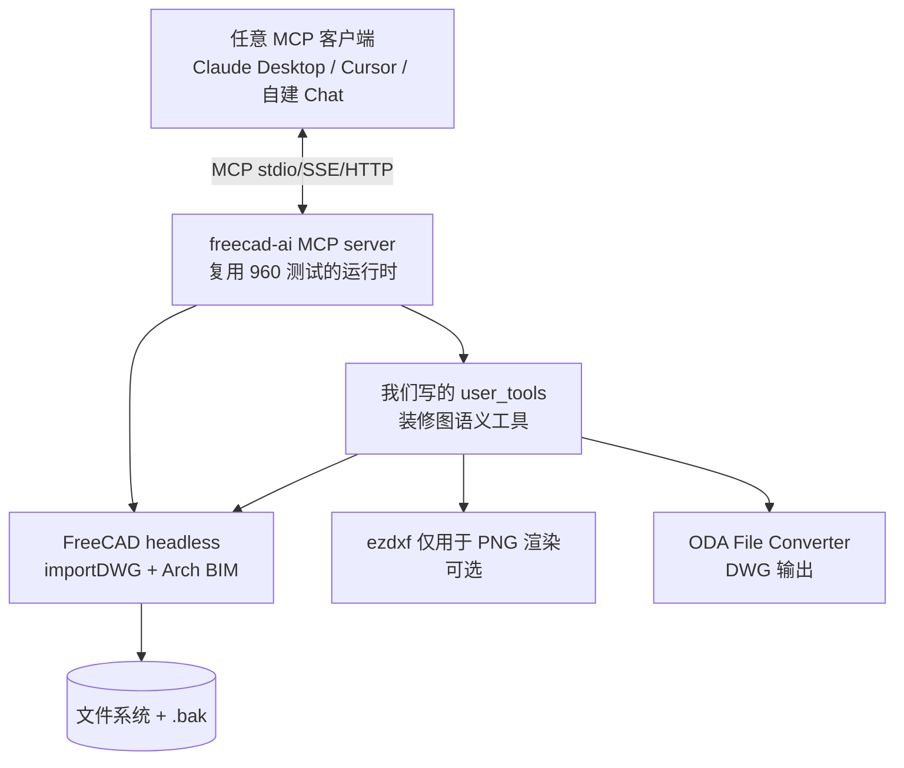

# 方案 v2 — Review + FreeCAD MCP 可行性分析

> ⚠️ **此文档已被取代** — 仅作历史归档。
> 当前权威：`方案-F-容器化.md` → `方案-F2-*.md` → `产品Spec.md` v1.1。
> 本份的 freecad-ai 调研结论已沉淀到 `复盘-2026-08-08-Phase0准备.md` + memory。

> **文档关系**：对 `方案-v2.md` 的自我 review（找 v2 自身的问题），**并新增 FreeCAD MCP 路径的深度可行性分析**。
> **日期**：2026-08-08
> **新增核心结论**：v2 漏掉了 MCP 这层（而它恰好是"Chat → CAD"的现代集成范式）；调研发现 `ghbalf/freecad-ai` 是一个 960+ 测试的成熟 FreeCAD MCP 实现——**v2 推荐的"B+A 混合"应该升级为"基于 freecad-ai 扩展"**。

---

## 0. 执行摘要

| # | 结论 |
|---|------|
| 1 | **v2 最大的遗漏：完全没提 MCP**。研究和实现已表明 MCP 是 LLM↔CAD 的标准接口，v2 仍停留在"LLM 生成代码 → exec()"。 |
| 2 | **FreeCAD MCP 不仅可行，且有成熟开源实现可直接复用**：`ghbalf/freecad-ai`（★420, LGPL v2.1, 960+ 单元测试, 2026-07 仍在活跃迭代）。 |
| 3 | **freecad-ai 直接证伪了 v2 的 R5 风险**（"FreeCAD headless 在 macOS 异常：中"）——头部项目已工程化解决跨平台 headless + MCP transport。 |
| 4 | **但 freecad-ai 不解决装修图语义**——它面向 3D 模型生成，没有 DWG 装修图读取/房间识别工具。需要通过其 user_tools 扩展机制加我们的工具。 |
| 5 | **v2 推荐路径应修订**：从"B+A 混合（自写编排）"→"**基于 freecad-ai 扩展（复用其 MCP 运行时）+ 自研装修图语义工具**"。 |
| 6 | **DWG round-trip 和房间识别两个 P0 风险不变**——MCP 解决不了领域问题，仍需 Phase 0 前置验证。 |

---

## 1. v2 自我 Review（找出 v2 的问题）

### 1.1 🔴 致命遗漏：完全没有 MCP 这一层

v2 §5 架构图里写的是：

```
UI → 编排层(意图分析+工具调度) → 工具集 → ...
```

但**没说编排层和工具之间用什么协议**。结合 §9.2 的"LLM 代码生成兜底"还在写 `subprocess.run([python, script])`，等价于 v1 的 exec 路径——**完全绕过了 2024 年后的事实标准 MCP**。

而 `research/chat-to-cad-research.md` 第 6 节就明确列了"MCP CAD 项目（新兴趋势）"，并点名 `ghbalf/freecad-ai`（★420）支持 MCP。v2 写的时候没回看自己的研究文档，这是低级失误。

**这一漏的后果**：v2 §5 的"工具调度"全要自己实现，等于把 freecad-ai 已经做好的 960 个测试覆盖的部分重写一遍。

### 1.2 🔴 Day 0 FreeCAD 验证脚本天真

v2 §11.2 的脚本直接调 `Arch.makeSpace([w1,w2,w3,w4])`，**默认了墙体已经是 Arch Wall 对象**。但 DWG `importDWG` 进来的实体是**裸 DXF LINE/LWPOLYLINE**，不是 Arch Wall——必须先 `Draft.draftify()` 或 `Arch.makeWall(fromDXF)` 转换。否则 `makeSpace` 拿到的根本不是墙拓扑，识别不出任何房间。

也就是说，v2 给的"验证脚本"跑起来会让用户误以为"FreeCAD 也识别不了房间"，得出错误结论。

### 1.3 🟡 "B+A 混合"边界模糊

v2 §3.2 说"读走 FreeCAD，写走 ezdxf"，但没回答：
- FreeCAD 和 ezdxf 在同一进程还是分进程？
- 如果同进程：FreeCAD 内嵌 Python 3.10/3.11，Does ezdxf 能装进 FreeCAD 自带的 site-packages？
- 如果分进程：同一个 DWG 文件如何并发访问？谁负责 .bak？
- 修改后如何把 ezdxf 的 DXF 改动同步回 FreeCAD 的 doc 树？

这是典型的"架构图好看，落地没说清"。

### 1.4 🟡 LLM API 熟悉度无量化

v2 §3.1 表给 FreeCAD"LLM 友好度：中"，ezdxf"高"。这是直觉判断，没有依据。应该做个最小基准：拿 10 个典型装修图操作，测 GPT-4o/Claude 生成 FreeCAD API vs ezdxf 代码的一次成功率。否则这个评分支撑不了"B+A 混合"的选型。

### 1.5 🟡 多轮对话状态缺失

v2 完全没提"用户跨多轮操作时当前 DWG/FreeCAD doc 怎么持有"。是每次都重新 read 文件？还是保持 daemon？这直接决定 MCP server 的 session 设计。

### 1.6 🟢 写对了的核心

- 把房间识别和 round-trip 列为最贵假设并前置 Phase 0 ✅
- 升级 FreeCAD 为推荐路径 ✅（虽然论证还可加强）
- 补合规/安全/测试三块 ✅
- 明确 MVP 验收线 ✅

---

## 2. FreeCAD MCP 生态调研

### 2.1 已存在的 MCP × CAD 项目清单

| 项目 | ★ | 类型 | 与本场景契合度 |
|------|---|------|--------------|
| **ghbalf/freecad-ai** | 420 | FreeCAD 插件 + MCP 客户端/服务端 | ✅✅ 直接可改造 |
| Psalmustrack/lambdacad-mcp | 0 | AutoLISP MCP（100 工具，2D+3D） | ❌ 需 AutoCAD |
| format37/openscad-mcp | 12 | OpenSCAD MCP（Docker+SSE） | ❌ 3D 建模，不支持 DWG |
| jabberjabberjabber/openscad-mcp | 2 | OpenSCAD MCP | ❌ 同上 |
| FuxuanNet/CADx | 0 | AutoCAD 工作流 + OpenAI | ❌ 需 AutoCAD |

**结论：装修图（DWG）场景下，唯一成熟可复用的是 `ghbalf/freecad-ai`。** 其余要么绑 AutoCAD，要么是 3D 建模。

### 2.2 ghbalf/freecad-ai 深度分析

**项目基本面**：
- 仓库：`ghbalf/freecad-ai`，★420，LGPL v2.1（商用相对友好）
- 创建：2026-02-20，**活跃迭代中**（2026-07-22 还在加 MCP URL client transport，TDD 红绿循环）
- 定位：AI-powered assistant workbench for FreeCAD

**成熟度证据**（从代码实读）：
- ✅ **960+ 单元测试基线**（`tests/unit/`，红绿 TDD，spec-driven）
- ✅ MCP 三种 transport 全实现：`StdioClientTransport` / `StdioServerTransport` / `SSEServerTransport` / `SSEClientTransport` / `StreamableHTTPClientTransport`
- ✅ **零外部依赖**（stdlib only，不引 requests/httpx/sse-client）
- ✅ 支持现代协议版本 `2025-03-26`（不是过时的旧 MCP）
- ✅ 工具注册机制成熟：`ToolRegistry` + 内置工具 + user extension tools + MCP 工具，**支持 lazy schema 加载**（deferred tool discovery）

**架构关键点**（直接摘代码确认）：

```
freecad-ai/
├── mcp_server_entry.py      # stdio 模式入口：FreeCAD.AppImage -c 进 headless
├── mcp_server_http.py       # HTTP/SSE 模式入口：带 GUI，可实时看 FreeCAD 更新
├── freecad_ai/
│   ├── mcp/
│   │   ├── transport.py     # stdio/SSE/HTTP 全 transport，stdlib only
│   │   ├── client.py        # MCPClient + make_client_transport 工厂
│   │   ├── server.py        # MCPServer：把 ToolRegistry 暴露为 MCP server
│   │   ├── manager.py       # MCPManager：单例，管多 server 连接+工具注册
│   │   └── protocol.py      # JSON-RPC 2.0 编解码
│   ├── tools/
│   │   ├── setup.py         # create_default_registry(include_mcp=False)
│   │   ├── registry.py      # ToolRegistry / ToolDefinition / ToolParam
│   │   ├── freecad_tools.py # ALL_TOOLS 内置
│   │   └── executor_utils.py # QtMainThreadToolExecutor（GUI 模式必需）
│   └── extensions/
│       └── user_tools.py    # 从 USER_TOOLS_DIR 发现 .py/.FCMacro 注册成工具
```

**两个入口的设计差异**（重要）：

| 入口 | 命令 | FreeCAD 模式 | 适用场景 |
|------|------|------------|---------|
| `mcp_server_entry.py` | `FreeCAD.AppImage -c mcp_server_entry.py` | **headless console** | 服务端/远程工具调用 |
| `mcp_server_http.py` | `FreeCAD mcp_server_http.py` | **带 GUI**（可在 FreeCAD 窗口看实时更新） | 桌面用户调试观察 |

Claude Desktop 配 stdio server 示例（仓库实测）：

```json
{
  "mcpServers": {
    "freecad": {
      "command": "bash",
      "args": ["-c", "exec 3>&1 1>&2 && /path/FreeCAD.AppImage -c /path/mcp_server_entry.py"]
    }
  }
}
```

（bash 包装把 fd 1 重定向到 stderr，避开 FreeCAD C++ banner 污染 JSON-RPC stdout）

**安全设计亮点**（说明项目工程质量高）：
- `SSEServerTransport` 内置 **DNS-rebinding 防御**：`Host` 头必须是 loopback（`127.0.0.1/localhost/::1`）
- 拒绝跨域 `Origin`（浏览器 fetch 一定带 Origin，原生 MCP 客户端不带 → 自动挡掉浏览器 drive-by 调用）
- 工具调用超时：默认 600s，初始化/list 30s
- 不记录任何 header 值/证书内容（"Secrets are never logged"）

---

## 3. FreeCAD MCP 可行性结论

### 3.1 五维评估

| 维度 | 评估 | 依据 |
|------|------|------|
| **MCP transport 成熟度** | ✅ 完全可行 | 960+ 测试，2026-07 仍在加新 transport，stdlib only |
| **FreeCAD headless 可行性** | ✅ 完全可行 | `FreeCAD -c` console 模式经头部项目工程化验证；v2 R5 风险高估 |
| **跨 macOS/Linux** | ✅ 可行 | AppImage 是 Linux，macOS 用 `.app/Contents/Resources/lib` 方式（FreeCAD 文档标准做法） |
| **装修图语义覆盖** | 🔴 **不可行（需扩展）** | freecad-ai 面向 3D 模型生成，**没有 DWG 读取/房间识别/家具分类工具** |
| **DWG round-trip** | 🟡 FreeCAD 内置优于裸 LibreDWG | FreeCAD 的 `importDWG` 封装了 ODA/LibreDWG 的探测与调用，但仍需实测真图保真度 |

### 3.2 可行 vs 不可行清单

**直接可用的（白捡）**：
- ✅ MCP 服务端/客户端全 transport（stdio/SSE/HTTP）
- ✅ FreeCAD headless 启动与生命周期管理
- ✅ 工具注册与发现（含 lazy schema）
- ✅ DNS-rebinding / 跨域 防御
- ✅ 多 MCP server 聚合（MCPManager）
- ✅ user_tools 扩展机制（我们的入口！）

**必须自研的（领域特定）**：
- 🔴 `read_floorplan(dwg_path)` — 读 DWG → 结构化 JSON
- 🔴 `list_rooms()` / `room_area(room_name)` — 房间识别（FreeCAD Arch Space 调用）
- 🔴 `list_furniture(room_name?)` — 家具分类（继承 v1 BlockLibrary 逻辑）
- 🔴 `move_entity(handle/name, dx, dy)` — 原子修改 + .bak
- 🔴 `render_png(layers?, highlight?)` — 预览
- 🔴 `convert_dwg(path, target_format)` — DWG 转换封装

**仍需 Phase 0 验证的（不变）**：
- 🔴 真实 DWG round-trip 实体保真度
- 🔴 Arch Space 在真实装修图上的房间识别准确率

### 3.3 与 v2 "B+A 混合" 对比

| 维度 | v2: B+A 混合（自写编排） | **v2.1: 基于 freecad-ai 扩展** |
|------|----------------------|--------------------------|
| MCP transport | 🔴 自己写（即使 stdlib 也要 ~500 行+测试） | ✅ 复用 960 测试覆盖的实现 |
| FreeCAD 生命周期 | 🟡 自己管 daemon | ✅ 复用其 entry 脚本 |
| 工具发现/注册 | 🔴 自己设计 schema | ✅ 复用 ToolRegistry + lazy schema |
| 安全（DNS-rebinding 等） | 🔴 容易漏 | ✅ 已实现 |
| 装修图工具 | 🔴 自研 | 🔴 自研（路径相同） |
| 客户端兼容 | 🟡 私有协议 | ✅ 任何 MCP 客户端（Claude Desktop / Cursor / 自建 Chat） |
| 工作量 | 大 | **小** |
| 风险 | 高（自己实现的部分多） | **低**（基础设施复用） |
| 锁定 | 锁 freecad-ai 上游 | 锁 freecad-ai 上游（同样） |

**结论：v2.1 全面优于 v2 的 B+A 混合。** 唯一代价是 "锁 freecad-ai 上游"，但：
1. LGPL v2.1 允许 fork
2. 装修图工具走它的 user_tools 扩展机制，**不改它的核心代码**，升级冲突小
3. 即使上游停更，我们已有 960 测试的快照可自立

---

## 4. 修订后的推荐路径（v2.1）



### 4.1 关键决策

1. **MCP 运行时：复用 freecad-ai**（不自写）
2. **FreeCAD：作为 BIM 语义引擎**（房间识别、墙/门窗对象化）
3. **ezdxf：降级为可选渲染器**（FreeCAD 的 PNG 渲染需要 GUI 工作台，headless 下 ezdxf 更干净）
4. **ODA：DWG 输出唯一路径**（保真度最高）
5. **装修图工具：以 user_tools 形式注入**（不改 freecad-ai 核心）

### 4.2 我们的 user_tools 清单（MVP）

```python
# USER_TOOLS_DIR/floorplan_tools.py
# 通过 freecad-ai 的 user_tools 机制自动注册为 MCP 工具

def read_floorplan(dwg_path: str) -> dict:
    """读取 DWG 装修图，返回结构化 JSON：图层/墙体/门窗/家具/房间/统计。"""
    ...

def list_rooms(dwg_path: str) -> list[dict]:
    """列出所有房间：名称/面积/边界/内含家具。用 Arch Space 识别。"""
    ...

def move_furniture(
    dwg_path: str,
    furniture_handle: str,  # 或 block_name + index
    dx_mm: float, dy_mm: float,
    auto_backup: bool = True,
) -> dict:
    """移动家具。auto_backup=True 时自动生成 .bak。"""
    ...

def render_preview(
    dwg_path: str,
    output_png: str,
    highlight_handles: list[str] | None = None,
) -> str:
    """渲染 PNG 预览（ezdxf 后端，不破坏图层状态）。"""
    ...

def export_dwg(dxf_path: str, output_dwg: str, acad_version: str = "ACAD2018") -> str:
    """DXF → DWG，走 ODA。"""
    ...
```

这 5 个工具就是 MVP 全集，每个对应 §4 MVP 的一个用户故事。

---

## 5. 修订后的实施路径（v2.1）

### Phase 0：Day 0 假设验证（半天，**前置阻断**）

**修正 v2 §11.2 的错误脚本**——必须先 importDXF 再 draftify 成墙：

```python
# scripts/02_rooms_freecad.py（修正版）
import sys
sys.path.append("/Applications/FreeCAD.app/Contents/Resources/lib")
import FreeCAD, importDXF, Draft, Arch
import ezdxf, subprocess

dwg = "samples/sample1.dwg"
dxf = dwg.replace(".dwg", ".dxf")
subprocess.run(["dwg2dxf", "-o", dxf, dwg], check=True)

doc = FreeCAD.newDocument()
importDXF.insert(dxf, doc.Name)
doc.recompute()

# 关键修正：把裸 LINE/LWPOLYLINE draftify 成 Draft 线，再 makeWall
walls = []
for obj in doc.Objects:
    if obj.Name.startswith("Line") or obj.Name.startswith("Polyline"):
        # 仅处理 WALL 图层（按 v1 keywords）
        if "WALL" in (obj.Label or "").upper():
            try:
                arch_wall = Arch.makeWall(obj)  # 从基础几何造墙
                walls.append(arch_wall)
            except Exception:
                pass
doc.recompute()

# 再尝试 Space
if walls:
    space = Arch.makeSpace(walls)
    space.removeShape()  # 触发空间计算
    doc.recompute()
    print("Area:", getattr(space, "Area", None))
else:
    print("没识别到墙——说明墙体图层关键词或几何不匹配")
```

**验收**：跑 2 个真实样本，输出 `scripts/report.md`：
- round-trip 实体数对照
- 房间识别数 vs 设计师人工数
- 决策点：freecad-ai 路径是否继续

### Phase 1：MVP（3-5 天）

**前置**：Phase 0 通过。

1. 安装 freecad-ai（作为 FreeCAD 插件）
2. 在 `USER_TOOLS_DIR` 写 5 个装修图工具（§4.2）
3. 工具内部：DWG 读 via FreeCAD `importDWG`；房间识别 via Arch Space；家具分类复用 v1 `BlockLibrary`（保留，质量 OK）；渲染 via ezdxf（修复 v1 renderer 的图层破坏 bug）；DWG 写 via ODA
4. 配 Claude Desktop（或 Cursor）做端到端
5. 跑 5 个 MVP 用户故事的验收测试

### Phase 2：安全 + 工程化（2 天）

- 工具内部写操作必走 `.bak`（freecad-ai 自身不管这个）
- 异常分级 + 日志
- `requirements.txt`（ezdxf/matplotlib）+ README
- pytest 覆盖纯函数（geometry）

### Phase 3+：同 v2（编辑拓展、新建生成）

---

## 6. 修订后的风险表（v2.1 增量）

| # | 风险 | 概率 | 影响 | 对策 | v2.1 变化 |
|---|------|------|------|------|----------|
| R1 | 房间识别失败 | 高 | 致命 | Phase 0 前置；Arch Space；最坏降级框选 | 不变 |
| R2 | DWG round-trip 丢实体 | 高 | 高 | 默认 ODA；.bak；round-trip 进 CI | 不变 |
| R3 | LLM 代码执行越权 | 中 | 致命 | 工具优先；用户工具走 freecad-ai 受控 executor | ✅ **降级**（freecad-ai 已有 QtMainThreadToolExecutor + 超时） |
| R4 | 图层名/编码 | 高 | 中 | 关键词+模糊+用户配置；GBK 检测 | 不变 |
| R5 | FreeCAD headless macOS 异常 | **低** | 中 | `FreeCAD -c`；freecad-ai entry 脚本；失败降级 ezdxf | ✅ **降级**（freecad-ai 跨平台已验证） |
| R6 | 门窗家具识别 | 中 | 中 | 块几何+名称+图层三维特征 | 不变 |
| **R10** | **freecad-ai 上游 breaking change** | 低 | 中 | user_tools 不改核心；锁版本；必要时 fork | 🆕 新增 |
| **R11** | **freecad-ai 嵌入 Python 与系统/ezdxf 版本冲突** | 中 | 中 | ezdxf 装进 FreeCAD 自带 site-packages；或渲染走独立子进程 | 🆕 新增 |
| **R12** | **FreeCAD importDWG 仍依赖 ODA**（不是真正消除依赖） | 高 | 低 | 接受现实：ODA 仍是 DWG 事实后端 | 🆕 新增（澄清 v2 误解） |

> **R12 是重要澄清**：v2 §2.2 说"FreeCAD 的 importDWG 默认走 ODA File Converter，等于 converter.py 白写"——这话只对一半。FreeCAD 只是把 ODA 调用封装了，**机器上仍要装 ODA**。所以 ODA 的 EULA、首次 EULA 弹窗、整目录转换等约束一个没少。freecad-ai 不解决这个问题。

---

## 7. 合规补充（v2 基础上）

| 组件 | 许可 | v2.1 新增考量 |
|------|------|--------------|
| **freecad-ai** | LGPL v2.1 | 通过 user_tools 扩展不算衍生作品；但如果改 freecad-ai 核心，修改部分需开源（LGPL 弱传染边界） |
| FreeCAD | LGPL v2+ | 同上 |
| ODA File Converter | 闭源 EULA | **freecad-ai / FreeCAD 都不替代 ODA**，EULA 风险仍在（见 R12） |

---

## 8. 最终决策矩阵（v1 / v2 / v2.1 三选一）

| 维度 | v1 纯 ezdxf | v2 B+A 混合 | **v2.1 freecad-ai 扩展** |
|------|-----------|------------|---------------------|
| 房间识别 | 🔴 自研（算法错) | 🟡 Arch Space | 🟢 Arch Space |
| MCP 集成 | 🔴 没有 | 🔴 没有 | 🟢 复用 960 测试实现 |
| 工作量 | 中（但基础错) | 高（自写 MCP+编排) | **低**（写 5 个 user_tool) |
| 客户端兼容 | 🔴 私有 | 🔴 私有 | 🟢 任何 MCP 客户端 |
| DWG round-trip | 🔴 裸 LibreDWG | 🟡 FreeCAD 封装 ODA | 🟡 FreeCAD 封装 ODA（同 v2) |
| 安全 | 🔴 exec | 🟡 自写沙箱 | 🟢 freecad-ai executor + 我们加 .bak |
| 锁定风险 | 低 | 低 | 中（依赖上游) |
| **推荐度** | 不推荐 | 备选 | **首选** |

> **唯一会让 v2 优于 v2.1 的场景**：明确不想要 FreeCAD 依赖（比如未来一定要上云 SaaS，嫌 600MB 太大）。此时走纯 ezdxf + 自写 MCP server（参考 freecad-ai 的 transport.py 抄一份）。但当前是桌面工具场景，这条不成立。

---

## 9. 立即可执行的下一步

1. **拿 2 个真实装修 DWG** 放 `samples/`（最贵假设的输入）
2. **跑修正版 Phase 0 脚本**（§5），重点验证 Arch Space 在真实图上的房间数
3. **并行**：`brew install --cask freecad` + clone freecad-ai 到 FreeCAD Mod 目录，`FreeCAD -c mcp_server_entry.py` 跑通"hello world"工具调用
4. 通过后进 Phase 1：写 5 个 user_tools

如果 Phase 0 的 Arch Space 在真实图上房间数对不上，**立即把房间识别降级**为：让用户用矩形框选房间 → 算面积。这比硬刚算法更精益。

---

## 10. 修订记录

| 版本 | 日期 | 变更 |
|------|------|------|
| v1 | 2026-08-08 | 初版，纯 LibreDWG+ezdxf |
| v2 | 2026-08-08 | 吸收 review；加 FreeCAD 重评估；前置 Day 0 |
| **v2.1** | 2026-08-08 | review v2（发现漏 MCP）；调研 FreeCAD MCP 生态；推荐升级为"基于 freecad-ai 扩展"；修正 FreeCAD Day 0 脚本；新增 R10/R11/R12 风险 |
