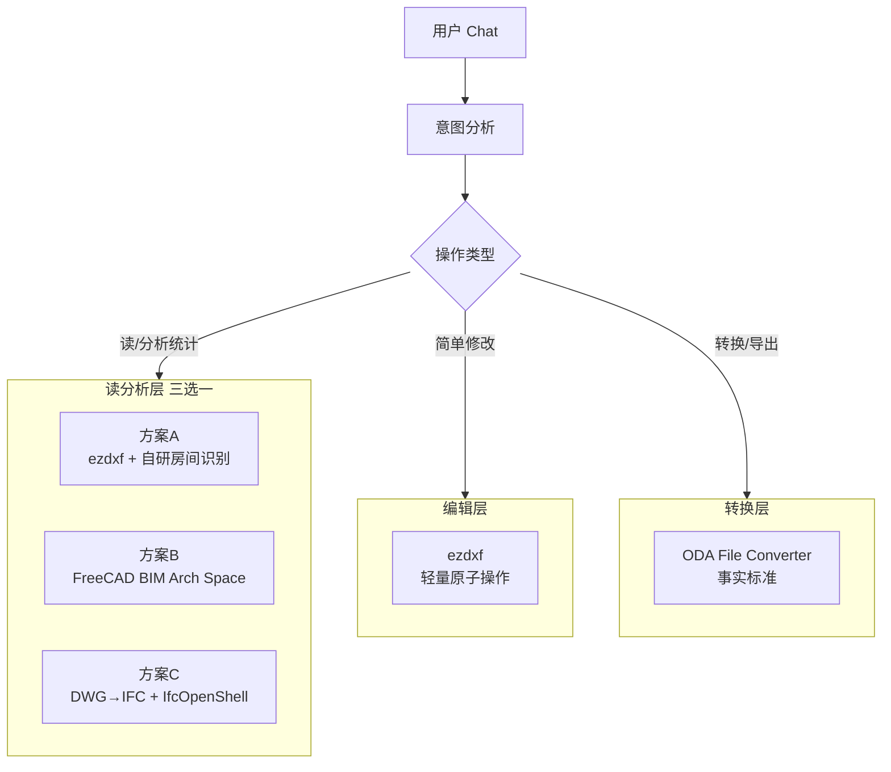
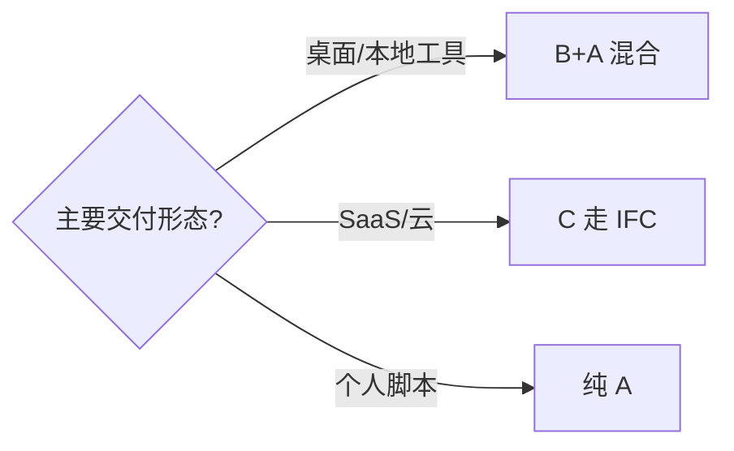
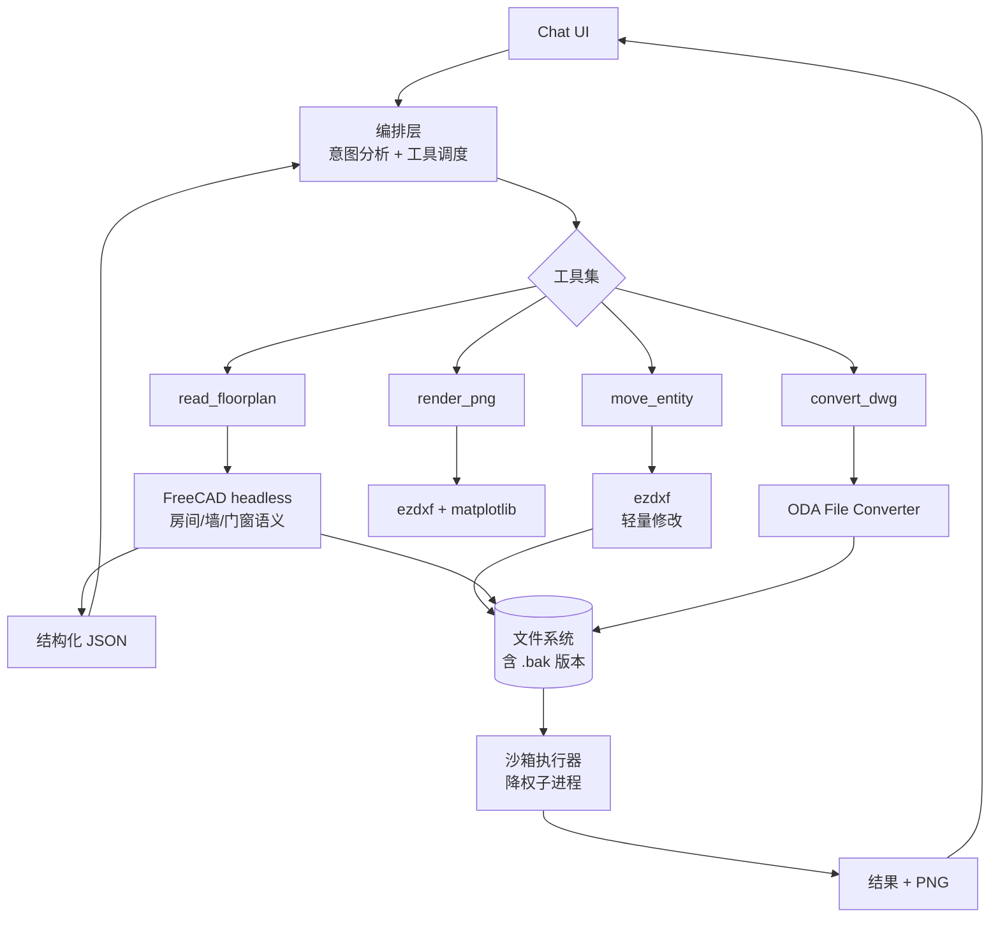
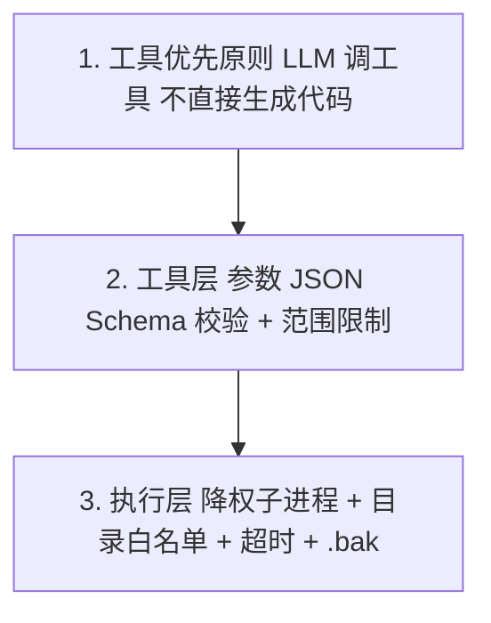

# Chat → DWG 房屋装修图操作方案 v2

> ⚠️ **此文档已被取代** — 仅作历史归档。
> 当前权威：`方案-F-容器化.md` → `方案-F2-*.md` → `产品Spec.md` v1.1。
> 本 v2 的核心缺口（漏 MCP 层）详见 `复盘-2026-08-08-Phase0准备.md §三`。

> **文档关系**：本文是 `方案.md`（v1）的修订版，吸收对 v1 的系统性 review，并新增**对 FreeCAD 路径的重新评估**。
> **日期**：2026-08-08
> **变化要点**：① 把最贵假设（DWG round-trip、房间识别）前置验证；② 升级 FreeCAD 为推荐路径之一；③ 给出三条路径决策矩阵；④ 明确 MVP、合规、安全、测试四个缺口。

---

## 0. 执行摘要（TL;DR）

| 项 | 结论 |
|----|------|
| **v1 最大的两个问题** | ① 房间识别算法不成立（依赖"墙是闭合多段线"假设，真实图纸不成立）；② DWG round-trip 零验证就写了 6 个模块 |
| **v1 是否可挽救** | 是。技术栈方向正确（ezdxf + DWG 转换桥），但需要重排优先级、补关键能力 |
| **FreeCAD 是否可完成** | ✅ **可以**，且在房间识别和 DWG 保真度上有结构性优势；v1 一刀切否决是错误的 |
| **v2 推荐主路径** | **混合方案 B+A**：读/分析走 FreeCAD（语义化），简单修改走 ezdxf（快），DWG 转换统一走 ODA |
| **必须先做的事** | Day 0（半天）跑两个真实 DWG 样本，验证 round-trip 与房间识别，再决定后续 |

---

## 1. v1 Review 总结

### 1.1 维度评分回顾

| 维度 | 评分 | 关键问题 |
|------|------|---------|
| 可行性 | 🟡 6/10 | 选型对，但 LibreDWG 写 DWG 和 ODA 的 GUI 弹窗被低估 |
| 正确性 | 🔴 4/10 | 房间识别算法地基空、面积重复统计、渲染破坏图层状态 |
| KISS | 🔴 3/10 | 6 模块 + 双后端 + 13 种家具块工厂，远超 Phase 1 目标 |
| 精益 | 🔴 3/10 | `examples/`、`tests/` 全空，最贵假设零验证 |
| 工程化 | 🔴 3/10 | 无依赖文件、无版本备份、无中文编码处理 |
| 安全/合规 | 🟡 5/10 | LLM 代码直接执行；GPL/EULA 未评估 |

### 1.2 问题分级清单

#### 🔴 P0 致命问题（阻断招牌功能）

1. **房间识别算法不成立**
   - v1 做法（`reader._detect_rooms`）：遍历墙体，**若墙体是闭合 LWPOLYLINE** 就当一个房间。
   - 真实图纸的墙是几十~上百段独立 `LINE` + 门窗洞口切开，几乎不存在"单根闭合多段线"。
   - 后果：招牌场景"户型有几个房间？客厅面积多大？"实际跑出来 `rooms=[]`。
   - 正确做法是 **planar-graph face detection**：

   ```mermaid
   flowchart LR
     A[所有 LINE/LWPOLYLINE] --> B[端点 snap 合并]
     B --> C[共线段合并]
     C --> D[求所有交点 拓扑打断]
     D --> E[构建 planar graph]
     E --> F[face/最小环检测]
     F --> G[过滤外环+面积阈值]
     G --> H[房间多边形]
   ```

2. **房间面积会重复累加**
   `summary.total_area_m2 = sum(rooms.area)`，遇嵌套闭合线（外墙轮廓 + 内分隔）会双倍计。

#### 🔴 P1 严重问题（数据 / 安全）

3. **DWG round-trip 未验证**
   LibreDWG 写 R2010+ 复杂实体（HATCH / DIMENSION / PROXY）经常丢内容；ODA 也是 GUI 弹窗 + 整目录转换 + 同名覆盖。

4. **LLM 生成代码直接执行 = RCE 面**
   `doc.saveas()` 会覆盖原文件，无沙箱无回滚。

5. **渲染破坏图层状态**
   `renderer.py` 用 `doc.layers.get(x).off()` 控制可见性，**直接修改了传入的 Drawing 对象**，渲染后图层永久关闭。
   次生问题：`render_with_info` 把图画两次（先 render 保存一次，又新建 fig 重画覆盖）。

#### 🟡 P2 中等问题（鲁棒性）

6. **关键词匹配脆弱**
   - `WINDOW_KEYWORDS = ["W_", ...]` 误命中 `W_POOL / WORK`
   - `DOOR_KEYWORDS = ["D_", ...]` 误命中 `D_DESK / D_PIPE`
   - 门/窗/家具识别"先到先得"，依赖 `INSERT` 遍历顺序，结果不稳定

7. **家具归属房间用 INSERT 基点**
   基点常不在块几何中心；旋转 + 非对称缩放后基点可能落到墙线外。应算旋转后包围盒中心。

8. **门宽猜测**
   `re.search(r'(\d+)', block_name)` 取第一个数字；`2F_DOOR900` → 2。

#### 🟠 P3 偏离（KISS / 精益）

9. **工程过度**：Phase 1 标"今天验证"，却已经写完 reader/writer/renderer/converter/geometry/blocks 六模块。研究期应是几十行脚本。

10. **不必要的功能**：13 种家具块工厂（沙发/床/桌/马桶/…）。真实图纸自带块库，自画占位块没人用。

11. **`FloorPlanReader` 缓存 + 7 个 getter** 是冗糖，`parse()` 已返回全部。

12. **文档与实现不一致**：v1 §3.1 说"LibreDWG 首选 ODA 备选"，实际 `converter._detect_backend` 是 ODA 优先。

#### ⚪ P4 缺失（必须新增）

13. 无 `requirements.txt`/`pyproject.toml`/`README`
14. 无任何测试（连纯几何函数都没用例）
15. 无写操作的 .bak / 副本策略
16. 无中文 GBK 编码图层名处理
17. 无合规小节（GPL 传染 / ODA EULA）
18. 无 MVP 定义（1.1 列 5 大场景，没说哪个是"成功线"）

---

## 2. FreeCAD 路径重新评估（v2 新增）

### 2.1 v1 否决 FreeCAD 的理由及其有效性

v1 §2.3 给出的否决理由：

| v1 否决理由 | v2 重新评估 |
|------------|------------|
| 🔴 "500MB+ 体积大" | **对桌面/本地工具不构成问题**。运维上等于一次 `brew install --cask freecad`，跟装 Node 一样。对 SaaS/容器化才是真负担。 |
| 🔴 "启动慢" | 命令行 `freecadcmd` 首次冷启动 3~8 秒，但可以做 **daemon 常驻**（一次启动后接受多请求），均摊后亚秒级。 |
| 🔴 "headless 模式不稳定" | 这是 **2018 年前的印象**。FreeCAD 0.20+ 起 `freecadcmd` 在 Linux/macOS 无 X11 已稳定，社区大量 server-side 用例（FreeCAD as a service）。macOS 上仅 GUI 需要 XQuartz，cmd 不需要。 |
| 🟡 "杀鸡用牛刀" | **反了**。装修图分析是"建筑语义理解"，不是"操作几条线"——ezdxf 自己写房间识别才是杀鸡用牛刀。 |

**结论：v1 的四个否决理由在 2026 年、本场景下全部不成立或过重。**

### 2.2 FreeCAD 解决了 v1 的两个 P0/P1 痛点

#### 痛点 A：房间识别 → FreeCAD 的 `Arch Space`

FreeCAD 的 **BIM 工作台**（继承自 Arch 工作台）原生理解这些对象：

| 对象 | 对应装修图元素 |
|------|--------------|
| `Arch.makeWall()` | 墙（自带厚度、连接拓扑） |
| `Arch.makeWindow()` | 门 / 窗（区分 type=Door/Window） |
| `Arch.makeStructure()` | 楼板 / 梁 |
| **`Arch.makeSpace()`** | **房间 / 空间**（自带面积、周长、体积） |
| `Arch.BuildingPart` | 楼层 |

`Arch Space` 对象智能识别由墙围合形成区域——**这正是 v1 自己要从零写、且写错了的能力**。

```python
import FreeCAD, Arch, Draft

doc = FreeCAD.newDocument()
# 墙（FreeCAD 推断连接关系）
w1 = Arch.makeWall(length=5000, height=2800, width=240)
w2 = Arch.makeWall(length=3000, height=2800, width=240)
w2.Placement.Base = FreeCAD.Vector(5000, 0, 0)
w2.Placement.Rotation = FreeCAD.Rotation(FreeCAD.Vector(0,0,1), 90)
# ...围成闭合区
doc.recompute()

# 空间 / 房间 —— FreeCAD 自动从墙推断
space = Arch.makeSpace([w1, w2, w3, w4])
space.Area   # 自动计算面积（mm²）
space.Boundary   # 房间边界
```

#### 痛点 B：DWG round-trip → FreeCAD 的 importDWG

- FreeCAD 的 DWG 读写**默认走 ODA File Converter**，但它把"找 ODA / 调用 / 改名 / 错误处理"封装好了，等于 `converter.py` 那一坨shell包装白写。
- FreeCAD 0.21+ 还支持走 LibreDWG 作为 DWG 后端（在 Edit > Preferences > Draft 可切换）。
- FreeCAD 的 `importDXF` / `importDWG` 模块经过多年打磨，对**中文图层名、复杂实体、PROXY 实体**的兼容性远好于裸 LibreDWG。

### 2.3 FreeCAD 的真实代价（诚实清单）

| 代价 | 严重度 | 缓解办法 |
|------|--------|---------|
| 体积 ~600MB（0.21 macOS .dmg） | 低（一次性） | — |
| 冷启动 3~8s | 中 | daemon 常驻；或预先加载到内存 |
| macOS headless 路径绕 | 低 | `import sys; sys.path.append("/Applications/FreeCAD.app/Contents/Resources/lib")` 后 `import FreeCAD` |
| matplotlib 渲染不如 ezdxf 干净 | 中 | 渲染交给 ezdxf（混合方案） |
| 内嵌 Python 3.10/3.11 与系统 Python 版本冲突 | 中 | 用 FreeCAD **自带的** Python 解释器（不要拼接到系统 Python） |
| 部分 GUI 依赖模块在 headless 下不可用 | 低 | 用 `freecadcmd` 而非 `import FreeCADGui` |
| LLM 对 FreeCAD API 熟悉度低于 ezdxf | 中 | 写好工具函数封装 + few-shot 示例 |

### 2.4 结论

> **FreeCAD 不仅"可以完成"，而且在两个最贵能力上结构性优于 ezdxf 自研路线。**
> v1 把它当备选是判断失误；v2 应把它升级为**主候选**，并把"用哪个"作为 Day 0 验证后的决策点。

---

## 3. 三条技术路径对比



### 3.1 三方案对照

| 维度 | A. ezdxf 自研 | B. FreeCAD BIM | C. IFC + IfcOpenShell |
|------|--------------|----------------|----------------------|
| 安装体积 | ~50MB | ~600MB | ~150MB（IfcOpenShell + ezdxf） |
| 冷启动 | <1s | 3~8s | <2s |
| 房间识别 | **自写 planar-graph**（1 周+） | ✅ `Arch Space` 原生 | ✅ `IfcSpace` 一等对象 |
| 墙/门窗语义 | 关键词匹配（脆弱） | ✅ Arch 对象结构化 | ✅ IFC 实体类型严格 |
| DWG round-trip | LibreDWG/ODA（裸调） | ✅ FreeCAD 封装 ODA | ❌ 仍要 ODA 先转 IFC |
| 写操作 | ✅ 快、API 干净 | ⚠️ 重 | ⚠️ 重（IFC 写入复杂） |
| LLM 友好度 | ✅ 高（声明式 API） | 🟡 中（API 大但成熟） | 🔴 低（schema 复杂） |
| 渲染 PNG | ✅ matplotlib 干净 | 🟡 中（要 GUI 工作台） | 🟡 中 |
| 云 SaaS 友好 | ✅ 高 | 🟡 中（体积 daemon） | ✅ 高（纯 Python） |
| 学习曲线 | 低 | 中 | 高 |
| 行业标准化 | DXF（事实） | DXF/DWG/IFC | IFC（**国际标准** ISO 16739） |

### 3.2 决策建议

**对当前阶段（MVP / 研究演示）**：推荐 **B + A 混合**——
- 用 FreeCAD 做 DWG 读入 + 房间识别 + 语义抽取（**解决 P0 #1**）
- 用 ezdxf 做轻量修改和 PNG 渲染（轻、快、LLM 友好）
- 用 ODA File Converter 做 DWG 最终输出（保真度最高）

**若产品化目标明确是云 SaaS**：考虑 **C**——业务对象用 IFC，最标准、最可移植。

**若目标仅是"我能用 Chat 改我自己的装修图"**：纯 **A** 也能跑，但房间分析降级为"按用户框选多边形算面积"。



---

## 4. MVP 重新定义

### 4.1 一句话 MVP

> **给定一份真实装修 DWG，用户问"列出所有房间及面积，以及每个房间里的家具"，系统能正确回答，并给出可视化预览。**

这条 MVP 同时压测了 v1 两个 P0：房间识别 + round-trip 保真度。

### 4.2 MVP 用户故事（验收标准）

- [ ] **US-1**：上传 DWG → 自动转 DXF → 渲染 PNG 返回
- [ ] **US-2**：问"户型有几个房间" → 数字正确（对照设计师原图 ±1）
- [ ] **US-3**：问"客厅面积" → 误差 < 5%
- [ ] **US-4**：问"客厅里有哪些家具" → 列表正确（类型 + 数量）
- [ ] **US-5**：问"把沙发往右移 500mm" → 修改成功、原图自动备份、PNG 重渲染

> **不包含**：新建生成户型图、多方案对比、家具智能布局建议（这些放 Phase 3+，避免过早优化）。

---

## 5. 系统架构（v2 混合方案）



### 5.1 关键设计原则

1. **工具优先，代码生成次要**：LLM 应调工具，而不是每次生成完整 ezdxf 脚本。
   - 工具 = 参数明确、可校验、可撤销的函数
   - 代码生成 = 兜底，需走沙箱
2. **读用语义对象，写用原子操作**：读走 FreeCAD 给语义 JSON；写走 ezdxf 给精确控制。
3. **DWG 转换统一一层**：`convert_dwg` 工具封装 ODA（唯一可靠路径），hidden LibreDWG。
4. **写操作必走版本**：每次写前自动 `*.bak.N`，提供回滚。
5. **执行隔离**：所有写操作在降权子进程（无网络、目录白名单、超时）。

---

## 6. 实施路径（v2 重排）

### Phase 0：Day 0 假设验证（半天，**前置阻断**）

**目标**：用 2 份真实装修 DWG 验证最贵的两个假设。**不通过本阶段，不进入后续。**

产出：
1. **round-trip 对照表**：DWG → DXF → DWG，对比每类的实体数、图层、标注、填充
2. **房间识别准确率**：算法 count vs 设计师人工 count

```bash
# 目录建议
cad/
├── samples/             # 新建：放真实样本（.gitignore 忽略）
│   ├── sample1.dwg
│   └── sample2.dwg
├── scripts/
│   ├── 00_roundtrip.py  # round-trip 对照
│   ├── 01_rooms_ezdxf.py
│   ├── 02_rooms_freecad.py
│   └── report.md        # 结论
└── ...
```

### Phase 1：MVP（3-5 天）

依赖 Phase 0 结论选 B+A 或纯 A：

- 若 FreeCAD 可用 → `cad_tools/semantic.py` 封装 FreeCAD，提供 `read_floorplan(path) -> dict`
- 房间识别如自研 → `cad_tools/rooms.py` 用 shapely + ezdxf 实现 planar-graph
- 工具化：把 v1 的方法重构成 4 个带 schema 的工具
- 实现自动备份（`.bak`）
- 写 5 个 MVP 用户故事的端到端测试

### Phase 2：安全 + 工程化（2 天）

- 代码执行沙箱：降权子进程 + 超时 + 目录白名单
- 异常分级与日志
- requirements.txt / pyproject.toml / README

### Phase 3：编辑能力拓展（按需）

- 增删门窗（自动断墙）
- 批量布局
- 标注自动生成

### Phase 4：新建生成（放最后）

- 从零生成户型（难度最高，留到 MVP 验证后）

> 废弃 v1 Phase 4 里的"家具智能布局建议"和"多方案对比"——典型的过早优化。

---

## 7. 风险与对策（v2 重写）

| # | 风险 | 概率 | 影响 | 对策 |
|---|------|------|------|------|
| R1 | **房间识别失败**（招牌功能失效） | 高 | 致命 | Phase 0 前置；FreeCAD Arch Space 兜底；最坏降级为"框选算面积" |
| R2 | **DWG round-trip 丢实体** | 高 | 高 | 默认 ODA；写 DWG 前自动 `.bak`；round-trip 对照纳入 CI |
| R3 | **LLM 代码执行越权** | 中 | 致命 | 工具优先；代码生成走降权沙箱 |
| R4 | **图层名不规范 / 中文编码** | 高 | 中 | 关键词表 + EditDistance 模糊匹配 + 用户可配置；GBK/UTF-8 自动检测 |
| R5 | **FreeCAD headless 在 macOS 异常** | 中 | 中 | 优先 `freecadcmd`；daemon 常驻；失败降级到 ezdxf 路径 |
| R6 | **门/窗/家具识别不稳定** | 中 | 中 | 用块定义几何 + 名称 + 图层三维特征，不靠单关键词 |
| R7 | **大文件性能** | 低 | 中 | 按需 query（ezdxf `query()`），不全遍历 |
| R8 | **EULA/合规** | 中 | 高 | 见 §8 |
| R9 | **AutoCAD 版本差异** | 中 | 低 | 支持 R12/R2010/R2018 三档；默认 R2018 |

---

## 8. 合规与商业（v2 新增）

| 组件 | 许可证 | 限制 | 缓解 |
|------|--------|------|------|
| **LibreDWG** | GPL v3+ | 传染：闭源产品链接即触发 | 仅作读 DWG 用；可与产品隔离（独立子进程） |
| **ODA File Converter** | 闭源、免费但需注册 | EULA 禁止再分发 / 商业打包 | 允许终端用户本地下载；云端用需购买 ODA SDK |
| **ezdxf** | MIT | 无限制 | ✅ 商用友好 |
| **FreeCAD** | LGPL v2+ | 弱传染，动态链接 OK | ✅ 商用相对友好；但静态打包需注意 |
| **IfcOpenShell** | LGPL v3 | 弱传染 | 同 FreeCAD |

**结论**：研究期无问题。**SaaS 商用前必须法务确认 ODA EULA**，可能需要替换为 ODA SDK（付费）或纯 LibreDWG + 自承担兼容性风险。

---

## 9. 安全设计（v2 新增）

### 9.1 三层防护



### 9.2 代码生成兜底的沙箱约束

```python
import subprocess, sys, os

def run_llm_code(code: str, work_dir: str, timeout: int = 10):
    """LLM 生成的代码必须经此函数执行。"""
    # 1. 写入临时文件
    script = os.path.join(work_dir, "_gen.py")
    with open(script, "w") as f:
        f.write(code)
    # 2. 降权 + 隔离 + 限时
    return subprocess.run(
        [sys.executable, script],
        cwd=work_dir,
        timeout=timeout,
        env={"PATH": "/usr/bin:/bin"},      # 最小环境
        # Linux 可加 user="nobody" / seccomp
        capture_output=True, text=True,
    )
```

绝不直接 `exec()` 或在主进程 `import`。

---

## 10. 测试与质量（v2 新增）

| 层级 | 工具 | 覆盖目标 |
|------|------|---------|
| 单元 | pytest | geometry.py 纯函数（鞋带公式/射线法/snap），目标 90% |
| 集成 | pytest + 真实样本 | US-1~US-5 五个 MVP 用户故事 |
| 回归 | CI 每个 PR | round-trip 实体数对照 |
| 性能 | pytest-benchmark | 10MB DWG 读取 < 3s |
| 黄金 | 快照对比 | 同 DWG 渲染 PNG 哈希稳定 |

`tests/` 必须从一开始就跟代码同步，不再允许空目录。

---

## 11. Day 0 验证脚本（草案）

### 11.1 round-trip 对照

```python
# scripts/00_roundtrip.py
import ezdxf, subprocess, json
from collections import Counter
from pathlib import Path

def stats(path):
    if path.suffix == ".dwg":
        subprocess.run(["dwg2dxf", "-o", path.with_suffix(".dxf"), path], check=True)
        path = path.with_suffix(".dxf")
    doc = ezdxf.readfile(str(path))
    msp = doc.modelspace()
    return {
        "entities": Counter(e.dxftype() for e in msp),
        "layers": [l.dxf.name for l in doc.layers],
        "blocks": [b.name for b in doc.blocks if not b.is_layout],
        "dims": len(msp.query("DIMENSION")),
        "hatches": len(msp.query("HATCH")),
    }

for s in Path("samples").glob("*.dwg"):
    before = stats(s)
    # DXF → DWG
    dxf = s.with_suffix(".dxf")
    subprocess.run(["dxf2dwg", "-o", s.with_suffix(".rt.dwg"), dxf], check=True)
    after = stats(s.with_suffix(".rt.dwg"))
    print(s.name)
    print("  entities delta:", before["entities"] - after["entities"])
    print("  layers lost:", set(before["layers"]) - set(after["layers"]))
    print("  dims lost:", before["dims"] - after["dims"])
    print("  hatches lost:", before["hatches"] - after["hatches"])
```

### 11.2 FreeCAD 房间识别

```python
# scripts/02_rooms_freecad.py
import sys
sys.path.append("/Applications/FreeCAD.app/Contents/Resources/lib")
import FreeCAD, importDWG, Arch
import json, subprocess

dwg = "samples/sample1.dwg"
subprocess.run(["dwg2dxf", "-o", dwg.replace(".dwg", ".dxf"), dwg], check=True)
doc = FreeCAD.open(dwg.replace(".dwg", ".dxf"))

# 尝试用 Arch 自动识别空间
spaces = [o for o in doc.Objects if o.Name.startswith("Space")]
if not spaces:
    print("Note: 需要先 makeSpace，或图纸里没有空间对象")
print("rooms:", len(spaces))
for s in spaces:
    print(s.Name, getattr(s, "Area", None))
```

跑完填写 `scripts/report.md`，决定 Phase 1 走 B+A 还是纯 A。

---

## 12. 对 v1 现有代码的处理建议

| 文件 | 处置 |
|------|------|
| `cad_tools/geometry.py` | ✅ 保留，质量 OK，加 pytest 用例 |
| `cad_tools/converter.py` | ✏️ 修改探测顺序（ODA 优先）；ODA 转换防同名覆盖 |
| `cad_tools/reader.py` | 🔴 **大改**：`_detect_rooms` 重写为 planar-graph，或改调 FreeCAD |
| `cad_tools/writer.py` | ✏️ 加 `.bak` 自动备份；删 13 个家具块工厂（保留 door/window） |
| `cad_tools/renderer.py` | 🔴 **修复破坏性副作用**：图层可见性改用 `RenderContext` 副本；`render_with_info` 去重画图 |
| `cad_tools/blocks.py` | ✏️ 砍到只剩 door/window |

---

## 13. 附录

### 13.1 真实样本采集清单

- [ ] 1 份典型新建商品房平面图（小户型，60-90㎡）
- [ ] 1 份装修公司施工图（含水电、标注密集）
- [ ] 1 份旧 DWG（AutoCAD R14 或 2000，验证老版本兼容）
- [ ]（可选）1 份含 HATCH / 自定义 PROXY 实体的图（验证 round-trip）

### 13.2 术语表

| 术语 | 说明 |
|------|------|
| round-trip | DWG → DXF → DWG 往返，看实体是否丢 |
| Arch Space | FreeCAD BIM 工作台的"空间"对象，对应房间 |
| IfcSpace | IFC 标准里的空间实体 |
| planar graph | 平面图（图论），节点+边嵌入平面，face 即闭合区域 |
| PROXY 实体 | AutoCAD 用第三方扩展产生的实体，转换时最易丢 |

### 13.3 关键参考

- ezdxf docs: https://ezdxf.mozman.at/
- FreeCAD BIM tutorial / Arch API
- IfcOpenShell: https://ifcopenshell.org/
- LibreDWG: https://www.gnu.org/software/libredwg/
- ODA File Converter: https://www.opendesign.com/guestfiles/oda_file_converter

---

## 14. 修订记录

| 版本 | 日期 | 变更 |
|------|------|------|
| v1 | 2026-08-08 | 初版，LibreDWG+ezdxf 方案 |
| **v2** | 2026-08-08 | 吸收 review；新增 FreeCAD/B/C 三路对比；前置 Day 0 假设验证；新增合规/安全/测试三章；重排 Phase |
