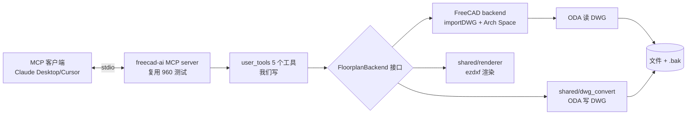
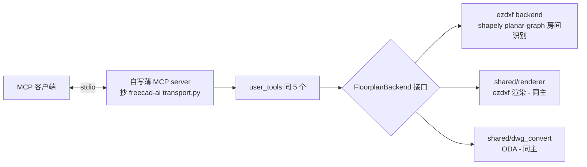
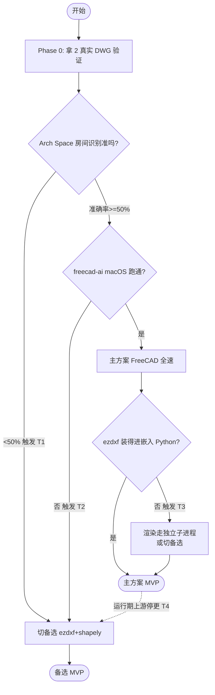

# 方案 v3-final — 收敛后的最终决策（含备选）

> ⚠️ **此文档已被取代** — 仅作历史归档。
> v3 的"备选方案"设计思路被当前权威继承（FloorplanBackend 抽象 + 环境变量切后端），
> 但 transport / 平台判断已被 F 覆盖。当前权威：`方案-F-容器化.md` → `方案-F2-*.md` → `产品Spec.md`。

> **文档关系**：v1 → v2 → v2-review(v2.1) → **v3-final（本文，取代前面所有版本）**
> **日期**：2026-08-08
> **本轮收敛的约束**：
> - 场景锁定为**桌面工具**（云端是远期可能，当前不设计）
> - 安装包大小**不考虑**
> - 渲染**保留 ezdxf**（已定）
> - **必须有备选方案，不能是唯一方案**（本轮核心）

---

## 0. 执行摘要

| 决策 | 结论 |
|------|------|
| **主方案** | 基于 `ghbalf/freecad-ai` 扩展（复用 MCP 运行时）+ FreeCAD BIM（房间识别）+ ezdxf（渲染）+ ODA（DWG 输出） |
| **备选方案** | 纯 ezdxf + shapely（自研房间识别）+ 自写薄 MCP server（抄 freecad-ai transport） |
| **架构关键** | 领域工具调 **`FloorplanBackend` 接口**，主/备是该接口的两个实现 → 后端可切换，领域代码不重复 |
| **共同单点** | ODA File Converter（所有方案都要，EULA 风险无法靠备选消除） |
| **现在做什么** | 只实现主方案 + 留 backend 接口；备选实现"接口已留、实现待触发" |
| **触发实现备选的条件** | 见 §5 矩阵（Phase 0 失败 / 上游停更 / 嵌入 Python 冲突） |

---

## 1. 深度思考：什么样的"备选"才有价值

### 1.1 反模式：平行重写

最容易犯的错是把备选搞成"另一份完整方案"：

```
❌ 反模式
main/        freecad-ai + FreeCAD + Arch Space
backup/      ezdxf + shapely + 自写 MCP    ← 完整平行另一套
```

后果：两套都要测试、两套都要维护、出 bug 不知道哪套对、最后哪个都没做好。违背 KISS 和精益。

### 1.2 正模式：分层抽象 + 后端可替换

```
✅ 正模式
user_tools/        领域工具（后端无关，调 backend 接口）
  └─ floorplan_backend.py    ← Protocol/ABC 接口定义
backends/
  ├─ freecad_backend.py      ← 主（Phase 1 实现）
  └─ ezdxf_backend.py        ← 备（Phase 0 失败时实现）
shared/             主备都复用的部分
  ├─ geometry.py    原样保留 v1（质量 OK）
  ├─ blocks.py      块识别关键词（原样保留）
  ├─ renderer.py    ezdxf 渲染（主备都用，修复 v1 bug）
  └─ dwg_convert.py ODA 封装（主备都用）
```

**关键洞察**：主/备的差异只在最贵、最不确定的能力上；其余全部共享。这样"备选"几乎零额外维护成本（接口已定义），只在触发时实现具体类。

### 1.3 备选要覆盖主方案的"独有失败模式"

主方案依赖 FreeCAD 这条链 + freecad-ai 上游，其独有失败模式是：

| 主方案独有风险 | 备选如何覆盖 |
|--------------|------------|
| FreeCAD headless/importDWG/Arch Space 任一环失效 | 备选用 ezdxf + shapely，不碰 FreeCAD |
| freecad-ai 上游停更或 breaking change | 备选自写薄 MCP server，不依赖 freecad-ai |
| FreeCAD 嵌入 Python 装不下 ezdxf | 备选完全在系统 Python 跑，无嵌入冲突 |

**反向也要验证**：备选（纯 ezdxf）的独有失败模式是房间识别算法可能不准——这时主方案（Arch Space）反而是兜底。**主备在房间识别这一最贵能力上用不同策略，互相兜底，这是设计的关键。**

---

## 2. 主方案（Phase 1 实现）

### 2.1 技术栈



### 2.2 落地组件

- **MCP 运行时**：clone freecad-ai 到 FreeCAD Mod 目录，配 `mcp_server_entry.py`（stdio headless）
- **5 个 user_tools**：`read_floorplan` / `list_rooms` / `move_furniture` / `render_preview` / `export_dwg`
- **FreeCAD backend**：DWG→DXF via ODA → `importDXF` → `Draft.draftify` 成墙 → `Arch.makeSpace` 识别房间
- **渲染**：shared/renderer.py（ezdxf，修复 v1 破图层 bug）
- **DWG 写**：shared/dwg_convert.py（ODA，封装 v1 converter.py 的同名覆盖问题）
- **几何/块识别**：复用 v1 geometry.py / blocks.py

---

## 3. 备选方案（接口已留、实现待触发）

### 3.1 触发条件（任一满足即启动备选实现）

| # | 触发条件 | 检测时机 |
|---|---------|---------|
| T1 | Phase 0 验证 Arch Space 在 ≥1 个真实样本上房间识别准确率 < 50% | Phase 0 结束 |
| T2 | freecad-ai `FreeCAD -c mcp_server_entry.py` 在 macOS 跑不通且 1 天内无法修复 | Phase 1 初 |
| T3 | FreeCAD 嵌入 Python 装不下 ezdxf/matplotlib 且独立子进程方案也受阻 | Phase 1 中 |
| T4 | freecad-ai 上游出现 breaking change 长期不修 | 运维期 |

> T1 是最可能的触发条件——这也是为什么 Phase 0 必须前置。

### 3.2 备选技术栈



### 3.3 备选方案的两个自研重点

#### 重点 A：自写薄 MCP server

freecad-ai 的 `mcp/transport.py`（stdlib only, LGPL v2.1）可直接参考。我们只需：
- `StdioServerTransport`（stdin/stdout JSON-RPC）
- 简单 tool registry
- 不需要 SSE/HTTP（桌面 stdio 够用）

⚠️ **合规注意**：LGPL v2.1 允许学习参考，但若直接复制代码片段到我们项目，需保留版权声明 + 开源修改部分。规避方式：**只学协议结构，代码自己写**（MCP over stdio 本身是公开协议，不构成衍生）。

#### 重点 B：shapely planar-graph 房间识别

这是主备真正差异化的地方。算法：

```python
# shared/rooms_graph.py（备选时实现）
from shapely.ops import unary_union, polygonize
from shapely.geometry import LineString, MultiLineString

def detect_rooms(wall_segments: list[tuple]) -> list[dict]:
    """
    wall_segments: [((x1,y1),(x2,y2)), ...]
    返回: [{"boundary": [...], "area": float}, ...]
    """
    # 1. 端点 snap 合并（容差 1mm）
    lines = [LineString(s) for s in wall_segments]
    # 2. 合并并打散所有交点
    merged = unary_union(lines)
    # 3. 平面图 polygonize → 自动找所有闭合面
    polys = list(polygonize(merged))
    # 4. 过滤外环（最大面积那块是建筑外轮廓）
    # 5. 面积阈值（> 0.5㎡）过滤碎片
    rooms = []
    for p in sorted(polys, key=lambda x: -x.area):
        if p.area > 5e5:  # mm²
            rooms.append({
                "boundary": list(p.exterior.coords),
                "area": p.area,
            })
    return rooms
```

shapely 的 `polygonize` 内部就是 planar-graph face detection 的成熟实现，比 v1 那个"闭合多段线=房间"靠谱几个数量级。

### 3.4 主备共享的部分（不重复实现）

| 组件 | 主用 | 备用 | 来源 |
|------|-----|-----|------|
| `shared/geometry.py` | ✅ | ✅ | v1 原样 |
| `shared/blocks.py`（块识别关键词） | ✅ | ✅ | v1 砍掉家具工厂后 |
| `shared/renderer.py`（ezdxf PNG） | ✅ | ✅ | v1 修 bug |
| `shared/dwg_convert.py`（ODA） | ✅ | ✅ | v1 修同名覆盖 |
| 领域 dataclass（Wall/Door/Room/...） | ✅ | ✅ | v1 reader.py 头部 |
| 5 个 user_tools 的签名/Schema | ✅ | ✅ | 接口同一份 |

**这是分层抽象的真正价值**：触发备选时，只新增 `backends/ezdxf_backend.py` + `shared/rooms_graph.py` + 薄 MCP server，其余全部复用。

---

## 4. 接口抽象设计（核心）

```python
# user_tools/floorplan_backend.py
from __future__ import annotations
from typing import Protocol


class FloorplanBackend(Protocol):
    """装修图后端接口。主/备选都是该接口的实现。"""

    def read(self, dwg_or_dxf_path: str) -> dict:
        """读图 → 结构化 JSON（图层/墙/门窗/家具/房间/统计）。"""
        ...

    def list_rooms(self, path: str) -> list[dict]:
        """列出房间：名称/面积/边界/内含家具。"""
        ...

    def move_entity(
        self, path: str, handle_or_name: str,
        dx_mm: float, dy_mm: float, auto_backup: bool = True,
    ) -> dict:
        """移动实体。auto_backup=True 自动生成 .bak。"""
        ...

    def render_preview(
        self, path: str, output_png: str,
        highlight_handles: list[str] | None = None,
    ) -> str:
        """渲染 PNG（ezdxf，共享实现）。"""
        ...

    def export_dwg(
        self, dxf_path: str, output_dwg: str,
        acad_version: str = "ACAD2018",
    ) -> str:
        """DXF → DWG（ODA，共享实现）。"""
        ...


# user_tools/__init__.py
import os
from .floorplan_backend import FloorplanBackend

def get_backend() -> FloorplanBackend:
    """根据环境变量选择后端。user_tools 只调此函数。"""
    choice = os.getenv("FLOORPLAN_BACKEND", "freecad").lower()
    if choice == "ezdxf":
        from backends.ezdxf_backend import EzdxfBackend
        return EzdxfBackend()
    # 默认主方案
    from backends.freecad_backend import FreeCADBackend
    return FreeCADBackend()
```

**user_tools 永远只调 `get_backend()`，不直接 import FreeCAD 或 ezdxf**——这是主备可切换的保证。

### 4.1 配置切换

```bash
# 主方案（默认）
export FLOORPLAN_BACKEND=freecad

# 备选方案
export FLOORPLAN_BACKEND=ezdxf
```

后端切换不改任何 user_tools 代码，只改一个环境变量。

---

## 5. 决策树与触发流程



---

## 6. 共同单点：ODA（必须诚实标注）

**所有方案（主、备、终极降级）都依赖 ODA File Converter 做 DWG 输出。** 这无法靠 backend 抽象消除，因为：

- LibreDWG 写 DWG 兼容性差（v1 风险表已确认）
- FreeCAD 的 importDWG 也只是封装 ODA
- 没有其他免费可靠的 DWG 写入器

### ODA 失效场景与终极应对

| ODA 风险 | 终极应对（所有方案都不再适用，需单独处置） |
|---------|---------------------------------|
| EULA 禁止商用打包 | 桌面个人工具：终端用户自行下载 ODA，我们不打包（合规） |
| ODA 停止免费提供 | 转 Aspose.CAD 云 API（付费）或只支持 DXF 输入输出（放弃 DWG 写） |
| ODG 版本不支持新 AutoCAD | 锁 ACAD2018 版本（向后兼容足够） |

**结论**：ODA 是接受的、显式标注的共同依赖，不进入 backend 抽象（主备都直接调 `shared/dwg_convert.py`）。

---

## 7. 主备对比总表

| 维度 | 主方案（FreeCAD+freecad-ai） | 备选方案（ezdxf+shapely+薄MCP） |
|------|------------------------|--------------------------|
| MCP 运行时 | 复用 freecad-ai（960 测试） | 自写薄层（抄 transport 结构） |
| 房间识别 | Arch Space（FreeCAD 原生） | shapely polygonize（自研） |
| DWG 读 | FreeCAD importDWG（封装 ODA） | shared/dwg_convert（直调 ODA） |
| 渲染 | shared/renderer（ezdxf） | **同主** |
| DWG 写 | shared/dwg_convert（ODA） | **同主** |
| 几何/块识别 | shared（v1 复用） | **同主** |
| 领域工具签名 | user_tools（5 个） | **同主** |
| 外部进程依赖 | FreeCAD + ODA | ODA（少一个） |
| 实现工作量（相对） | 1.0 基准 | ~1.5（房间识别要写+测） |
| 上游依赖风险 | freecad-ai / FreeCAD 双依赖 | 仅 shapely（成熟） |
| 触发条件 | 默认 | T1/T2/T3/T4 |

---

## 8. 实施路径（最终版）

### Phase 0：假设验证（半天，前置阻断）

需要：2 个真实装修 DWG 放 `samples/`。

产出 `scripts/report.md`，回答两个问题决定走主还是备：
1. **DWG round-trip** 实体保真度（主备都依赖，必过）
2. **FreeCAD Arch Space** 房间识别准确率（决定 T1 是否触发）

脚本：round-trip 对照 + 修正版 FreeCAD 房间识别（修正 v2 §11.2 的错误：必须先 importDXF→draftify→makeWall→makeSpace）。

### Phase 1：MVP（3-5 天）

- 写 `FloorplanBackend` 接口
- 实现 `backends/freecad_backend.py`（主）
- 写 `shared/renderer.py`（修 v1 bug）、`shared/dwg_convert.py`（修 v1 同名覆盖）
- 写 5 个 user_tools（调 get_backend）
- 配 Claude Desktop 端到端
- 跑 5 个 MVP 用户故事测试

### Phase 1b（条件触发）

仅当 Phase 0 触发 T1，或 Phase 1 触发 T2/T3 时启动：
- 实现 `backends/ezdxf_backend.py`
- 实现 `shared/rooms_graph.py`（shapely）
- 写薄 MCP server

### Phase 2：工程化（2 天）

- .bak 自动备份、异常分级、日志
- requirements.txt / README
- pytest 覆盖 shared/ 纯函数
- CI 跑 round-trip 对照回归

### Phase 3+：编辑拓展、新建生成（按需，同 v2）

---

## 9. 对前面几版文档的处理

| 文档 | 处置 |
|------|------|
| `方案.md` (v1) | 归档，标注"已过时" |
| `方案-v2.md` | 归档，标注"被 v3 取代" |
| `方案-v2-review.md` | 归档，标注"结论已并入 v3" |
| **`方案-v3-final.md`（本文）** | **当前唯一权威方案** |

建议在三个旧文档顶部各加一行 `> ⚠️ 已被 方案-v3-final.md 取代，仅作历史归档`。需要我加吗？

---

## 10. 下一步

需要你提供才能启动：
1. **2 个真实装修 DWG** 放 `samples/`（最贵假设的输入，没有这个 Phase 0 没法跑）

我能立刻做：
- 写 Phase 0 的验证脚本到 `scripts/`（round-trip + 修正版 FreeCAD 房间识别）
- 在三个旧文档顶部加"已被取代"标注
- 起草 `FloorplanBackend` 接口骨架和 5 个 user_tools 签名

你先给样本，还是先让我把不依赖样本的部分（接口骨架 + Phase 0 脚本）写起来？

---

## 11. 修订记录

| 版本 | 日期 | 变更 |
|------|------|------|
| v1 | 2026-08-08 | 初版，纯 LibreDWG+ezdxf |
| v2 | 2026-08-08 | 加 FreeCAD 重评估，前置 Day 0 |
| v2.1 | 2026-08-08 | review v2，发现漏 MCP，引出 freecad-ai |
| **v3-final** | 2026-08-08 | 收敛桌面场景；锁定 ezdxf 渲染；**新增备选方案 + 分层抽象（FloorplanBackend 接口）+ 触发条件矩阵 + ODA 共同单点标注** |
