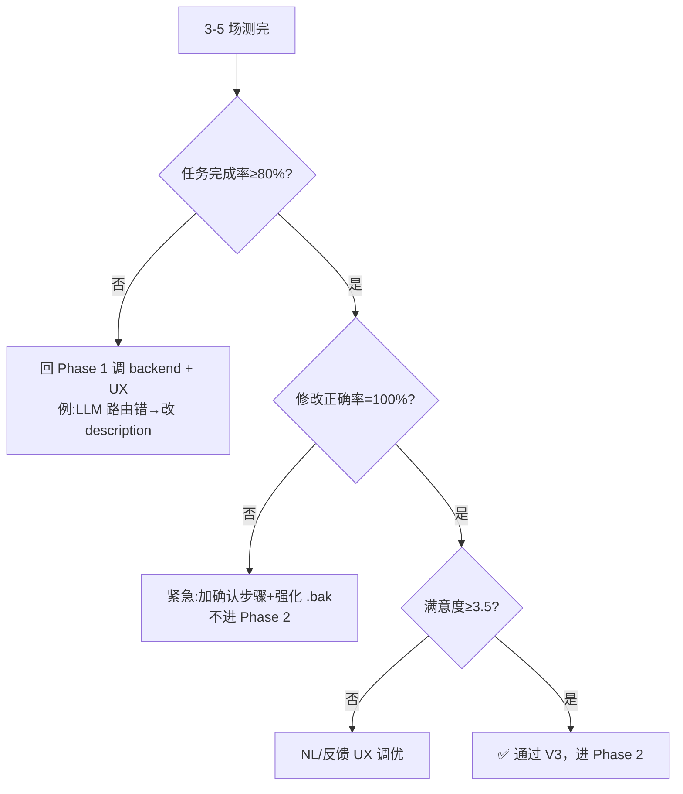

# 多场汇总表 — floorplan-mcp V3 用户测试

> 测完所有参与者场（建议 3-5 场）后，把每场 scorecard 的 F 段填到下表，
> 然后跑通过线判定，给出本期结论与下一步决策。

---

## 1. 参与者列表明细

| # | 编号 | 画像 | 前端 | 客观完成率 T1-T5 (%) | T5 修改正确率=100%? | 主观均分 (/5) | 全场分类 |
|---|------|------|------|---------------------|-------------------|--------------|---------|
| 1 | P-01 | ___ | ☐Goose Desk ☐Goose CLI ☐OpenWork | ___ | ☐是 ☐否 | ___ | ☐顺 ☐提示 ☐局败 ☐红败 |
| 2 | P-02 | ___ | ___ | ___ | ___ | ___ | ___ |
| 3 | P-03 | ___ | ___ | ___ | ___ | ___ | ___ |
| 4 | P-04 | ___ | ___ | ___ | ___ | ___ | ___ |
| 5 | P-05 | ___ | ___ | ___ | ___ | ___ | ___ |

总共测试：**___ 人**

---

## 2. 量化指标汇总（产品Spec §4 + §4 KPI）

| 指标 | 公式 | 本期值 | 通过线 | 通过? |
|------|------|-------|-------|-------|
| 任务完成率 (T1-T5) | Σ 完成 / (5 × N) | ___ % | ≥ 80% | ☐ |
| **修改正确率 (T5)** | 全员的 T5 = 100% ? | ___ % | **= 100%** | ☐ **🔴 红线** |
| 主观满意度 | 平均主均分 | ___ / 5 | ≥ 3.5 | ☐ |
| 安装摩擦中位数 | 中位 T1 提示次数 | ___ 次 | ≤ 2 | ☐ |
| 首次成功率 | "0 提示完成 T1-T5" 的场数 / N | ___ % | ≥ 60% | ☐ |

---

## 3. 失败模式 Top 5（从所有 scorecard D.1 汇总）

按出现次数排，选前 5：

| 排名 | 失败模式 | 次数 | 占比 | 影响严重度 | Phase 2 解决方案 |
|------|---------|------|------|----------|----------------|
| 1 | ___ | ___ | ___ % | ☐高 ☐中 ☐低 | __________ |
| 2 | ___ | ___ | ___ % | ☐高 ☐中 ☐低 | __________ |
| 3 | ___ | ___ | ___ % | ☐高 ☐中 ☐低 | __________ |
| 4 | ___ | ___ | ___ % | ☐高 ☐中 ☐低 | __________ |
| 5 | ___ | ___ | ___ % | ☐高 ☐中 ☐低 | __________ |

---

## 4. 失败模式 → Phase 2 改造清单

把 #3 的 Top 5 翻成具体可做的 Phase 2 任务：

| Phase 2 任务 | 解决哪个失败 | 优先级 | 工作量 |
|-------------|------------|-------|-------|
| ___ | #1 Top | ☐ 高 ☐ 中 ☐ 低 | ___ 天 |
| ___ | #2 | ☐ | ___ |
| ___ | #3 | ☐ | ___ |

---

## 5. 主观原话精选（每场挑 1-2 条）

| 编号 | sentiment | 原话 |
|------|----------|------|
| P-01 | ☺/😐/☹ | __________ |
| P-02 | ☺/😐/☹ | __________ |
| P-03 | ☺/😐/☹ | __________ |
| P-04 | ☺/😐/☹ | __________ |
| P-05 | ☺/😐/☹ | __________ |

> 这些话进 V3 报告封面 / Phase 2 启动会的开场，**情绪比具体分数更直接**。

---

## 6. 画像差异化分析（看主画像 vs 副画像）

| 画像 | 人数 | 平均完成率 | 主观均分 | 主要摩擦 |
|------|-----|-----------|---------|---------|
| P1 设计师 | ___ | ___ % | ___ / 5 | __________ |
| P2 施工 | ___ | ___ % | ___ / 5 | __________ |
| P3 房主 | ___ | ___ % | ___ / 5 | __________ |

> 如果 P2/P3 完成率显著低于 P1（>15pp），说明易用性对非设计师不够 → Phase 2 加入门向导/默认 demo 图。

---

## 7. 前端差异化（Goose vs OpenWork）

| 前端 | 人数 | T1 平均用时 | 完成 T1 率 |
|------|-----|------------|----------|
| Goose Desktop | ___ | ___ min | ___ % |
| Goose CLI | ___ | ___ min | ___ % |
| OpenWork Desktop | ___ | ___ min | ___ % |

> 如某前端 T1 完成率显著低，Phase 1.5 (streamable_http) 优先级上调；或改进对应 client 文档。

---

## 8. 通过判定（产品Spec §4.3 失败决策树）

按下面顺序检查：

**本期判定**：☐ 通过 / ☐ 部分通过（指标 1+3 通过，2 通过） / ☐ 不通过

判定理由（1-3 句）：

__________

---

## 9. 下一步行动（领导/团队看的总结）

| 项 | 决策 |
|----|------|
| Phase 2 启动 | ☐ 立即 ☐ 待修订后 ☐ 推迟 |
| Phase 2 内容 | 见 §4 改造清单 |
| Phase 1.5（streamable_http）优先级 | ☐ 维持 / ☐ 上调 / ☐ 下调 |
| 下次 V3 跑测时机 | 完成 Phase 2 后再测 |

---

## 10. 本期报告归档

把这份汇总表另存为 `floorplan-mcp/V3-round1-report.md`，附 §3 失败模式截图 + §5 原话引用作为附录。

下次复盘（Phase 2 完成后）对照本表的 §4 改造清单打勾。
